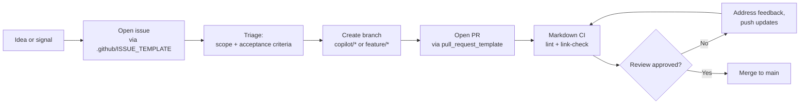

# Contributing

## Start here

Begin with [`docs/framework-continuity-and-memory.md`](docs/framework-continuity-and-memory.md). It is the durable continuity anchor for framework intent, constraints, and handoff expectations.
Use [`docs/README.md`](docs/README.md) as the canonical documentation hub for navigating core docs, runbooks, examples, ADRs, and reference material.

## Diagram

Contributor journey from initial idea to merged change, showing the GitHub surfaces and CI gates along the way.

> 📐 Hi-res view: [SVG](docs/diagrams/CONTRIBUTING.svg)

## How we work

This framework operates across multiple surfaces, with GitHub as the control plane and durable system of record. Keep workflow decisions and execution aligned with:

- [`docs/operating-model.md`](docs/operating-model.md)
- [`docs/gh-agents-and-automation.md`](docs/gh-agents-and-automation.md)

## Code of conduct

This project follows the [Contributor Covenant Code of Conduct](CODE_OF_CONDUCT.md).
By participating, you are expected to uphold it. Report unacceptable behavior via the
repository's GitHub Security tab or to the maintainer listed in `.github/CODEOWNERS`.

## Before you open an issue

Use the issue templates in [`.github/ISSUE_TEMPLATE/`](.github/ISSUE_TEMPLATE/) and review the intake/routing model in [`docs/product-support-and-improvement-loop.md`](docs/product-support-and-improvement-loop.md).

## Before you open a PR

Review:

- [`docs/branching-and-cleanup.md`](docs/branching-and-cleanup.md)
- [`docs/governance-checklist.md`](docs/governance-checklist.md)
- [`.github/pull_request_template.md`](.github/pull_request_template.md)

PRs should stay bounded to a clear objective and acceptance criteria, then be cleaned up after merge (branch cleanup and artifact completeness).

## Working with agents (Copilot, GH CLI, mobile, external AI)

- [`docs/multi-agent-handoff-playbook.md`](docs/multi-agent-handoff-playbook.md)
- [`docs/prompt-cookbook.md`](docs/prompt-cookbook.md)
- [`docs/github-mobile-guide.md`](docs/github-mobile-guide.md)
- [`docs/context-synchronization.md`](docs/context-synchronization.md)

Use the handoff contract and normalize external AI outputs into GitHub artifacts before implementation/review flow continues.

## Local environment

- [`docs/contributor-environment-guide.md`](docs/contributor-environment-guide.md)
- [`.devcontainer/`](.devcontainer/)
- [`.vscode/`](.vscode/)

## Non-negotiables

See the principles in [`docs/framework-continuity-and-memory.md`](docs/framework-continuity-and-memory.md). In brief:

- GitHub artifacts are the system of record.
- Prompts are first-class artifacts.
- External AI output must be normalized into repository artifacts.
- PRs are the control gate for bounded change.
- Handoffs must preserve objective, context, constraints, acceptance criteria, validation, and next owner.
