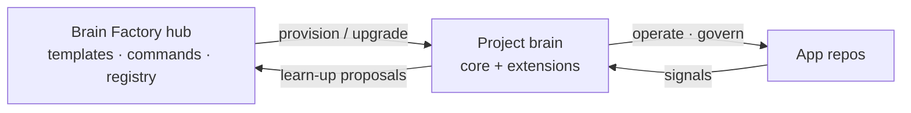

# Brain Factory

**Give every project its own upgradeable "brain" for AI-assisted delivery — with GitHub as the system of record.**

Brain Factory is a hub. From it you create a small companion repository — a
**brain** — for each project. The brain ships a shared, upgradeable **core**
(governance, continuity, quality checks, and a set of agent commands) plus your
own project **extensions**. Improvements flow up from brains to the hub, and
approved upgrades flow back down to every brain.

## Diagram

The model at a glance: the hub provisions and upgrades a project brain, the
brain proposes learnings back, and the brain operates and governs its app repos.



New here? Read **[Brain Factory: how it works](docs/how-brain-factory-works.md)** for a five-minute tour.

## Why use it

- **Stop re-inventing project setup.** Provision a consistent governance,
  continuity, and quality baseline for a new project in one step — or adopt an
  existing repo with an inspect-first gap report that never clobbers what works.
- **Keep AI-assisted work durable.** Objectives, constraints, and decisions live
  in GitHub artifacts (issues, PRs, ADRs), not in chat history.
- **Upgrade without redoing setup.** The hub owns the core layer; your project
  owns its extensions. Upgrades update the core and leave extensions untouched.
- **Work anywhere.** The same commands run across local, cloud, CLI, and mobile
  surfaces, with cross-platform adapters (bash, PowerShell, Python).

## Quick start

Prerequisites: `git`, Python 3, and Node.js (for the markdown checks).

### Install the CLI (optional)

The onboarding engine ships as a Python package with a `brainfactory` command —
no clone needed to use it:

```bash
pipx install brainfactory        # isolated CLI (or: pip install brainfactory)
brainfactory inspect --repo .    # read-only gap report for any repo
```

`npx brainfactory` forwards to the same engine. See
**[CLI distribution & releases](docs/cli-distribution-and-releases.md)** for every
install method and how versions are published, or the package READMEs under
[`brain-factory/adapters/python/`](brain-factory/adapters/python/README.md) and
[`installers/npm/`](installers/npm/README.md).

### From a clone

```bash
# 1. Clone the hub
git clone https://github.com/izakl/brainforge.git brain-factory
cd brain-factory

# 2. See what a brain would add to any repo — read-only, changes nothing
bash brain-factory/adapters/run.sh inspect-repo --repo .

# 3. Run the framework's own quality gates
npx -y markdownlint-cli2 "**/*.md"
bash scripts/check-brain-factory.sh
```

Step 2 prints a gap report (which governance, CI, commands, continuity, and docs
a repo already has versus what the brain would add). Point `--repo` at any local
project to try it there.

Next steps:

- Read the operating contract: [`AGENTS.md`](AGENTS.md).
- Provision a new brain or adopt an existing repo: [`brain-factory/onboard/`](brain-factory/onboard/README.md).
- Browse the commands every brain inherits: [`brain-factory/core-commands/CATALOG.md`](brain-factory/core-commands/CATALOG.md).

## How it works

- **Hub vs. brain.** The hub (this repo) is the canonical source: the brain
  template, the core command catalog, the onboarding engine, and the registry.
  A brain is a separate per-project repo created from the template; it is
  portable and works without a live link to the hub.
- **Core vs. extensions.** `brain.manifest.json` is the boundary. The core layer
  is hub-owned and upgradeable; the extension layer is project-owned and never
  overwritten.
- **The two-way loop.** *Learn-up:* a proven pattern is proposed to the hub.
  *Improve-down:* the hub releases it, and an upgrade pulls it into a brain's
  core while preserving extensions.

Full detail: [Brain Factory architecture](docs/framework-brain-factory-architecture.md) and [ADR 0019](docs/adr/0019-project-brain-factory-and-improvement-loop.md).

## What's in this repository

| Area | Path | What it is |
| --- | --- | --- |
| **Executable layer** | [`brain-factory/`](brain-factory/README.md) | The brain template, core command catalog, onboarding engine, registry, and cross-platform adapters. |
| **Documentation framework** | [`docs/`](docs/README.md) | The operating model, adoption profiles, governance, runbooks, and ADRs that define *what* a good brain contains. |
| **Worked examples** | [`examples/`](examples/README.md) | End-to-end walkthroughs of real issue-to-PR and adoption flows. |
| **Quality gates** | [`scripts/`](scripts/) | The checks that keep docs, diagrams, and continuity honest (run in CI). |

## Core ideas

1. **Prompts are artifacts.** Preserve important prompts in issues, PRs, docs,
   and ADRs — not only in chat.
2. **Use the right execution mode.** Human-led, local agent, cloud agent, CLI,
   mobile, or external AI — chosen per task.
3. **Keep work bounded.** Every task carries objective, context, constraints,
   acceptance criteria, validation steps, and non-goals.
4. **GitHub is the durable control plane.** Implementation depends on normalized
   GitHub artifacts, not private memory.
5. **Connect support and product learning to delivery.** Route findings into
   issues, projects, docs, and PRs with explicit follow-up.
6. **Improve continuously.** Recurring loops refine prompts, templates,
   governance, and automation.

## Documentation

- **[`AGENTS.md`](AGENTS.md)** — the minimum operating contract; start here as an agent or contributor.
- **[`docs/README.md`](docs/README.md)** — the full documentation hub: core docs, runbooks, examples, ADRs, and reference.
- **[Brain Factory: how it works](docs/how-brain-factory-works.md)** — the newcomer overview.
- **[Brain Factory — design overview](docs/brain-factory-design-overview.md)** — the whole architecture on one page, with diagrams.
- **[Operator onboarding pack](docs/operator-onboarding-pack.md)** — a practical first-day/first-week path.

## Project status

The framework foundation — architecture, manifest schema, command catalog,
registry, onboarding engine, and cross-platform adapter seam — is in place and
runnable, and has matured across successive releases through the hub's normal
governance (ADR + task queue). See
[`brain-factory/registry/`](brain-factory/registry/README.md) for the current
framework version and releases.

## Contributing and license

- Contributions: see [`CONTRIBUTING.md`](CONTRIBUTING.md) and the [Code of Conduct](CODE_OF_CONDUCT.md).
- Security: report privately via the process in [`SECURITY.md`](SECURITY.md).
- License: [MIT](LICENSE).
