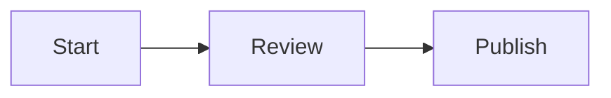

# ADR 0009: Mermaid as primary diagram format

- Status: Accepted
- Date: 2026-05-24

## Context

As the framework grew across docs, runbooks, ADRs, governance, and automation, maintainers wanted visual representations of architecture and end-to-end flows alongside prose.

`docs/visual-diagrams-plan.md` scopes rollout details, but the format choice itself is a durable architectural decision worth recording in the ADR log.

Without a recorded format decision, future contributors may introduce inconsistent diagram formats (PNG screenshots, Lucidchart embeds, JSX components, and similar), each with different review, diff, and maintenance properties.

## Decision

Adopt **Mermaid** as the primary diagram format for this repository.

Diagrams should live inline in the markdown document they describe, inside fenced `mermaid` code blocks.

Follow the convention defined in `docs/visual-diagrams-plan.md`:

- Use a single `## Diagram` or `## Diagrams` section in a document.
- Include a one-line caption per diagram.
- Keep each diagram to about 12 nodes or fewer for mobile legibility.

Allow SVG or PNG assets in `docs/assets/diagrams/` only when Mermaid cannot express the diagram (for example, detailed UI mockups or complex layouts). When this fallback is used, commit the editable source file (such as `.drawio` or `.excalidraw`) alongside the rendered asset.

Defer JSX or React diagram components unless and until this repository adopts a docs site build pipeline (for example, Docusaurus or Astro Starlight).

## Consequences

- Diagrams render natively on github.com and GitHub Mobile with no build step or new dependencies.
- Diagrams diff as text, so they can be reviewed in pull requests like any other code change.
- Diagrams stay co-located with the prose they describe, helping catch prose/diagram drift in the same pull request.
- Contributors make a small skill investment in Mermaid syntax, in exchange for avoiding external tools, accounts, and rendering pipelines.
- The `docs/framework-health.md` audit will gain a `Diagrams in sync` row when rollout begins in a separate continuity PR.

## Alternatives considered

- **PNG / SVG screenshots only:** rejected because they are opaque to diff, drift silently, and require external tools.
- **Lucidchart / Miro / Excalidraw embeds:** rejected because they add external dependencies, account requirements, and auth/link fragility.
- **JSX / React components:** rejected for now because they require a docs site build pipeline this repository intentionally does not have.
- **PlantUML:** rejected because it does not render natively on github.com and would require CI pre-rendering.

## References

- `../visual-diagrams-plan.md`
- `0001-github-as-durable-control-plane.md`
- `0004-markdown-ci-guardrail.md`
- `../framework-continuity-and-memory.md`
