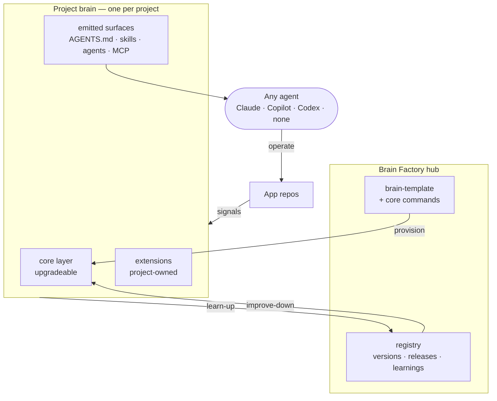
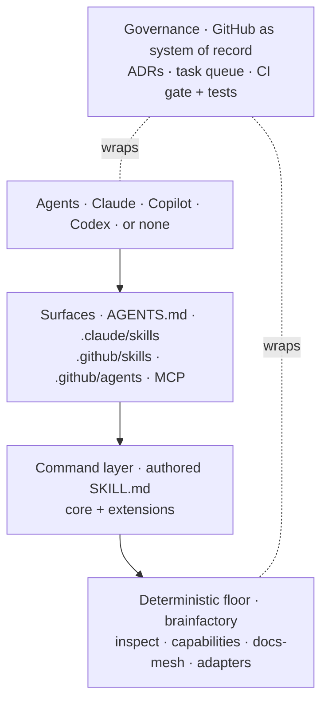
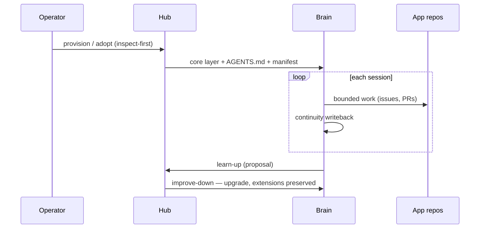
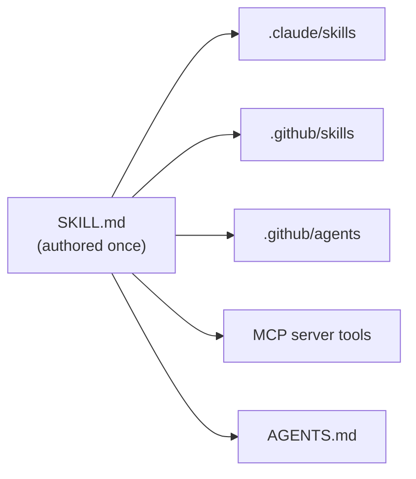
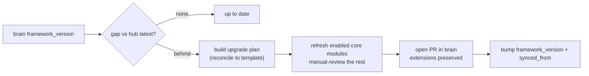
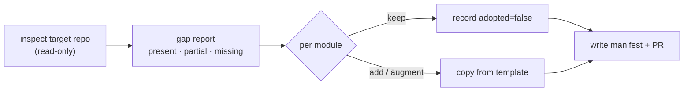
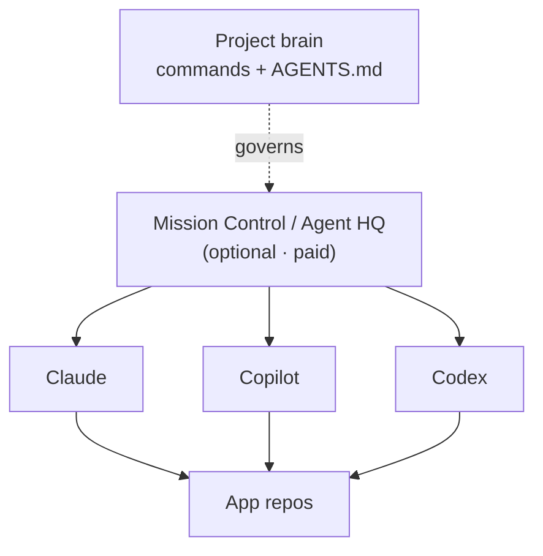
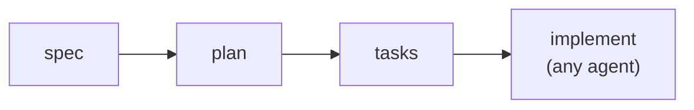

# Brain Factory — design overview

A single, readable picture of what Brain Factory is, how it fits together, and
where it is heading. Each section gives the idea in plain language first, then the
detail. For the formal decisions behind each piece, follow the ADR links; for a
five-minute intro, see [how it works](how-brain-factory-works.md).

## Diagram

The whole system on one page: the hub provisions and upgrades a per-project
brain; the brain emits surfaces that any agent (or none) uses to operate the app
repos; learnings flow back up to the hub.

> 📐 Hi-res view: [SVG](diagrams/brain-factory-design-overview.svg)

## The big idea

Brain Factory is a **hub**. From it you create a small companion repository — a
**brain** — for each project. The brain is where day-to-day work is coordinated;
the app code stays in its own repos, which the brain governs.

A brain holds two kinds of content, separated by `brain.manifest.json`:

- a hub-owned **core layer** (governance, continuity, quality, and the command
  set) that the hub keeps up to date, and
- a project-owned **extension layer** that the hub never overwrites.

That boundary is the heart of the design. It means a project can take fixes and
new capabilities from the hub *without* losing or re-doing its own work.
Improvements move both ways: a pattern proven in a brain is proposed up to the
hub (**learn-up**); approved improvements flow back down into every brain
(**improve-down**). GitHub is the durable system of record the whole way through —
objectives, decisions, and evidence live in issues, PRs, and ADRs, not in chat.

## Architecture in layers

Brain Factory is built so its value lives in plain files, open standards, and
deterministic code. The AI agent sits on top as a swappable execution engine —
never a dependency.

- **Deterministic floor.** The `brainfactory` Python package and the
  bash/PowerShell adapters run with no LLM at all: inspect a repo, regenerate the
  capability map, check docs drift, enforce the intent gate. It is standard
  library only — nothing to install beyond Python 3 — so it works on any machine
  and in CI. This is the floor every brain stands on, and the reason a brain
  keeps working even with no AI subscription.
- **Command layer.** Each command is authored once as an Agent Skills `SKILL.md`,
  plus any project extensions. One source, not one-per-vendor.
- **Surfaces.** Those commands are emitted to the places agents actually look,
  and the registry and onboarding engine are exposed over MCP.
- **Agents.** Whatever you run — Claude, Copilot, Codex, an open-source runner, or
  nothing at all.
- **Governance** wraps every layer: GitHub artifacts are the record, with an ADR
  log for decisions, a task queue for what's next, and a single CI gate that runs
  the guardrails and the test suite on every change.

## How a brain is born and grows

A brain has a simple life: it is created once, then operated session by session,
staying current with the hub over time.

- **Provision** stands up a brain for a new project from the template, stamping
  the manifest and writing a standards-compliant `AGENTS.md`.
- **Adopt** is inspect-first: it audits an existing repo, reports a gap, and adds
  only what is missing — never clobbering working artifacts (detailed below).
- **Operate** runs sessions through the `<prefix>-*` commands. Every session ends
  with a continuity writeback so the next session — human or agent — resumes with
  full context.
- **Learn-up / improve-down** keep every brain current without redoing setup.

## One command, every agent

A command is authored once and emitted to the discovery locations each runtime
reads, so the same brain works across vendors — and losing one runtime loses
nothing.

The `emit-commands` task does the fan-out; generated files are marked and
refreshed idempotently, and stale ones are pruned without touching anything you
authored by hand. The manifest's `agent_runtimes` field declares which runtimes a
brain targets — `none` is always valid and is the default, meaning a brain's
mechanical work runs with no AI agent at all.

## Affordable and lock-in-free by design

Brain Factory is built to run on what an individual already has:

- **GitHub Pro covers the framework itself** — CI minutes, branch protection, and
  a docs site (GitHub Pages) at no extra cost.
- **The `none` runtime is the floor** — the deterministic tasks need no LLM, so a
  brain never stops working when a subscription (or a job) ends.
- **Bring any agent, cheaply** — Claude (Pro, or Haiku via API for pennies),
  Copilot Pro, or open-source runners (Aider, Kilo) on a local model.
- **Paid/enterprise features are additive** — multi-agent orchestration
  (GitHub Agent HQ) and managed memory are optional integrations, off by default,
  never required for core operation.

## Proposed and optional flows

The flows above are built today. The ones here are a mix of recently shipped
increments (inspect-first adoption, improve-down) and additive or proposed
layers a brain can switch on if it wants them. Each item's status is in the
table below.

### Improve-down: applying an upgrade

Down-sync execution is built. A brain compares its `framework_version` to the
hub, reconciles its enabled core modules to the current framework template,
bumps `framework_version` and each refreshed module's `synced_from`, and lands
the result as a PR. Pre-existing (project-owned) modules are surfaced for manual
review rather than overwritten, and project extensions are never touched.

The MCP `version_status` tool and `<prefix>-status` report the gap; the
`upgrade` task (`<prefix>-upgrade`) applies the plan — dry-run by default, with
`--apply` to write.

### Inspect-first adoption

Adopting an existing repo never overwrites working artifacts. The inspector
produces a read-only gap report; each core module is then kept (recorded as
project-owned) or added/augmented from the template, and the result lands as a PR.

The inspector and the dry-run applier are built; richer per-module merge
heuristics can grow over time.

### Additive: multi-agent orchestration (optional, paid)

For teams on paid GitHub Copilot tiers, the brain's emitted agents and `AGENTS.md`
make it a first-class citizen of GitHub Agent HQ / Mission Control — assign one
task to several agents and compare. This is purely additive: the brain governs
the work through the same GitHub artifacts whether or not Mission Control is used.

### Additive: spec-driven work and memory (optional)

Two more optional layers from the research, both off by default and both keeping
GitHub as the system of record: a **spec-driven** flow (e.g. GitHub Spec Kit) that
turns a bounded work packet into spec → plan → tasks → implementation, and a
**pluggable memory** adapter (self-hosted) for soft recall that never replaces the
durable GitHub record.

## Governance and quality

- **GitHub is the system of record.** Objectives, decisions, and validation live
  in issues, PRs, and ADRs — not chat memory. Every meaningful unit of work maps
  to a durable artifact.
- **Decisions are durable.** The [ADR log](adr/README.md) records why each piece
  exists and what alternatives were weighed; the
  [task queue](https://github.com/izakl/brainforge/blob/main/.github/framework-task-queue.json) tracks what is next.
- **One always-on CI gate.** A single required check runs the framework guardrails
  (markdown lint, link check, diagram companions, mobile coverage, handoff
  completeness, index parity, security anchors, queue health, and brain-factory
  invariants) plus the Python test suite — so neither the docs nor the engine can
  silently regress, and PRs are never wedged by a path-filtered check that didn't
  run.

## What's built vs. planned

| Capability | State | Reference |
| --- | --- | --- |
| Hub/brain model and manifest boundary | ✅ Built | [ADR 0019](adr/0019-project-brain-factory-and-improvement-loop.md) |
| Onboarding engine (inspect / provision / adopt) | ✅ Built | [`onboard/`](https://github.com/izakl/brainforge/blob/main/brain-factory/onboard/README.md) |
| Registry + down-sync contract | ✅ Built | [`propagation.md`](https://github.com/izakl/brainforge/blob/main/brain-factory/registry/propagation.md) |
| Cross-platform adapter seam | ✅ Built | [`adapters/`](https://github.com/izakl/brainforge/blob/main/brain-factory/adapters/README.md) |
| Runtime-agnostic brains (`agent_runtimes`, `none`) | ✅ Built | [ADR 0020](adr/0020-portable-core-additive-enterprise.md) |
| Standards-native `AGENTS.md` per brain | ✅ Built | [ADR 0020](adr/0020-portable-core-additive-enterprise.md) |
| MCP server | ✅ Built | [ADR 0021](adr/0021-expose-brain-factory-over-mcp.md) |
| Multi-target command emission | ✅ Built | [ADR 0022](adr/0022-multi-target-command-emission.md) |
| Test suite in the CI gate | ✅ Built | [`check-python-tests.sh`](https://github.com/izakl/brainforge/blob/main/scripts/check-python-tests.sh) |
| Documentation framework (operating model, profiles, runbooks) | ✅ Built | [`docs/`](README.md) |
| Down-sync **execution** (apply an upgrade plan) | ✅ Built | [`propagation.md`](https://github.com/izakl/brainforge/blob/main/brain-factory/registry/propagation.md) |
| `tools`/`model` frontmatter on emitted agents | ✅ Built | [ADR 0022](adr/0022-multi-target-command-emission.md) |
| Installer (pipx/npx) + published docs site | ✅ Built | [`adapters/python`](https://github.com/izakl/brainforge/blob/main/brain-factory/adapters/python/README.md) |
| Security scanning (CodeQL / secret scan / dep review) | ✅ Built | [`SECURITY.md`](https://github.com/izakl/brainforge/blob/main/SECURITY.md) |
| Spec Kit adapter; pluggable self-hosted memory | ◻️ Optional | this page |
| GitHub Agent HQ / Mission Control integration | ◻️ Optional (paid) | this page |

## Go deeper

- [Brain Factory architecture](framework-brain-factory-architecture.md) — the formal model and contracts.
- [How it works](how-brain-factory-works.md) — the five-minute intro.
- [`brain-factory/` README](https://github.com/izakl/brainforge/blob/main/brain-factory/README.md) — the executable layer.
- [ADR log](adr/README.md) — every decision, with context and alternatives.
- [Core command catalog](https://github.com/izakl/brainforge/blob/main/brain-factory/core-commands/CATALOG.md) — the commands every brain inherits.
