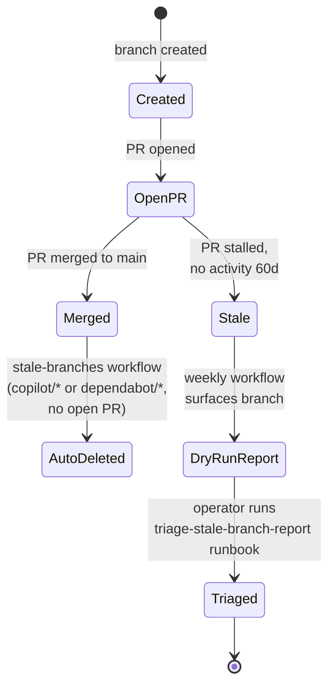

# Branching and Cleanup

This guide defines how branches are named, used, and cleaned up — whether the work
is done locally, in the cloud, from the CLI, on mobile, or with help from an AI
agent. It is for anyone opening branches or pull requests in a Brain Factory repo.
New to the project? See [How Brain Factory works](how-brain-factory-works.md).

## Diagram

A branch's lifecycle from creation through merge or triage. Stale-branch cleanup is automated per ADR 0008.

> 📐 Hi-res view: [SVG](diagrams/branching-and-cleanup.svg)

## Branching principles

- Use branches + PRs for implementation and automation changes.
- Keep branches short-lived and scoped to one issue/work packet.
- Preserve prompt, constraints, and validation context in linked issue/PR artifacts.
- Delete merged branches quickly to reduce stale context.

## Branch naming conventions

Use:

- `feature/<issue-or-topic>`
- `fix/<issue-or-topic>`
- `docs/<issue-or-topic>`
- `chore/<issue-or-topic>`
- `improvement/<issue-or-topic>`
- `redev/<issue-or-topic>`

Examples:

- `feature/142-support-export-filter`
- `fix/318-login-timeout-regression`
- `docs/451-mobile-followup-flow`
- `redev/509-billing-workflow-decomposition`

## Coding-agent branch handling

A coding agent is an AI assistant that writes code directly in the repository (for
example, GitHub Copilot Coding Agent running in the GitHub cloud). When one opens a
branch:

- the branch should map to a single linked issue
- the PR body must state the execution surface and the source of its normalized context
- do not combine multiple unrelated issue scopes in one agent branch
- apply the same review and validation gates as human-authored branches

## External-agent contribution handling

An external agent is an AI tool that works outside the repository (for example,
Claude Code). Its output must be turned into GitHub artifacts before any code
lands — this is what "normalize" means throughout these docs. Contribute in this
order:

1. discovery summary or discussion
2. triage-ready issue and, if needed, an ADR proposal
3. approved implementation issue
4. implementation branch and PR on the approved execution surface

Do not implement straight from an external transcript or file dump without first normalizing it into GitHub artifacts.

## Hybrid handoff flow (branch-oriented)

1. **Discovery surface** (external AI or human): prepare normalized issue/ADR.
2. **Planning surface** (Copilot chat or human): confirm constraints/acceptance/validation.
3. **Implementation surface** (VS Code Copilot local or Coding Agent): create branch and implement.
4. **Review surface** (desktop + optional mobile): verify constraints and validation evidence.
5. **Closure surface** (desktop/CLI/mobile): merge, close linked issues, create follow-up items.

## Stale branch cleanup

Run weekly cleanup:

- list branches with no commits in 14+ days
- check linked issue/project status
- close abandoned branches with closure notes in issue
- open follow-up issue if useful work remains

## Merged branch cleanup

After merge:

- confirm issue linkage (`Closes #...` or `Relates-to #...`) is accurate
- delete head branch (automatic deletion recommended)
- ensure deferred work is captured in follow-up issue(s)
- move project item to closure state and add verification note

## Abandoned work cleanup

If work is abandoned:

- close branch (if open PR exists, close PR with reason)
- summarize partial findings in issue or discussion
- explicitly mark what is reusable vs superseded
- create replacement issue only if further execution is still needed

## Direct-to-main guidance

Direct commits to `main` should remain rare and low-risk (typically docs/admin only). If uncertain, use branch + PR.

## Automated cleanup

A weekly workflow at [`.github/workflows/stale-branches.yml`](https://github.com/izakl/brainforge/blob/main/.github/workflows/stale-branches.yml)
deletes merged `copilot/*` and `dependabot/*` branches whose last commit is older
than 7 days, and lists any other branch with no open PR and no activity in 60 days
for the maintainer to review. The workflow can also be triggered manually from the
Actions tab.

**copilot/* cleanup criteria:**

- Branch prefix matches `copilot/` or `dependabot/`.
- No open pull request against the branch.
- Last commit is older than 7 days.
- Branches meeting all three criteria are automatically deleted on the weekly schedule.

**Manual / first-run:**

- Trigger from the Actions tab using `workflow_dispatch`.
- The default dispatch mode is `dry_run: true` (reports only, no deletions), which is
  safe for a first-run audit.
- Set `dry_run: false` to execute deletions on a manual dispatch.
- See [Triage the stale-branch report](runbooks/triage-stale-branch-report.md) for
  the full first-run procedure.

## Mobile quick action

- **Use when:** you are validating branch status, cleanup, or stale-branch triage from GitHub Mobile.
- **Do from mobile:**
  - Check whether a branch has an open PR and linked issue.
  - Leave a branch disposition comment (`keep`, `close`, or `needs owner decision`).
  - Delete clearly abandoned branches only when ownership and status are unambiguous.
- **Do not do from mobile:**
  - Perform rebases, conflict resolution, or branch surgery.
  - Bulk-delete branches in one pass.
- **Escalate to desktop/cloud when:**
  - Branch history is unclear or linked artifacts conflict.
  - The branch requires recovery, rebase, or complex merge decisions.
- **Primary artifact to update:**
  - The related pull request or tracking issue comment with branch triage outcome.

## Related docs

- [How Brain Factory works](how-brain-factory-works.md) — five-minute tour for newcomers.
- [Operating model](operating-model.md) — how the framework runs day-to-day.
- [Product support and improvement loop](product-support-and-improvement-loop.md) — how signals flow back into the framework.
- [Framework continuity and memory](framework-continuity-and-memory.md) — what the framework remembers across sessions.
- [Governance checklist](governance-checklist.md) — periodic audit items.
- [Framework health](framework-health.md) — current snapshot and charter-to-artifact map.
