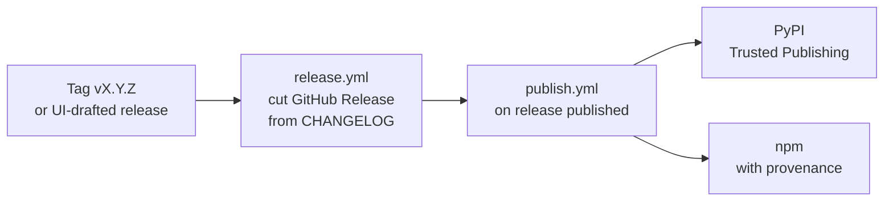

# CLI distribution & releases

Brain Factory's onboarding engine ships as the **`brainfactory`** CLI, published to
both [PyPI](https://pypi.org/project/brainfactory/) and
[npm](https://www.npmjs.com/package/brainfactory). This page covers how to install
it and how new versions are released.

## Install

The Python package is the real CLI (standard library only); the npm package is a
thin launcher that forwards to it.

```bash
# Isolated CLI (recommended):
pipx install brainfactory

# Or with pip:
pip install brainfactory

# Stricter manifest validation (optional — pulls in jsonschema):
pipx install "brainfactory[schema]"

# JS ecosystem — forwards to the Python engine (needs Python 3.10+):
npx brainfactory --help
```

To run the latest unreleased build straight from the repository:

```bash
pipx install "git+https://github.com/izakl/brainforge#subdirectory=brain-factory/adapters/python"
```

Requires Python 3.10+. Licensed MIT. The package READMEs under
`brain-factory/adapters/python/` (engine) and `installers/npm/` (launcher) carry
the full per-package detail.

### First commands

```bash
brainfactory --help
brainfactory inspect --repo .          # read-only gap report for any repo
brainfactory upgrade --brain ./brain   # down-sync (dry-run; --apply to write)
```

## How releases are published

Distribution is automated and tied to GitHub Releases — there is no manual upload
step.



1. **Cut a release.** Push a `vX.Y.Z` tag, or draft a Release in the GitHub UI.
   `release.yml` publishes the GitHub Release using the matching `CHANGELOG.md`
   section as its notes, after a version-parity check. Drafting in the UI also
   works — the workflow is idempotent and skips creation when the Release already
   exists.
2. **Packages publish.** Once the Release is published, `publish.yml` builds and
   publishes the CLI:
   - **PyPI** via Trusted Publishing (OIDC — no stored token).
   - **npm** with build provenance.

   Both steps are **idempotent**: if that version already exists on the registry,
   the step is a no-op, so re-running a release never double-publishes.

### Versioning

The **CLI package version is independent of the framework version.**

- The *framework version* (`brain-factory/registry/framework-version.json`) tracks
  the brain template and core modules that brains sync against.
- The *CLI version* lives in the package metadata —
  `brain-factory/adapters/python/brainfactory/__init__.py` (`__version__`) and
  `installers/npm/package.json`.

Because publishes are idempotent, a framework release that doesn't change the CLI
is a clean no-op. To ship a new CLI build, bump both package versions together,
then cut a release. See
[ADR 0025](adr/0025-cli-distribution-via-pypi-and-npm.md) for the decision record.
