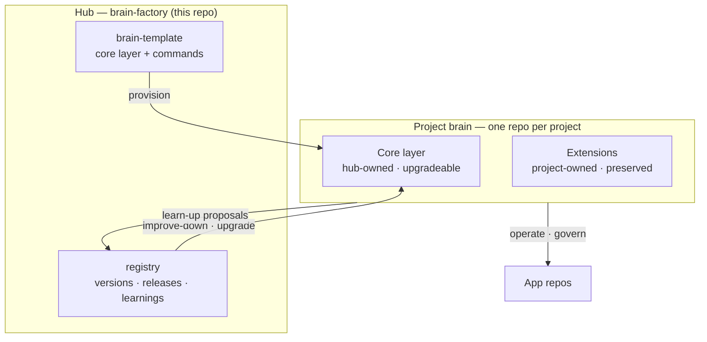
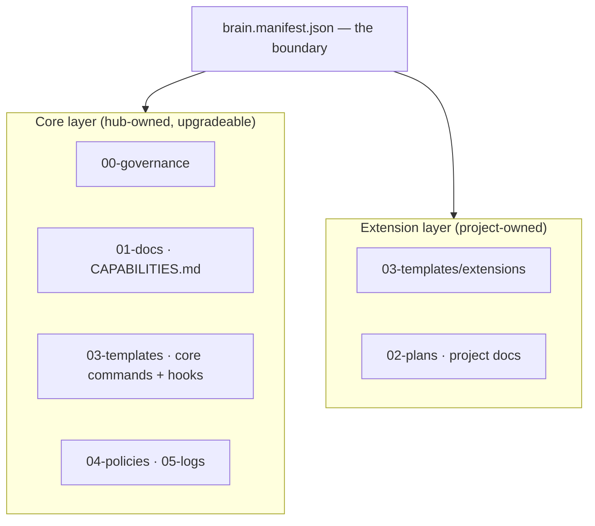
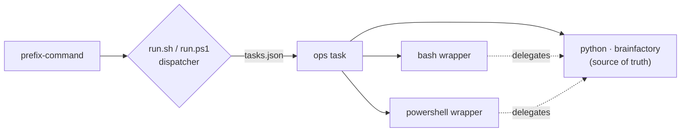

<!-- mobile-quick-action: Read this to understand how the framework provisions, operates, and continuously improves per-project "brains." -->

# Brain Factory architecture

> Status: Accepted (see [ADR 0019](./adr/0019-project-brain-factory-and-improvement-loop.md)).
> This is the canonical architecture for how the **hub** (`brain-factory`)
> provisions and continuously improves a per-project **brain**, and how
> learnings flow back from brains to the hub.

## Purpose

Brain Factory turns a documentation-and-governance framework into something
**executable**: it can *do the setup* for a new or existing project, give that
project a living, self-documenting **brain**, and then run a **two-way
improvement loop** between every brain and the hub.

In one sentence: **the hub is the canonical source; each project gets its own
brain repo instantiated from the hub; improvements flow up from brains into the
hub, and approved improvements flow back down into every brain.**

## Diagram

How the hub and a project brain relate: the hub provisions and upgrades the
brain's core layer, the brain proposes learnings back, and the brain operates
and governs its app repos.



> 📐 Hi-res view: [SVG](diagrams/framework-brain-factory-architecture.svg)

## Vocabulary

| Term | Meaning |
| --- | --- |
| **Hub** | This repository (`brain-factory`). The canonical source of the brain template, the core command set, the onboarding engine, and the improvement registry. |
| **Brain** | A project's autonomy/governance repository (one per project). An instance of the brain template, stamped with the framework version it runs. |
| **Brain template** | The canonical `00–08` numbered structure plus core skills, hooks, and ops scripts that the hub ships and a brain is instantiated from. |
| **Core layer** | Capabilities shared by every brain (governance, flow, continuity, quality, and the brain/framework commands). Owned by the hub; updated via the down-sync. |
| **Extension layer** | Project-specific capabilities a brain adds (for example, ingestion commands for a data platform). Owned by the project; never overwritten by the hub. |
| **`brain.manifest.json`** | Per-brain stamp recording project identity, `framework_version`, enabled platforms, enabled core modules, declared extensions, and the app repos the brain coordinates. |
| **Registry** | Hub-side record of the current framework version, published releases, the learnings inbox (upstream proposals), and propagation rules. |

## Topology

- **One brain repo per project.** App repos stay clean; the brain coordinates
  one or many app repos for that project.
- **The hub never contains a project's brain.** It contains the *template* the
  brain is built from and the *registry* the brain syncs against.
- **A brain is portable.** It carries its own copy of the core layer, so it
  works offline and is not coupled to the hub at runtime. The hub relationship
  is used only at **provision**, **upgrade**, and **learn** time.

## Brain anatomy

A brain instance uses a proven numbered structure. The manifest is the
boundary: anything under `core_modules` is hub-owned and upgradeable; anything
under `extensions` is project-owned and never touched by the down-sync.



The full layout a brain is instantiated with:

```text
<project>-autonomy-system/
  brain.manifest.json   # identity, framework_version, platforms, agent_runtimes, modules, extensions, app repos
  AGENTS.md             # standards-compliant agent entrypoint (agents.md)
  00-governance/        # operating contract, decision board
  01-docs/              # CAPABILITIES.md (generated), diagrams/
  02-plans/             # roadmaps, plans
  03-templates/         # agent-commands/ (skills + prompts + hooks)
  04-policies/          # continuity, cloud-agent, security policies
  05-logs/              # session continuity log + master index
  06-archive/           # retired material
  08-ops/               # cross-platform ops via adapters/
```

## Core vs extension split

The command/skill set is **core + extensible**, and onboarding an existing
project must **inspect first** before extending.

- **Core commands** ship with every brain and are upgraded by the hub. See
  [`brain-factory/core-commands/CATALOG.md`](https://github.com/izakl/brainforge/blob/main/brain-factory/core-commands/CATALOG.md)
  for the authoritative list. They cover governance/flow, quality/security, and
  the brain/framework loop itself (`upgrade`, `learn`, `capabilities`).
- **Extension commands** are declared per project in the manifest and live under
  an `extensions/` namespace. Examples: a data platform adds
  ingestion/correlation commands; a trading app adds backtest/strategy/risk
  commands.
- **Decision points are explicit.** Some choices are made once at provision time
  (platforms, profile, which optional core modules) and recorded in the
  manifest; others are added as the project grows. The onboarding engine
  surfaces these rather than assuming them.
- **The command prefix is per project.** Commands are stored by stable base name
  (`sync`, `status`, `upgrade`, …) and invoked as `<prefix>-<base>`. Each brain
  sets its own `command_prefix` in the manifest — the framework hardcodes no
  prefix.

## Lifecycle flows

### Provision a new project

1. Run the onboarding engine targeting a new project.
2. The engine creates the brain repo from the template and fills
   `brain.manifest.json` (project name, platforms, profile, app repos).
3. It installs session hooks and the selected core commands.
4. It runs the first capabilities scan to seed `01-docs/CAPABILITIES.md`.
5. It commits and pushes; the brain is ready for its first session.

### Adopt an existing project (inspect-first)

1. The engine **inspects** the target repo and produces a **gap report**: what
   governance, CI, commands, continuity, and docs already exist.
2. It **applies only what is missing or upgradeable**, never clobbering working
   artifacts. Conflicts are surfaced for operator review.
3. The manifest records what was adopted from the hub versus pre-existing in the
   project, so future upgrades respect the boundary.

### Operate

- Sessions follow the open/close ritual baked into every command and the hooks.
- `<prefix>-capabilities` regenerates the capability map from code so docs
  cannot drift; docs-mesh checks keep links, diagrams, and freshness honest.

### Learn-up (brain to hub)

- A pattern proven in a brain is emitted as a **structured learning** (see
  [`brain-factory/registry/learnings-inbox/`](https://github.com/izakl/brainforge/tree/main/brain-factory/registry/learnings-inbox))
  and opened as a proposal against the hub.
- The hub curates accepted learnings into a framework **release**.

### Improve-down (hub to brain)

- `<prefix>-upgrade` queries the hub registry, diffs the brain's
  `framework_version` against the latest, and produces an **upgrade plan**
  (which core modules changed and why).
- Applying the plan updates only the core layer, preserves project extensions,
  and bumps the manifest's `framework_version`.

## Cross-platform adapter seam

Automation targets **multiple platforms** and must be extensible to more. Each
ops capability is defined once as a **task** with per-platform implementations.
A dispatcher selects the implementation by platform and manifest; the Python
package is the source of truth, and the bash/PowerShell entrypoints are thin
wrappers over it.



A brain's manifest `platforms` array declares which adapters are installed. New
runtimes are added by introducing a new adapter directory and dispatcher entry —
no change to the calling commands.

## Runtime-agnostic by design

A brain's value is plain files, open standards, and deterministic code — the AI
agent is a *swappable execution engine*, not a dependency. This keeps brains
affordable for individuals and portable across vendors (see
[ADR 0020](adr/0020-portable-core-additive-enterprise.md)).

- **The deterministic floor.** Every brain must operate with
  `agent_runtimes: ["none"]`: the ops tasks (inspect, capabilities, docs-mesh,
  intent-gate) run through the adapter seam with no LLM at all.
- **Author once, emit to many.** Each command is authored once as an Agent Skills
  `SKILL.md` and emitted by `brainfactory emit-commands` to the locations each
  runtime discovers — `.claude/skills` (Claude Code), `.github/skills` and
  `.github/agents` (GitHub Copilot) — alongside an MCP surface
  (`python -m brainfactory mcp`). No single vendor is required, and each brain
  ships a standards-compliant `AGENTS.md`.
- **`agent_runtimes` declares support.** The manifest lists which runtimes a brain
  targets (`none`, `claude`, `copilot`, `codex`, `aider`); `none` is always valid
  and is the default.
- **Enterprise is additive.** Paid orchestration (such as multi-agent control
  planes) and managed services are optional integrations, off by default, and
  never required for core operation.

## Relationship to the rest of the framework

This layer **builds on**, and does not replace, the framework's documentation
and governance assets:

- The **operating model**, **portability/adoption**, **profiles**, **maturity
  model**, and **starter kit** docs describe *what* a brain should contain; the
  brain template makes those *executable*.
- The **setup intent schema** and `apply-setup.sh` are the conceptual ancestor
  of the onboarding engine; the engine generalizes them to produce a full brain
  and to support inspect-first adoption.
- The **task queue**, **CI guardrails**, **handoff packets**, and **ADR log**
  remain the hub's own governance and are themselves part of the core template
  offered to brains.

## Build phases

1. **Generalize the hub** (current foundation): brain template, core command
   catalog, onboarding engine (inspect-first), registry, manifest schema, and
   the adapters seam.
2. **Onboard the first project** as a separate brain repo, retiring any
   non-GitHub source-of-truth model in favor of GitHub-as-system-of-record.
3. **Retrofit the donor project** into a hub-managed brain once the loop is
   proven.

## Open decisions

Tracked as queue items rather than assumed:

- Manifest schema versioning and migration rules between framework versions.
- Whether learnings-inbox proposals are issues, PRs, or files (initial default:
  files promoted via PR, consistent with GitHub-as-system-of-record).
- Granularity of core modules for partial upgrades.

## Related docs

- [Brain Factory: how it works](how-brain-factory-works.md) — the newcomer-level overview of the same model.
- [`brain-factory/` README](https://github.com/izakl/brainforge/blob/main/brain-factory/README.md) — the executable layer and its directory map.
- [ADR 0019: Project brain factory and improvement loop](adr/0019-project-brain-factory-and-improvement-loop.md) — the decision record.
- [Framework setup intent schema and application model](framework-setup-intent-schema-and-application-model.md) — the setup contract the onboarding engine generalizes.
