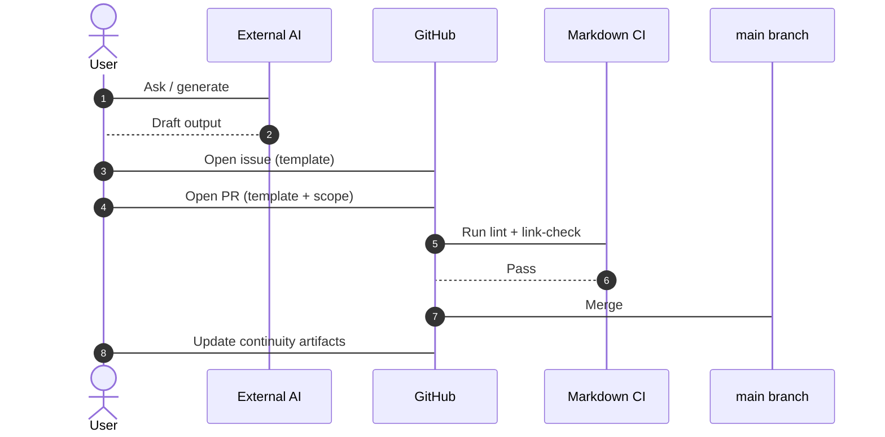

# Framework Continuity and Memory

This is the framework's **continuity anchor**: the durable record of why the framework exists,
the principles that must not be eroded, and the rules future contributors and agents follow so
the operating model survives across sessions, people, and tools. When you need to know what is
non-negotiable here — or you are resuming work and need to recover context — start in this
document.

New to the project? Read [How Brain Factory works](how-brain-factory-works.md) for a
five-minute tour first, then use this anchor for the durable rules. The
[glossary](glossary.md) defines the recurring terms.

## Diagram

How an external AI output (a chat transcript, agent suggestion, or ad-hoc idea) becomes a durable GitHub artifact — the "GitHub as system of record" principle in action.

## Repository purpose and continuity intent

This is a practical framework for AI-assisted software delivery, redevelopment, governance, support routing, and mixed human/agent execution, with GitHub as the durable control plane — the coordination layer where issues, PRs, docs, and history hold execution authority.

It exists to preserve a working model teams can actually operate, not a set of disconnected documentation pages. The goal is to keep delivery, support, discovery, governance, and follow-up work connected through durable GitHub artifacts.

## Non-negotiable framework principles

- GitHub artifacts are the system of record for execution.
- Prompts should not live only in chat.
- External AI outputs must be normalized into GitHub artifacts before implementation.
- Pull requests are the main control gate for changes.
- Handoffs must preserve objective, context, constraints, acceptance criteria, validation, and next owner.
- Security-sensitive findings must follow private reporting paths; durable public artifacts must stay sanitized.
- Support and product signals should feed backlog, docs, governance, and improvement loops.
- Framework effectiveness should be reviewed on a recurring cadence using lightweight, artifact-backed metrics.
- Framework lifecycle changes should use explicit release/version/deprecation semantics so adopters can absorb updates predictably.
- Meaningful framework changes should be summarized in durable release-note/upgrade-summary artifacts with clear adopter action levels.
- Automation and check/workflow enablement should be selected through profile-aware, maturity-aware bundles rather than ad hoc accumulation.
- Setup application should start from a durable intent contract so prompt-driven setup is explainable, repeatable, and auditable.
- Adoption readiness should be assessed with a lightweight, profile-aware checklist that supports intentional deferrals and avoids compliance theater.
- GitHub Mobile is a coordination surface, not a deep implementation surface.
- Branches and PRs should remain bounded and be cleaned up after completion.
- The framework must not regress into undocumented, chat-only, or single-surface execution patterns.

## Framework scope to preserve

The framework supports:

- VS Code Copilot local workflows
- GitHub Copilot / GitHub-hosted / cloud workflows
- GH CLI participation
- GitHub Mobile participation
- external AI agents such as Claude Code
- hybrid workflows across those surfaces
- GitHub Projects as an operational layer
- GitHub Projects minimum viable field/status model with durable issue/project/PR/handoff synchronization
- context synchronization from local/private and connector-accessible sources into durable GitHub artifacts
- support, product, redevelopment, discovery, ADR, docs, and improvement work types
- continuous improvement / continuous development loops

## Evolution summary

The repository deliberately evolved from a narrow, repository-local agent model into a broader multi-surface framework, because real-world work did not stay inside one tool, one device, or one agent mode.

The framework now preserves a broader operating model in which discovery, planning, implementation, review, support handling, governance, and follow-up can move across local tools, GitHub-native tools, mobile workflows, CLI flows, and external AI-assisted synthesis while still being anchored in durable GitHub artifacts.

Future contributors should preserve that broader model rather than simplifying the repository back into a narrower single-agent or chat-dependent pattern.

## Portability and adaptation expectation

This framework is intended to be reused across repositories and teams, but
adoption must preserve the core contract in this document.

When transplanting the framework:

- keep invariants (GitHub artifacts as system of record, normalized context,
  bounded PRs, durable handoffs, repeatable governance)
- classify artifacts as essential/recommended/optional before copying
- adapt repo-specific assumptions explicitly (labels, project fields, owner
  handles, workflow names, index paths)
- adopt incrementally in bounded PRs rather than one bulk import

Use [`docs/framework-portability-and-adoption.md`](framework-portability-and-adoption.md)
as the portability layer for that process.
Use [`docs/framework-starter-kit.md`](framework-starter-kit.md) as the practical
minimum bootstrap layer when starting adoption in a new repository.

## Future contributor and future agent rules

- Prefer incremental improvements over broad rewrites.
- Preserve terminology consistency across docs, templates, and examples.
- Update templates and examples when adding new concepts.
- Maintain cross-links and onboarding paths so discovery remains easy.
- Do not introduce chat-only execution patterns.
- Do not treat private memory, private notes, or agent transcript history as the execution system of record.
- Do not disclose secrets, credentials, or exploit detail in public GitHub artifacts.
- Any new surface or workflow must be connected to governance, projects, normalization, examples, and handoff rules.
- If a new work type, execution mode, or operating path is introduced, update the surrounding framework so it remains coherent rather than partially documented.
- If changes affect how teams actually operate, ensure README discoverability, issue templates, PR templates, and example flows stay aligned.
- If metrics or review criteria change, update the scorecard template and cross-links so the feedback loop stays reusable.
- Keep major remaining framework-completion work queued in a durable in-repo roadmap artifact rather than chat-only lists.
- Keep continuity state in a structured snapshot artifact so lifecycle/setup/readiness/work/queue/handoff/next-action posture is quickly inspectable.
- Keep continuity artifacts searchable by maintaining lightweight continuity index pointers (latest snapshot/handoff/readiness/queue links) in active issue/PR artifacts.
- Keep queue state machine-readable in `.github/framework-task-queue.json` so merge-triggered preparation can continue after context loss.
- Keep a durable in-repo major-prompt library current so next execution packets do not depend on chat-only prompt recall.
- Keep queue schema, issue-backed linkage semantics (`issue_backed_queue_model`), and drift-recovery governance aligned with `docs/framework-queued-execution-memory.md`.
- If framework expectations materially change, classify impact (`PATCH`/`MINOR`/`MAJOR`) and capture release/deprecation communication in durable artifacts.
- Ensure release summaries include compatibility signal, migration burden, and required operator action so future sessions do not need chat reconstruction for upgrade decisions.
- Govern framework component lifecycle events (introduce/change/deprecate/remove docs/templates/scripts/workflows) with explicit notice, replacement path, owner responsibility, and writeback using `docs/framework-change-governance-and-deprecation-policy.md`.
- Keep the release-notes index current so upgrade-relevant context is not lost in PR history.
- If automation/check/workflow recommendations change, keep bundle guidance and profile/maturity cross-links aligned.
- If readiness criteria evolve, keep readiness guidance aligned with starter/adoption/profile/automation/release/governance references and keep it lightweight.
- If adoption worked examples become stale relative to the framework guidance they reference, update them before they create misleading precedents.

## Lightweight maintenance checklist

Before changing the framework, confirm:

- [ ] The change preserves GitHub artifacts as the execution system of record.
- [ ] New prompts, decisions, or flows are captured in durable repository artifacts.
- [ ] Templates, examples, and cross-links were updated if scope or terminology changed.
- [ ] Project, governance, and handoff implications were addressed.
- [ ] Effectiveness review expectations (signals, cadence, scorecard writeback) remain clear and actionable.
- [ ] Branch and PR scope remain bounded, reviewable, and cleanly closable.
- [ ] The change does not reintroduce undocumented or chat-only execution dependencies.
- [ ] README and related docs still make the framework discoverable for future contributors.
- [ ] Security-sensitive intake/routing and redaction guardrails were preserved.
- [ ] Lifecycle impact and deprecation handling are explicit when framework expectations change (see release/versioning model).
- [ ] Release-note / upgrade-summary writeback is captured and indexed for meaningful framework changes.
- [ ] Compatibility signal, migration burden, and required operator action are explicit in meaningful release summaries.
- [ ] Readiness guidance remains profile-aware, maturity-aware, and deferral-friendly (no rigid all-or-nothing scoring).

## Mobile quick action

- **Use when:** you need a quick continuity check before approving or closing framework work from GitHub Mobile.
- **Do from mobile:**
  - Confirm the core principles still match the current issue or PR scope.
  - Verify links to operating, governance, and health docs are still present.
  - Leave a continuity-risk comment if required context is missing.
- **Do not do from mobile:**
  - Rewrite continuity charter sections.
  - Perform broad cross-document wording rewrites.
- **Escalate to desktop/cloud when:**
  - The change alters framework principles or scope boundaries.
  - Multiple docs must be edited together to preserve consistency.
- **Primary artifact to update:**
  - The linked framework issue or pull request with a continuity decision note.

## Last session / resume point (2026-05-26, queue reconciliation + Copilot firewall guidance writeback)

- **Multiple queue-backed tasks were launched and merged in close succession.**
  - During this run, several dependency-ready queued tasks were prepared/executed/merged back-to-back.
  - Continuation must rely on durable queue + issue + PR artifacts, not chat ordering memory.
- **Observed drift root cause was explicit queue writeback lag.**
  - Prepared issues were re-created because completed tasks were still marked non-terminal in
    [`.github/framework-task-queue.json`](https://github.com/izakl/brainforge/blob/main/.github/framework-task-queue.json) instead of `done`.
  - This caused repeated next-task preparation for already-completed work.
- **Queue-state correction has already been merged.**
  - A bounded queue-fix PR was merged to reconcile stale queue task state and stop duplicate prepared-issue recreation.
  - Post-merge closeout expectation remains: every completed queue-backed implementation must be written back durably.
- **Copilot coding agent firewall/API warnings were repeatedly observed and are now a reusable framework concern.**
  - Agent runs reported blocked calls to `api.github.com/graphql` and issue endpoints.
  - Durable guidance now documents mitigation choices: allowlist `api.github.com` when live API checks are required, use pre-firewall Actions setup steps for prerequisites, and keep scripts/checks deterministic with manual reconciliation fallback when live API access is blocked.
  - Primary guidance surfaces: [`docs/gh-agents-and-automation.md`](gh-agents-and-automation.md),
    [`docs/framework-queued-execution-memory.md`](framework-queued-execution-memory.md), and
    [`docs/runbooks/operate-framework-task-queue.md`](runbooks/operate-framework-task-queue.md).
- **Next work should be resumed from durable artifacts, not this chat transcript.**
  - Use [`.github/framework-task-queue.json`](https://github.com/izakl/brainforge/blob/main/.github/framework-task-queue.json),
    [`docs/framework-roadmap-next-prompts.md`](framework-roadmap-next-prompts.md), open issues, and merged PR history as the source of truth.
  - Treat prior suggested next tasks as guidance only until confirmed against current queue state.

## Last session / resume point (2026-05-25, framework readiness checklist added)

- **Lightweight framework-readiness assessment is now explicit.**
  - Added a new canonical readiness surface:
    [`docs/framework-readiness-checklist.md`](framework-readiness-checklist.md),
    with baseline/recommended/advanced signals, practical self-assessment usage,
    and explicit deferral/exception handling.
  - Updated discoverability cross-links in entrypoint/adoption/onboarding docs:
    `README.md`, `docs/README.md`, `AGENTS.md`,
    `docs/operator-onboarding-pack.md`, `docs/framework-starter-kit.md`,
    `docs/framework-portability-and-adoption.md`,
    `docs/framework-adoption-maturity-model.md`,
    `docs/framework-profile-packs.md`,
    `docs/framework-automation-bundles-by-profile.md`.
  - Updated [`docs/framework-health.md`](framework-health.md) to treat readiness
    as a first-class reusable framework layer.
- **Next operator action:** during adoption and periodic reviews, use the
  readiness checklist to capture `Adopt now` / `Defer` / `Not applicable`
  decisions with durable follow-up links instead of implicit assumptions.

## Last session / resume point (2026-05-25, release-summary packet hardening)

- **Release-summary durability is now explicit.**
  - Added in-repo release summary packet path convention:
    `docs/release-notes/YYYY-MM-DD-<slug>.md` in
    [`framework-release-notes-and-upgrade-summaries.md`](framework-release-notes-and-upgrade-summaries.md).
  - Added a concrete release-summary packet:
    [`docs/release-notes/2026-05-25-release-notes-upgrade-summary-model.md`](release-notes/2026-05-25-release-notes-upgrade-summary-model.md).
  - Updated the release-notes index row to link a durable packet instead of
    PR-only context in [`framework-release-notes.md`](framework-release-notes.md).
  - Marked the release-notes/upgrade-summary prompt as completed in
    [`framework-next-monster-prompts.md`](framework-next-monster-prompts.md).
- **Next operator action:** publish future meaningful framework-change summaries as
  indexed release-note packets and keep action-level/applicability fields explicit.

## Last session / resume point (2026-05-25, automation bundle guidance hardened with guardrails)

- **Automation bundle guidance is now fully aligned with profile, maturity, and least-privilege principles.**
  - Updated [`docs/framework-automation-bundles-by-profile.md`](framework-automation-bundles-by-profile.md):
    - Bundle model renamed from `minimum → recommended → later` to
      `minimum → recommended → deferred` to make deferral intent explicit.
    - Added **advance criteria** to each bundle (conditions for moving from
      minimum to recommended, and from recommended to deferred).
    - Added **per-bundle operator runbook linkage** — each bundle now links
      the specific runbooks needed to operate its components.
    - Added **Least-privilege enablement guardrails** section with six explicit
      rules: prerequisite inventory confirmation, scoped triggers, queue-governance
      prerequisite for queue automation, one-layer-per-PR discipline, no-bypass rule,
      and local dry-run expectation for queue-operations changes.
    - Added **Deferred automation registry** section with a template issue format
      for capturing deferred items with rationale, enablement criteria, review
      trigger, and owner.
    - Updated **Profile + maturity chooser** table column header from "Delay until"
      to "Defer until" for consistency.
  - Updated [`.github/framework-task-queue.json`](https://github.com/izakl/brainforge/blob/main/.github/framework-task-queue.json):
    - `template-harmonization-pass` and `reporting-summary-templates` marked `done`.
    - `automation-bundles-by-profile` marked `in_progress`.
    - `adoption-examples-expansion` unblocked to `pending`.
    - `related_docs` for `automation-bundles-by-profile` now includes the primary doc.
  - Updated [`docs/framework-roadmap-next-prompts.md`](framework-roadmap-next-prompts.md)
    ordered queue summary to reflect current task statuses.
- **Automation boundary remains explicit:** bundle guidance covers staged adoption of
  existing checks/workflows — not autonomous delivery automation or new workflow creation.
- **Next operator action:** when starting adoption or transplant work, choose one primary
  bundle, capture all deferred items using the registry format, and record
  `minimum`/`recommended`/`deferred` decisions in the adoption issue.

## Last session / resume point (2026-05-25, queued-execution-memory formalization)

- **Queued execution memory is now explicit.**
  - New canonical model: [`docs/framework-queued-execution-memory.md`](framework-queued-execution-memory.md) —
    queue entry schema, prompt-ready task expectations, issue/PR linkage model, state transitions
    (including `superseded`), governance rules, and drift-recovery workflow.
  - Queue schema metadata updated in [`.github/framework-task-queue.json`](https://github.com/izakl/brainforge/blob/main/.github/framework-task-queue.json)
    (`schema_reference`, expanded `status_model`).
  - Queue validation guardrail updated in
    [`scripts/check-framework-task-queue.sh`](https://github.com/izakl/brainforge/blob/main/scripts/check-framework-task-queue.sh) —
    validates richer required task fields and top-level queue schema metadata.
  - Queue and governance cross-links aligned in: `README.md`, `AGENTS.md`, `docs/README.md`,
    `docs/framework-roadmap-next-prompts.md`, `docs/runbooks/operate-framework-task-queue.md`,
    `docs/governance-checklist.md`, `docs/framework-health.md`, `docs/operating-model.md`.
- **Automation boundary remains unchanged:** merge-triggered automation prepares issues only; humans
  still own queue transitions, implementation, review, and merge approval.
- **Next operator action:** If queue state drifts from issue/PR truth, run queue reconciliation
  through a bounded maintenance PR and re-run `prepare-next-framework-task.yml` if needed.

## Last session / resume point (2026-05-25, automation bundles by profile layer)

- **Automation bundle-selection gap is now closed.**
  - New guide: [`docs/framework-automation-bundles-by-profile.md`](framework-automation-bundles-by-profile.md) —
    high-signal bundle model across profile contexts, baseline vs recommended vs
    advanced/situational automation distinctions, comparison matrix, staged
    enablement sequence, and practical defer guidance.
  - Cross-links aligned in: `README.md`, `AGENTS.md`, `docs/README.md`,
    `docs/framework-profile-packs.md`, `docs/framework-starter-kit.md`,
    `docs/framework-adoption-maturity-model.md`,
    `docs/framework-portability-and-adoption.md`,
    `docs/framework-reporting-and-review-cadence.md`,
    `docs/operator-onboarding-pack.md`, `docs/work-type-matrix.md`,
    `docs/framework-health.md`, and this continuity anchor.
- **Automation boundary remains explicit:** this framework stays governance-first;
  bundle guidance helps staged adoption of existing automation, not a shift to
  autonomous code-delivery automation.
- **Next operator action:** when starting adoption/transplant work, choose one
  primary automation bundle and record deferred items as bounded follow-up issues.

## Last session / resume point (2026-05-25, merge-driven task queue preparation layer)

- **Durable merge-driven task queue layer added.** Next framework task preparation no longer depends on chat memory alone.
  - New queue artifact: [`.github/framework-task-queue.json`](https://github.com/izakl/brainforge/blob/main/.github/framework-task-queue.json) —
    ordered tasks with explicit state (`blocked`/`pending`/`in_progress`/`done`), dependencies,
    suggested prompts, and continuity/health writeback expectations.
  - New merge-triggered workflow:
    [`.github/workflows/prepare-next-framework-task.yml`](https://github.com/izakl/brainforge/blob/main/.github/workflows/prepare-next-framework-task.yml) —
    after each merge to `main`, prepares one next-task issue from the dependency-ready `pending`
    queue item; skips creation if that queue task already has an open prepared issue.
  - New queue validation script:
    [`scripts/check-framework-task-queue.sh`](https://github.com/izakl/brainforge/blob/main/scripts/check-framework-task-queue.sh) —
    validates queue schema, dependency references, and deterministic next-task readiness.
  - New operations runbook:
    [`docs/runbooks/operate-framework-task-queue.md`](runbooks/operate-framework-task-queue.md) —
    queue state transitions, recovery workflow, and automation boundary guidance.
  - Roadmap and discoverability updates: `docs/framework-roadmap-next-prompts.md`, `README.md`,
    `docs/README.md`, `AGENTS.md`, `docs/framework-health.md`, `docs/github-mobile-guide.md`.
- **Automation boundary remains explicit:** preparation is automated; queue state transitions,
  implementation execution, PR review, and merges remain human-in-the-loop.
- **Next operator action:** After each queue-changing merge, confirm the latest
  `Prepare Next Framework Task` workflow run and validate that the prepared issue matches the
  next dependency-ready queue item.

## Last session / resume point (2026-05-25, starter-kit bootstrap layer)

- **Starter-kit bootstrap layer added.** Framework adoption now has a practical,
  copy-ready minimum path that reduces first-use setup guesswork.
  - New guide: [`docs/framework-starter-kit.md`](framework-starter-kit.md) —
    essential/recommended/optional inventory, copy/adapt/customize matrix,
    minimum bootstrap checklist, first-hour/day/week path, and profile-aware
    bootstrap guidance.
  - Cross-links updated in: `README.md`, `docs/README.md`, `AGENTS.md`,
    `docs/framework-portability-and-adoption.md`,
    `docs/framework-profile-packs.md`,
    `docs/framework-roadmap-next-prompts.md`,
    `docs/framework-health.md`, and `docs/github-mobile-guide.md`.
  - Roadmap writeback: starter-kit queue item marked as completed milestone.
  - Validation expectation: markdownlint + framework check scripts + changed-file
    markdown link checks.
- **Next operator action:** Use the starter kit as the default first artifact when
  opening a framework adoption issue for another repository.

## Last session / resume point (2026-05-25, metrics and feedback-loop layer)

- **Metrics and feedback-loop layer added.** Framework effectiveness now has a
  lightweight, reusable measurement model tied to GitHub-visible artifacts.
  - New guide: [`docs/framework-metrics-and-feedback.md`](framework-metrics-and-feedback.md)
    — leading/lagging/guardrail signal model, goals-to-signals matrix, anti-vanity
    guidance, review cadence, and writeback pattern.
  - New reusable artifact:
    [`docs/framework-effectiveness-scorecard-template.md`](framework-effectiveness-scorecard-template.md)
    — recurring review packet template with evidence links, trend directions, top findings,
    and follow-up actions.
  - Cross-links updated in: `README.md`, `docs/README.md`, `AGENTS.md`,
    `docs/operating-model.md`, `docs/product-support-and-improvement-loop.md`,
    `docs/github-projects-setup.md`, `docs/governance-checklist.md`,
    `docs/framework-health.md`, and `docs/framework-portability-and-adoption.md`.
  - All validation scripts pass: markdownlint, link-check (changed files), SVG
    companions, mobile quick-action coverage, handoff packet, security guardrails,
    and index parity.
- **Next operator action:** Run one monthly effectiveness review packet using the
  new scorecard template and open one issue per actionable finding.

## Last session / resume point (2026-05-25, reporting summary templates layer)

- **Compact reporting summary templates added.** Weekly hygiene and quarterly
  adoption/portability writebacks now have concise reusable packet templates
  aligned to existing cadence and metrics guidance.
  - New reusable artifact:
    [`docs/framework-weekly-hygiene-summary-template.md`](framework-weekly-hygiene-summary-template.md)
    — compact weekly hygiene packet for stale-branch/PR/project/support-routing
    drift checks.
  - New reusable artifact:
    [`docs/framework-quarterly-adoption-portability-summary-template.md`](framework-quarterly-adoption-portability-summary-template.md)
    — compact quarterly adoption/portability packet for maturity, invariants,
    and portability gap writebacks.
  - Storage guidance clarified in
    [`docs/framework-reporting-and-review-cadence.md`](framework-reporting-and-review-cadence.md)
    under completed packet location conventions.
  - Cross-links updated in: `README.md`, `docs/README.md`, `AGENTS.md`,
    `docs/framework-metrics-and-feedback.md`, and `docs/framework-health.md`.
- **Next operator action:** Run the next weekly hygiene and quarterly
  adoption/portability reviews using the new concise templates and link one
  issue per actionable finding.

## Last session / resume point (2026-05-25, continuous-checks layer)

- **Continuous-checks layer added.** Three recurring manual audit items are now CI-enforced,
  and a consolidated scheduled framework-audit workflow has been introduced.
  - New script: [`scripts/check-index-parity.sh`](https://github.com/izakl/brainforge/blob/main/scripts/check-index-parity.sh) — verifies
    that ADR index, runbooks index, and examples index stay in sync with their directories. Runs
    on PRs that touch the script/workflow and monthly via the scheduled workflow.
  - New workflow: [`.github/workflows/framework-audit.yml`](https://github.com/izakl/brainforge/blob/main/.github/workflows/framework-audit.yml)
    — runs all five framework check scripts as parallel jobs on a monthly schedule and on
    `workflow_dispatch`. Provides a one-click full-framework audit surface.
  - New ADR: [`docs/adr/0016-continuous-checks-layer.md`](adr/0016-continuous-checks-layer.md) —
    decision record for the continuous-checks model, including the automated vs manual
    distinction.
  - Updated: `docs/framework-health.md` — new "Automated vs manual checks" table, updated
    charter-to-artifact map, updated operational hygiene checks, updated ADR log, updated snapshot.
  - Updated: `docs/governance-checklist.md` — index parity check item added.
  - Updated: `docs/runbooks/run-the-framework-health-audit.md` — framework-audit workflow now
    cited as the first step of each monthly audit pass.
  - Updated: `AGENTS.md` — `check-index-parity.sh` and framework-audit workflow now cited in
    the validation section.
  - Updated: `docs/adr/README.md` and `docs/README.md` — ADR 0016 indexed.
  - All validation scripts pass: markdownlint, link-check, SVG companions, mobile quick-action
    coverage, handoff packet, index parity, security guardrails.
- **Next operator action:** No immediate action required. Trigger `framework-audit.yml` via
  `workflow_dispatch` to verify the scheduled workflow runs cleanly on the current main branch.
- Suggested next session entry points (no commitments):
  - Execute the stale-branch first live workflow run (`dry_run: false`) if not yet done.
  - After cleanup, update the health snapshot with the final branch count.
  - Re-open ADR 0014 only if a consumer team explicitly requires deployment/infrastructure governance coverage.

## Last session / resume point (2026-05-25, AGENTS.md entrypoint)

- **AGENTS.md entrypoint added.** Root-level `AGENTS.md` created as the operational front door
  for coding agents and new contributors.
  - New file: [`AGENTS.md`](https://github.com/izakl/brainforge/blob/main/AGENTS.md) — minimum operating contract: non-negotiable rules,
    how to start work safely, durable artifact expectations, handoff packet expectations,
    validation commands, escalation routing, and key references.
  - Cross-links added in: `README.md` (Start here section), `docs/README.md` (entrypoint note).
  - `docs/framework-health.md`: AGENTS.md added to charter-to-artifact map; snapshot and
    operational hygiene table updated.
  - `docs/github-mobile-guide.md`: AGENTS.md added as Skip in mobile quick-action coverage table.
  - `.github/labeler.yml`: AGENTS.md added to the `docs` label pattern.
  - All validation scripts pass: markdownlint, link-check, SVG companions,
    mobile quick-action coverage, handoff packet.
- **Next operator action:** No immediate action required. AGENTS.md is now the recommended
  first-read for any agent or new contributor entering the repository.
- Suggested next session entry points (no commitments):
  - Execute the stale-branch first live workflow run (`dry_run: false`) if not yet done.
  - After cleanup, update the health snapshot with the final branch count.
  - Start a bounded improvement arc using the handoff packet template as the kickoff artifact.
  - Re-open ADR 0014 only if a consumer team explicitly requires deployment/infrastructure governance coverage.
- **Prior session (2026-05-25, external-context normalization example):** The gap between the three-tier
  context model description and a concrete end-to-end trace is now closed.
  - New example: [`examples/worked-example-external-context-normalization.md`](https://github.com/izakl/brainforge/blob/main/examples/worked-example-external-context-normalization.md)
    — traces a realistic session-timeout scenario from Tier 1 local notes through Tier 2
    synthesis to a normalized GitHub issue, implementation PR, and durable writeback.
  - Cross-links added in: `docs/context-synchronization.md`, `docs/README.md`,
    `examples/README.md`, `docs/github-mobile-guide.md` (mobile quick-action coverage),
    `docs/diagrams/README.md`.
  - All validation scripts pass: markdownlint, link-check, SVG companions,
    mobile quick-action coverage, handoff packet.
- **Prior session (2026-05-25, handoff packet enforcement):** Canonical template, issue
  template, enforcement script, CI workflow, and governance updates all merged.
  - Canonical template: [`docs/handoff-packet-template.md`](handoff-packet-template.md) — nine required fields.
  - Issue template: [`.github/ISSUE_TEMPLATE/handoff-packet.yml`](https://github.com/izakl/brainforge/blob/main/.github/ISSUE_TEMPLATE/handoff-packet.yml).
  - Enforcement script: [`scripts/check-handoff-packet.sh`](https://github.com/izakl/brainforge/blob/main/scripts/check-handoff-packet.sh) — reads inventory from playbook and verifies all required fields in Expected files.
  - CI workflow: [`.github/workflows/check-handoff-packet.yml`](https://github.com/izakl/brainforge/blob/main/.github/workflows/check-handoff-packet.yml).
  - ADR: [`docs/adr/0015-handoff-packet-enforcement.md`](adr/0015-handoff-packet-enforcement.md).
  - Inventory: `## Handoff packet coverage` table in [`docs/multi-agent-handoff-playbook.md`](multi-agent-handoff-playbook.md).
  - Handoff completeness is now CI-enforced, not purely advisory.
- **Prior session (2026-05-25, stale-branch hygiene first pass):** Branch inventory: 92 pre-existing `copilot/*` branches with no open PRs. Workflow fixed, runbook enhanced, branching guidance updated. Workflow ready for first execution via `workflow_dispatch`.
- **Validation baseline is green:** `npx -y markdownlint-cli2`, `scripts/check-svg-companions.sh`, `scripts/check-mobile-quick-action.sh`, and `scripts/check-handoff-packet.sh` all pass locally.
- **Next operator action:** Create a handoff issue using the new issue template when starting the next bounded work arc. Trigger stale-branch cleanup via `workflow_dispatch` if not yet done.
- Suggested next session entry points (no commitments):
  - Execute the stale-branch first live workflow run (`dry_run: false`) and confirm 90+ branches are cleaned up.
  - After cleanup, update the health snapshot with the final branch count.
  - Start a bounded improvement arc using the new handoff packet template as the kickoff artifact.
  - Re-open ADR 0014 only if a consumer team explicitly requires deployment/infrastructure governance coverage.

## Related docs

- [Operator onboarding pack](operator-onboarding-pack.md) — practical first-day/first-week route through core framework operations.
- [Operating model](operating-model.md) — how the framework runs day-to-day.
- [GitHub Projects setup](github-projects-setup.md) — minimum viable projects model and durable state synchronization guidance.
- [Framework portability and adoption](framework-portability-and-adoption.md) — how to adopt this framework incrementally in another repository/team.
- [Framework starter kit / bootstrap pack](framework-starter-kit.md) — practical minimum viable file set and transplant guidance for adoption.
- [Framework automation bundles by profile](framework-automation-bundles-by-profile.md) — profile-aware, maturity-aware automation/check/workflow bundle guidance.
- [Framework setup intent schema and application model](framework-setup-intent-schema-and-application-model.md) — durable setup contract for setup intent inputs, profile/default mapping, expected outputs, and ready-to-work criteria.
- [Framework metrics and feedback loop](framework-metrics-and-feedback.md) — lightweight signal model and recurring effectiveness review cadence.
- [Framework reporting and review cadence](framework-reporting-and-review-cadence.md) — practical rhythm and writeback guidance for recurring framework reviews.
- [Framework weekly hygiene summary template](framework-weekly-hygiene-summary-template.md) — concise reusable weekly hygiene writeback packet.
- [Framework quarterly adoption and portability summary template](framework-quarterly-adoption-portability-summary-template.md) — concise reusable quarterly adoption/portability writeback packet.
- [Framework roadmap: next GitHub agent prompts](framework-roadmap-next-prompts.md) — durable execution queue of next major bounded framework-completion tasks.
- [Framework prompt library and execution queue](framework-prompt-library.md) — curated major reusable prompt packets with execution order, dependency context, and bounded-scope guidance.
- [Framework continuity snapshot template](framework-continuity-snapshot-template.md) — structured continuity snapshot format for explicit handoff/resume posture.
- [Framework release/versioning/deprecation model](framework-release-versioning-and-deprecation.md) — lightweight lifecycle semantics for change impact, release communication, and deprecation handling.
- [Framework change governance and deprecation policy](framework-change-governance-and-deprecation-policy.md) — canonical governance policy for framework component lifecycle events and writeback expectations.
- [Framework queued execution memory](framework-queued-execution-memory.md) — canonical queue-entry schema, issue/PR linkage, state model, and drift-recovery governance.
- [GH agents and automation](gh-agents-and-automation.md) — execution-surface guardrails, including Copilot coding agent firewall/API-access constraints and mitigation paths.
- [Operate the framework task queue](runbooks/operate-framework-task-queue.md) — queue maintenance, merge-triggered preparation checks, and recovery steps.
- [Run the queue health check](runbooks/run-queue-health-check.md) — bounded queue audit/reconciliation workflow covering queue↔issue↔PR↔automation alignment and continuity writeback after drift recovery.
- [Create continuity snapshot](runbooks/create-continuity-snapshot.md) — when/how to create or refresh a structured continuity snapshot during handoff/resume.
- [Product support and improvement loop](product-support-and-improvement-loop.md) — how signals flow back into the framework.
- [Security and secure delivery guardrails](security-and-secure-delivery.md) — security-sensitive intake, routing, and execution guardrails.
- [Branching and cleanup](branching-and-cleanup.md) — branch lifecycle and stale-branch handling.
- [Governance checklist](governance-checklist.md) — periodic audit items.
- [Framework health](framework-health.md) — current snapshot and charter-to-artifact map.
