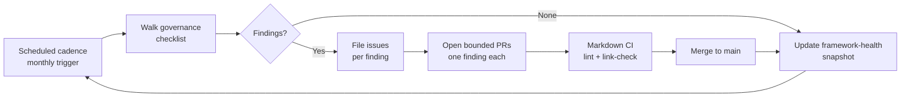

# Governance Checklist

A recurring audit checklist for keeping delivery — by humans and AI agents alike —
practical, reviewable, and anchored in GitHub. Run it on the cadence described
under [Review cadence](#review-cadence). New to the project? See
[How Brain Factory works](how-brain-factory-works.md) first.

Repository review ownership is defined in [`.github/CODEOWNERS`](../.github/CODEOWNERS).
Use it when assigning reviewers and validating approval routing.

## Diagram

The audit as a closed loop: a scheduled trigger drives a walk through this checklist, findings become pull requests, merges update the framework-health snapshot, and the next cycle begins.

> 📐 Hi-res view: [SVG](diagrams/governance-checklist.svg)

## 1) Human-in-the-loop checkpoints

- [ ] A human owner is assigned before implementation starts
- [ ] A human reviewer/approver is identified before merge
- [ ] Risky or ambiguous work has explicit human decision checkpoints
- [ ] Final merge approval remains with maintainers

## 2) Artifact readiness and normalization

- [ ] Work starts from a durable GitHub artifact (issue/discussion/ADR), not chat-only context
- [ ] External context (local files, Drive, OneDrive, connector sources, external AI output) is normalized into GitHub artifacts before implementation
- [ ] Issue includes objective, context, constraints, acceptance criteria, and validation
- [ ] For framework adoption/transplant work, core invariants vs customizable elements are explicitly documented (see [`framework-portability-and-adoption.md`](framework-portability-and-adoption.md))
- [ ] Relevant links are preserved (issue ↔ PR ↔ ADR ↔ discussion ↔ project)
- [ ] Diagrams — Every priority doc listed in [`docs/visual-diagrams-plan.md`](visual-diagrams-plan.md) still carries a current `## Diagram` section per [ADR 0010](adr/0010-diagrams-convention.md); update or remove diagrams whose underlying flow has changed and record the result in the "Diagrams in sync" row of [`docs/framework-health.md`](framework-health.md)
- [ ] SVG companions — Every doc listed in [`docs/diagrams/README.md`](diagrams/README.md) still has a `## Diagram` Mermaid block and a matching SVG that mirrors it, per [ADR 0012](adr/0012-svg-companions-for-diagrams.md). Regenerate any SVG whose source Mermaid block has changed; record the result in the "SVG companions in sync" row of [`docs/framework-health.md`](framework-health.md)
- [ ] Mobile quick action — New or changed operator-facing docs include a `## Mobile quick action` section when applicable, per [ADR 0013](adr/0013-mobile-quick-action-convention.md)
- [ ] Handoff packet — Handoff-facing canonical docs include all nine required fields (Objective, Context, Constraints, Acceptance criteria, Validation expectations, Related artifacts, Next owner, Status, Unresolved risks), per [ADR 0015](adr/0015-handoff-packet-enforcement.md); enforce via `scripts/check-handoff-packet.sh`
- [ ] Index parity — ADR index, runbooks index, and examples index are in sync with their directories, per [ADR 0016](adr/0016-continuous-checks-layer.md); enforce via `scripts/check-index-parity.sh` (also runs monthly via `framework-audit.yml`)
- [ ] Framework task queue state remains durable and deterministic in `.github/framework-task-queue.json`; merge-triggered prep remains issue-preparation only (no autonomous PR chaining)
- [ ] Queue entries follow the canonical queued-execution-memory schema and linkage model in [`framework-queued-execution-memory.md`](framework-queued-execution-memory.md) (stable queue id marker, issue↔PR linkage, durable supersession rationale)
- [ ] Queue issue-linkage expectations in `.github/framework-task-queue.json` (`issue_backed_queue_model`) are honored (`blocked`/`pending` may be issue-less; `in_progress`/`done`/`superseded` remain issue-backed and traceable)
- [ ] Queue drift is reconciled to durable issue/PR/merge truth in a bounded queue-maintenance PR before further queued execution
- [ ] Queue health and drift signals are clean — `bash scripts/check-queue-health.sh` passes with no errors; any warnings are reviewed and resolved or acknowledged
- [ ] Framework lifecycle-impact classification (`PATCH`/`MINOR`/`MAJOR`) is explicit for meaningful framework changes (see [`framework-release-versioning-and-deprecation.md`](framework-release-versioning-and-deprecation.md))
- [ ] Framework component lifecycle changes (introduce/change/deprecate/remove docs/templates/scripts/workflows) follow the canonical governance policy in [`framework-change-governance-and-deprecation-policy.md`](framework-change-governance-and-deprecation-policy.md)
- [ ] Any deprecation includes replacement path, transition notice, and removal target tracking in durable artifacts

## 3) Constraint preservation across handoffs

- [ ] Constraints and non-goals are copied forward during discovery → planning → implementation
- [ ] PR explicitly references source issue constraints
- [ ] Review checks for scope drift against issue/ADR
- [ ] Deferred work is captured as follow-up issues instead of silent scope expansion

## 4) Execution surface routing

- [ ] Execution surface is explicitly selected (VS Code Copilot local / GitHub Copilot Chat/Coding Agent cloud / GH CLI / GitHub Mobile / External AI / Hybrid)
- [ ] Surface choice matches task type and risk
- [ ] Mobile interactions are limited to triage/review/follow-up, not deep implementation
- [ ] External AI usage is limited to discovery/synthesis unless normalized and approved

## 5) Validation gates

- [ ] Required checks are defined before execution begins
- [ ] Validation evidence is captured in PR
- [ ] Security/permission implications were reviewed for changed files/workflows
- [ ] Security routing is explicit (public issue for sanitized hardening vs private advisory for sensitive findings)
- [ ] No secrets, credentials, or sensitive exploit details appear in issues, prompts, docs, handoffs, or PR text
- [ ] Security concerns: see [SECURITY.md](../SECURITY.md) for the private reporting path
- [ ] Dependency and security-alert intake has clear ownership and remediation path
- [ ] Acceptance criteria are re-checked during review before approval

## 6) ADR and decision hygiene

- [ ] ADR proposal is created when decisions are architectural/process-significant
- [ ] ADR includes context, decision, alternatives, and consequences
- [ ] Follow-up obligations from ADR are tracked as issues/project items

## 7) Project tracking and triage quality

- [ ] Work type is classified (defect/enhancement/docs/support/redevelopment/ADR/improvement)
- [ ] Minimum viable project fields are present and used (`Status`, `Work Type`, `Priority`, `Owner`, `Execution Mode`, `Linked PR`, `Needs Follow-up`)
- [ ] Severity/priority/routing fields are set in GitHub Projects
- [ ] Status transitions are kept current from intake to done and match durable artifact evidence
- [ ] Blocked items include clear unblock condition and owner

## 8) Closure and continuous improvement

- [ ] PR closes or links the correct issue(s)
- [ ] Post-merge verification is recorded
- [ ] User/support-facing follow-up communication is captured when applicable
- [ ] Recurring themes are converted into enhancement/improvement/ADR backlog items
- [ ] Latest framework effectiveness review packet captures trends, top findings, and durable follow-up actions

## Review cadence

Run this checklist when:

- templates are changed
- new automation/agents are introduced
- path-based labels are auto-applied via
  [`.github/workflows/labeler.yml`](../.github/workflows/labeler.yml), and weekly
  branching discipline is enforced via
  [`.github/workflows/stale-branches.yml`](../.github/workflows/stale-branches.yml)
- support-to-product routing quality drops
- handoffs show repeated constraint loss or validation gaps

## Mobile quick action

- **Use when:** you need a fast governance pass on an active issue or PR from mobile.
- **Do from mobile:**
  - Check critical checklist rows (artifact readiness, constraints, validation, closure).
  - Flag failed checks in a review or issue comment.
  - Open one follow-up issue per governance finding.
- **Do not do from mobile:**
  - Attempt a full repo-wide governance rewrite.
  - Approve high-risk changes without visible validation evidence.
- **Escalate to desktop/cloud when:**
  - Findings span multiple docs, workflows, or security-sensitive files.
  - Governance gaps require coordinated updates across many artifacts.
- **Primary artifact to update:**
  - The governance finding issue or the active pull request review comment.

## Related docs

- [How Brain Factory works](how-brain-factory-works.md) — five-minute tour for newcomers.
- [Operating model](operating-model.md) — how the framework runs day-to-day.
- [Framework portability and adoption](framework-portability-and-adoption.md) — portability scope, invariants, and safe customization points.
- [Product support and improvement loop](product-support-and-improvement-loop.md) — how signals flow back into the framework.
- [Framework continuity and memory](framework-continuity-and-memory.md) — what the framework remembers across sessions.
- [Framework metrics and feedback loop](framework-metrics-and-feedback.md) — practical indicators and review cadence for framework effectiveness.
- [Framework reporting and review cadence](framework-reporting-and-review-cadence.md) — practical recurring review rhythms, ownership, and writeback patterns.
- [Framework queued execution memory](framework-queued-execution-memory.md) — canonical queue schema, linkage model, and queue-governance guidance.
- [Framework change governance and deprecation policy](framework-change-governance-and-deprecation-policy.md) — canonical rules for introducing, changing, deprecating, and retiring framework components.
- [Framework release/versioning/deprecation model](framework-release-versioning-and-deprecation.md) — lifecycle impact classification, release communication, and deprecation handling.
- [Security and secure delivery guardrails](security-and-secure-delivery.md) — security-sensitive intake and secure-delivery checks.
- [Branching and cleanup](branching-and-cleanup.md) — branch lifecycle and stale-branch handling.
- [Framework health](framework-health.md) — current snapshot and charter-to-artifact map.
