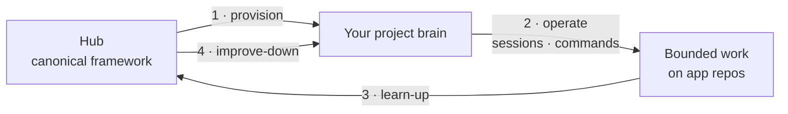

# Brain Factory: how it works

A five-minute, plain-language tour of the whole system. For the formal model,
see the [Brain Factory architecture](framework-brain-factory-architecture.md).

## The one-paragraph version

**Brain Factory is a hub.** From it, you create a small companion repository —
a **brain** — for each project you work on. The brain carries a shared,
upgradeable **core** (governance, continuity, quality, and a set of agent
commands) plus your own project-specific **extensions**. As you work, the brain
proposes improvements back up to the hub (**learn-up**); as the hub improves,
those upgrades flow back down into every brain (**improve-down**). GitHub is the
durable system of record throughout.

## Diagram

The lifecycle in four steps: the hub provisions your brain, the brain operates
on your app repos, learnings flow up, and upgrades flow back down.

> 📐 Hi-res view: [SVG](diagrams/how-brain-factory-works.svg)

## The three things to understand

### 1. Hub vs. brain

- The **hub** is this repository. It is the canonical source: the brain
  template, the core command catalog, the onboarding engine, and the registry.
  You generally do not run projects *in* the hub.
- A **brain** is a separate, per-project repository created from the hub's
  template. It is where day-to-day work is coordinated. A brain is portable: it
  carries its own copy of the core layer and works without a live connection to
  the hub.

### 2. Core vs. extensions

Every brain holds two kinds of content, separated by `brain.manifest.json`:

- **Core layer** — owned by the hub and kept up to date by the down-sync. You
  get fixes and new capabilities without re-doing setup.
- **Extension layer** — owned by your project and **never overwritten** by an
  upgrade. This is where project-specific commands and plans live.

### 3. The two-way improvement loop

- **Learn-up:** a pattern that proves itself in a brain is written up as a
  structured learning and proposed to the hub.
- **Improve-down:** the hub curates accepted learnings into a release; running
  the upgrade command pulls those changes into a brain's core layer while
  preserving its extensions.

## What you actually do

| You want to… | Start here |
| --- | --- |
| Understand the operating rules first | [`AGENTS.md`](../AGENTS.md) |
| Stand up a brain for a brand-new project | [Onboarding engine](../brain-factory/onboard/README.md) (provision) |
| Add a brain to an existing project safely | [Onboarding engine](../brain-factory/onboard/README.md) (inspect-first adopt) |
| See the commands a brain inherits | [Core command catalog](../brain-factory/core-commands/CATALOG.md) |
| Apply a lightweight setup to *this* repo | [Apply setup runbook](runbooks/apply-setup.md) |
| Go deeper on the architecture | [Brain Factory architecture](framework-brain-factory-architecture.md) |

## How this relates to the documentation framework

Brain Factory grew out of a complete documentation-and-governance framework
(operating model, adoption profiles, runbooks, CI guardrails). That framework
describes *what* good multi-agent delivery looks like; the brain template and
onboarding engine make it *executable* and repeatable across projects. The
[documentation hub](README.md) indexes the full set.

## Related docs

- [Brain Factory architecture](framework-brain-factory-architecture.md) — the formal model and contracts.
- [`brain-factory/` README](../brain-factory/README.md) — the executable layer.
- [Operating model](operating-model.md) — how work flows day to day.
- [Framework portability and adoption](framework-portability-and-adoption.md) — reusing the framework across repos and teams.
