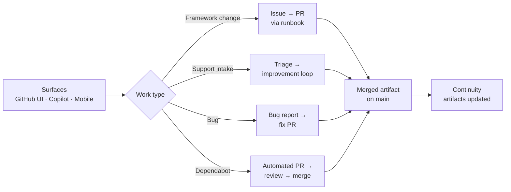

# Operating Model

This document describes how Brain Factory operates day to day: how humans, AI agents, and automation share work across the places people work from — desktop IDE, GitHub cloud, the GitHub CLI, and GitHub Mobile (collectively, the *surfaces*). It is the reference for what the model is; the runbooks cover how to carry each step out.

New to Brain Factory? Start with [how Brain Factory works](how-brain-factory-works.md) for a plain-language tour, then return here for the operating model.

For step-by-step operator procedures, see [`docs/runbooks/README.md`](runbooks/README.md).

## Diagram

How work flows from the surfaces, through bounded work types, and back out as merged artifacts on the main branch.

> 📐 Hi-res view: [SVG](diagrams/operating-model.svg)

## Outcomes

The operating model is designed to:

- turn ambiguous work into executable artifacts
- keep implementation auditable through GitHub-native history
- coordinate human and agent handoffs without losing constraints
- unify product delivery, support handling, and improvement loops
- reduce drift between discovery, planning, execution, and follow-up

## Core Modes of Work

Every task runs in one of five modes. Pick the mode that matches the work's risk and where its context lives.

### 1. Human-led

Use when risk is high, requirements are fluid, or approval judgment is central.

### 2. GitHub-native agent-assisted

Use a GitHub-hosted agent (GitHub Copilot Chat or the Copilot coding agent) when tasks are bounded and testable from repository context alone.

### 3. Local agent-assisted

Use a local agent (such as VS Code Copilot) when implementation needs local tooling, iterative debugging, or richer desktop editing loops.

### 4. External AI-assisted

Use an external agent (such as Claude Code) when the context needed lives outside the repository and must be synthesized before implementation.

### 5. Hybrid mode

Most real work combines modes. A typical flow:

- external synthesis and decomposition
- human normalization and acceptance definition
- GitHub-native/local implementation
- PR review and automation checks
- mobile-aware follow-up and backlog updates

## Multi-Surface Participation

Contributors can participate from any surface:

- desktop IDE and local CLI
- GitHub cloud workflows and PR review
- GitHub CLI operations for routing and maintenance
- GitHub Mobile for triage, approvals, and follow-up capture

Any surface can contribute, but the durable context a task needs to be executed must end up in GitHub artifacts (issues, PRs, ADRs, docs), not in chat history or local notes.

## Standard Work Packet

A *work packet* is the set of details a task needs so any approved agent or human can pick it up and act without hidden assumptions. Every meaningful task should include:

- objective
- context
- constraints
- acceptance criteria
- validation steps
- execution mode
- owner/reviewer
- related artifacts (issues, docs, ADRs, PRs)
- security handling decision (public issue vs private advisory) when applicable

## External Context Synchronization

Context often starts outside GitHub. Move it through three tiers:

1. local private working context (draft notes, temporary files)
2. connector-friendly shared context (Google Drive or OneDrive, where approved)
3. durable GitHub artifacts (required for execution)

Rule: implementation and review depend on Tier 3 artifacts, not private notes or chat memory alone. See [`docs/context-synchronization.md`](context-synchronization.md) for the detailed rules.

For security-sensitive context and reporting paths, see [`docs/security-and-secure-delivery.md`](security-and-secure-delivery.md) and [`SECURITY.md`](../SECURITY.md).

## Product and Support Flow

Support and product signals should follow a consistent path:

1. intake from support, feedback, QA, monitoring, or operations
2. triage classification (support/defect/enhancement/redevelopment/discovery/ADR/improvement)
3. routing into issue + project status
4. execution with explicit acceptance and validation
5. resolution notes + follow-up item creation
6. learning captured into docs/templates/governance improvements

See [`docs/issue-taxonomy.md`](issue-taxonomy.md) for the full issue type definitions and routing rules, and [`docs/product-support-and-improvement-loop.md`](product-support-and-improvement-loop.md) for the detailed flow.

## GitHub Projects as Operational Layer

GitHub Projects should be the shared operational board for:

- intake and triage
- discovery and refinement
- execution and review
- blocked work
- support-active work
- continuous-improvement backlog
- follow-up/deferred items

Use fields and views that expose routing, risk, owner, execution mode, and artifact linkage. Project state must reflect what the durable artifacts say (issue, PR, and handoff evidence), not chat-only state.

For the minimum viable setup and the status/artifact synchronization matrix, see [`docs/github-projects-setup.md`](github-projects-setup.md). For tailoring artifacts, validation depth, and follow-up by work category, see [`docs/work-type-matrix.md`](work-type-matrix.md).

## Decision Matrix

### Choose human-led when

- requirements are disputed
- blast radius is high
- sensitive/compliance concerns dominate

### Choose GitHub-native/local agent modes when

- repository context is sufficient
- tasks are bounded and reviewable
- CI or validation checks can prove outcomes

### Choose external AI when

- context is primarily outside repository
- synthesis/decomposition is the priority
- discovery precedes implementation

## Pull Request Expectations

Every PR should make clear:

- what problem is solved
- which prompt/task framing was used
- what constraints were applied
- how validation was performed
- what remains out of scope
- how security-sensitive context was handled (if applicable)

## Branch Cleanup

After PR completion:

- delete branch
- update linked issues/project status
- preserve decisions and validation in merged artifacts
- create follow-up issues for deferred work

## Continuous Improvement / Continuous Development

Run recurring improvement loops:

- collect lessons from delivery, support, and operations
- shape backlog from support/product insights
- refine prompts, templates, and issue packets
- tune governance and operating guidance from observed usage
- clean up project fields/views, issue types, docs, and automation periodically

Suggested cadence:

- weekly: intake/support/backlog shaping review
- biweekly or monthly: process and template refinement
- quarterly: broader framework refresh

## Anti-Patterns

Avoid:

- prompts living only in private chat
- agent execution without acceptance criteria
- bypassing repository controls with external agent output
- stale project statuses and undocumented decisions
- support resolutions that never feed product/docs improvement

## Success Indicators

The framework is working when:

- work packets convert to implementation with minimal rework
- support insights become visible backlog and documentation improvements
- multi-agent handoffs preserve constraints and validation context
- project views stay useful across desktop and mobile
- recurring process friction decreases over time
- recurring effectiveness reviews show actionable trend signals and durable follow-up actions

## Mobile quick action

- **Use when:** you need to choose or confirm the right execution surface and routing from mobile.
- **Do from mobile:**
  - Map the task to the correct work mode (human, GitHub-native, local, external, hybrid).
  - Check that objective, constraints, acceptance, and validation are present in the issue or PR.
  - Leave a routing comment when scope is clear.
- **Do not do from mobile:**
  - Redefine operating modes or core decision matrix rules.
  - Perform broad structural rewrites across this document.
- **Escalate to desktop/cloud when:**
  - Surface selection is disputed or risk is high.
  - The change requires workflow/config updates in addition to docs.
- **Primary artifact to update:**
  - The active issue or pull request work packet.

## Related docs

- [Operator onboarding pack](operator-onboarding-pack.md) — practical first-day/first-week path for maintainers, contributors, and agent operators.
- [Product support and improvement loop](product-support-and-improvement-loop.md) — how signals flow back into the framework.
- [Work-type matrix](work-type-matrix.md) — practical guidance for tailoring framework behavior by work category.
- [Framework profile packs](framework-profile-packs.md) — practical profile selection and scaling guidance for different operating contexts.
- [Framework metrics and feedback loop](framework-metrics-and-feedback.md) — practical indicators and recurring effectiveness review cadence.
- [Framework continuity and memory](framework-continuity-and-memory.md) — what the framework remembers across sessions.
- [Framework queued execution memory](framework-queued-execution-memory.md) — canonical queue-entry schema and issue/PR linkage model for durable queued execution.
- [Security and secure delivery guardrails](security-and-secure-delivery.md) — security-sensitive routing and safe execution rules.
- [Branching and cleanup](branching-and-cleanup.md) — branch lifecycle and stale-branch handling.
- [Governance checklist](governance-checklist.md) — periodic audit items.
- [Framework health](framework-health.md) — current snapshot and charter-to-artifact map.
