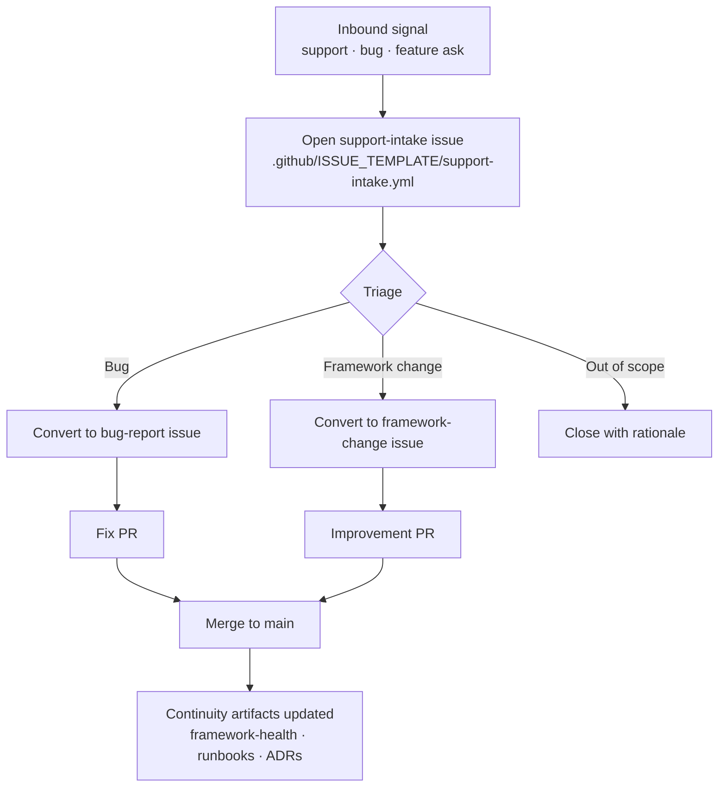

# Product, Support, and Continuous Improvement Loop

This guide describes the loop that turns support signals — tickets, feedback, bug reports, incidents — into durable product, docs, redevelopment, and process improvements. It is for anyone handling inbound work in a brain (a per-project repository); for the bigger picture, see [how Brain Factory works](how-brain-factory-works.md).

## Diagram

A single inbound signal travelling end to end: from intake, through triage and a fix or improvement PR, to a merged change and an updated continuity record.

## 1) Intake

Common intake channels:

- support tickets
- user feedback
- incidents/alerts
- security findings or vulnerability reports
- QA/UAT findings
- docs feedback

Create a **Support Intake** issue for each meaningful signal.

## 2) Triage and classification

Classify each intake into one or more work types:

- **Defect** (bug/failure)
- **Enhancement** (product behavior improvement)
- **Docs** (documentation/runbook/help content)
- **Redevelopment/Discovery** (legacy modernization or unknown-heavy investigation)
- **ADR Proposal** (architectural/process decision required)
- **Improvement** (framework/process/tooling quality)
- **Security-sensitive** (potential vulnerability, secret exposure, or unsafe disclosure risk)

Set severity, owner, and project status (`Triage`, `Ready`, `In Progress`, `In Review`, `Done`, `Follow-up / Deferred`).
Use the project status/artifact synchronization matrix in
[`docs/github-projects-setup.md`](github-projects-setup.md) when deciding transitions.

If intake is security-sensitive:

- do **not** post exploit details in public issues
- route via private advisory per `SECURITY.md`
- create sanitized public tracking artifacts only when appropriate

Quick routing examples:

- **Support only**: one-time password reset confusion resolved by direct response; no recurring pattern or product/doc gap.
- **Defect**: reproducible checkout error with expected behavior mismatch and clear failure evidence.
- **Enhancement**: repeated request for bulk export that improves workflow but is not a bug.
- **Docs**: feature works, but setup instructions are unclear or missing key troubleshooting steps.
- **Redevelopment/Discovery**: legacy module behavior is inconsistent and root cause is unknown; discovery spike needed first.
- **ADR Proposal**: change requires architecture/process decision (for example auth/session policy, integration boundary, or ownership model).

## 3) Normalize context before implementation

If source evidence is outside GitHub (Drive/OneDrive/local files/external AI output), summarize and link it into GitHub artifacts first.

If evidence includes sensitive security detail, normalize only sanitized context into public artifacts and keep sensitive detail in private advisory workflows.

Implementation should start only after issue fields include:

- objective
- context
- constraints
- acceptance criteria
- validation
- selected execution surface

## 4) Route to execution mode

Choose execution surface based on task shape:

- **VS Code Copilot (local)** for deep implementation and debugging
- **GitHub Copilot Coding Agent (GitHub cloud)** for bounded repository tasks
- **GH CLI** for scripted triage/routing/maintenance
- **GitHub Mobile** for quick triage/approval/follow-up actions
- **External AI agents** for discovery/synthesis only (before normalization)

## 5) Link PRs and track delivery

For implementation work:

- open PR with `Closes #...` or `Relates-to #...`
- include validation evidence in PR
- confirm constraint preservation during review
- keep project status aligned with actual stage
- update project status only after linked issue/PR/handoff artifacts are updated

Example artifact chain:

1. support intake issue created with severity and customer impact
2. triage updates project status/owner and routes to issue type
3. routed issue (`Defect`/`Enhancement`/`Docs`/`Redevelopment`/`ADR`) becomes execution source
4. PR links routed issue (`Closes #...` or `Relates-to #...`) with validation evidence
5. closure note records outcome, communication, and evidence links
6. follow-up issue created when scope is deferred, blocked, or intentionally phased

## 6) Closure and communication

After merge or resolution:

- verify behavior/doc outcome in target environment
- close linked issues with evidence
- post user/support-facing communication when applicable
- capture deferred items as follow-up issues

### Closure expectations

Before closure, evidence should include:

- what changed (PR/commit/doc link)
- how it was validated (repro, test notes, or environment verification)
- whether support/user communication was sent

Create a follow-up issue when:

- part of scope is intentionally deferred
- risk mitigation is temporary and needs permanent fix
- related discovery/ADR work is required before full completion

Update docs/runbooks when:

- behavior, operational steps, or troubleshooting expectations changed
- support had to use non-obvious workaround during resolution
- repeated intake pattern indicates missing guidance

## 7) Continuous improvement loop

On recurring themes:

1. cluster repeated support causes
2. create enhancement/improvement/ADR backlog items
3. update templates/prompts/guides/project views
4. measure whether recurrence decreases

## Health signals

The loop is healthy when:

- support items are triaged quickly and routed clearly
- conversion from support to actionable issues is consistent
- PR linkage and closure notes are complete
- repeated support themes become planned improvements
- recurring support-driven findings appear in the framework effectiveness scorecard with explicit follow-up ownership

## Mobile quick action

- **Use when:** you are triaging a new support/product signal and need to route it quickly from mobile.
- **Do from mobile:**
  - Acknowledge intake and assign a primary class.
  - Set severity/owner/status fields in the issue or project item.
  - Link or open the routed execution issue.
- **Do not do from mobile:**
  - Run deep root-cause investigation from fragmented context.
  - Close support loops without durable artifact links.
- **Escalate to desktop/cloud when:**
  - Reproduction, debugging, or broad evidence review is required.
  - Multiple linked artifacts need coordinated updates.
- **Primary artifact to update:**
  - The support intake issue with routing and next-step notes.

## Related docs

- [Operating model](operating-model.md) — how the framework runs day-to-day.
- [Work-type matrix](work-type-matrix.md) — practical work-type-specific artifact, validation, and follow-up expectations.
- [Framework metrics and feedback loop](framework-metrics-and-feedback.md) — leading/lagging indicator model and recurring review cadence.
- [Framework reporting and review cadence](framework-reporting-and-review-cadence.md) — practical recurring review rhythms and writeback patterns for support-driven findings.
- [Framework profile packs](framework-profile-packs.md) — profile-based adaptation guidance, including support-heavy/intake-heavy operating patterns.
- [Framework effectiveness scorecard template](framework-effectiveness-scorecard-template.md) — reusable review packet for monthly/quarterly feedback loops.
- [GitHub Projects setup](github-projects-setup.md) — minimum viable setup and project/artifact state mapping.
- [Framework continuity and memory](framework-continuity-and-memory.md) — what the framework remembers across sessions.
- [Security and secure delivery guardrails](security-and-secure-delivery.md) — secure intake, triage, and remediation guidance.
- [Branching and cleanup](branching-and-cleanup.md) — branch lifecycle and stale-branch handling.
- [Governance checklist](governance-checklist.md) — periodic audit items.
- [Framework health](framework-health.md) — current snapshot and charter-to-artifact map.
