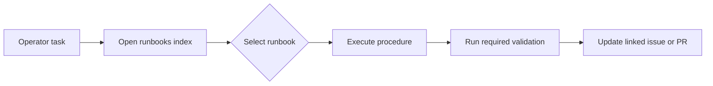

# Operator Runbooks

This index lists every operator runbook: a focused, step-by-step procedure for a
routine task in a Brain Factory project. Use it to find the right guide, run it,
and record the outcome in GitHub.

New to the project? Start with
[How Brain Factory works](../how-brain-factory-works.md) for the five-minute
tour, then come back here. Runbooks are the *how* layer: they sit below the
*what* of [`docs/operating-model.md`](../operating-model.md) (how work flows day
to day) and the *why* of
[`docs/framework-continuity-and-memory.md`](../framework-continuity-and-memory.md)
(the durable principles the system preserves across sessions).

## Runbook flow

This diagram shows how an operator picks a runbook from this index, runs it,
validates the result, and writes the outcome back to a durable artifact.

## Available runbooks

- [Framework lifecycle map and operator journey](framework-lifecycle-map.md) —
  the end-to-end map of all eight operating stages, from first bootstrap through
  active work, handoff, and resume. Includes a quick-reference stage table and a
  "where am I?" self-check. Start here if you are unsure which other runbook you
  need. Pair it with
  [Framework state milestones](../framework-state-milestones.md) for
  event-style transition acknowledgments and
  [Searchable continuity and artifact indexing guidance](../framework-continuity-artifact-indexing.md)
  for fast artifact lookup.

- [Create continuity snapshot](create-continuity-snapshot.md) — create or
  refresh a structured continuity snapshot so handoff/resume state is explicit,
  inspectable, and linked to durable artifacts.

- [Resume from a handoff packet](resume-from-handoff-packet.md) — resume paused
  work in a strict order, validate setup/readiness posture, reconcile blockers
  and deferred/queue posture, and select one next safe action.

- [Surface-specific startup guides](surface-specific-startup-guides.md) — choose
  the shortest startup path by execution surface (GitHub cloud agent, local VS
  Code/Copilot, or lightweight mobile/operator oversight), with explicit limits
  and escalation guidance.

- [Local-first quickstart (solo developer)](local-first-quickstart.md) — the
  shortest path from a fresh clone to a ready-to-work solo setup: recommended
  default profile, minimum field edits, exact command sequence, readiness
  confirmation, and safe deferrals.

- [Apply setup](apply-setup.md) — apply a setup intent and confirm a coherent
  "ready to work" state using `apply-setup.sh` and `check-setup-readiness.sh`.

- [Apply framework setup](apply-framework-setup.md) — setup-productization
  discoverability entrypoint that links to the executable setup flow and
  readiness validation scripts.

- [Prompt-to-setup bootstrap](prompt-to-setup-bootstrap.md) — translate
  natural-language setup needs into setup intent/profile choices, then run
  setup application and readiness verification.

- [Start a framework change](start-a-framework-change.md) — kick off any change
  to the framework (doc, workflow, or ADR-worthy decision).

- [Open an issue](open-an-issue.md) — choose the correct issue template, fill
  required fields, and confirm execution readiness before assigning.

- [Handle a Dependabot PR](handle-a-dependabot-pr.md) — triage and merge the
  weekly GitHub Actions updates.

- [Run the framework health audit](run-the-framework-health-audit.md) —
  re-run the audit captured in `docs/framework-health.md`.

- [Operate the framework task queue](operate-framework-task-queue.md) —
  maintain queue state and recover merge-driven next-task preparation.

- [Run the queue health check](run-queue-health-check.md) —
  detect and recover from queue drift using the drift-detection script and
  manual checklist.

- [Respond to a support intake](respond-to-support-intake.md) — acknowledge,
  classify, and route a new support-intake issue.

- [Handle security-sensitive intake](handle-security-sensitive-intake.md) —
  triage potential vulnerabilities or sensitive findings with safe routing.

- [Promote an external AI artifact](promote-external-ai-artifact.md) —
  normalize an external AI output (Claude Code, ChatGPT, transcript) into a
  durable repository artifact.

- [Close out a multi-agent handoff](close-out-a-multi-agent-handoff.md) —
  confirm acknowledgement, verify charter handoff elements, and clean up
  branches/PRs.

- [Maintain framework alignment](maintain-framework-alignment.md) —
  run an upgrade review cycle, classify framework changes for your repo, and
  recover from missed queue/issue closure after merge.

- [Triage the stale-branch report](triage-stale-branch-report.md) — review the
  weekly dry-run output from the stale-branches workflow and decide what to do
  with each flagged branch.

## Adding a new runbook

- Keep each runbook focused on one task, end to end.
- Use short numbered steps and checklists rather than prose.
- Cross-link the relevant operating-model doc, ADR, or charter section.
- Add the new runbook to the list above. CI checks that every runbook here stays
  linked, so do not remove or rename existing entries.
