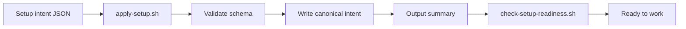

# Apply Setup

## When to use this runbook

Use this runbook to apply a *setup intent* — the JSON file that records a
project's chosen configuration — and confirm the result is in a coherent "ready
to work" state. New to the project? See
[How Brain Factory works](../how-brain-factory-works.md) for context first.

The runbook connects three things:

1. A setup description or structured setup intent → `scripts/apply-setup.sh`
2. The apply output and summary → operator review
3. Readiness validation → `scripts/check-setup-readiness.sh`

If you need the full bridge from natural-language setup needs to a chosen
profile and intent before applying setup, start with
[`prompt-to-setup-bootstrap.md`](prompt-to-setup-bootstrap.md).

For the full setup schema and profile-mapping model, see
[`docs/framework-setup-intent-schema-and-application-model.md`](../framework-setup-intent-schema-and-application-model.md).
For available profiles and example intents, see
[`docs/framework-setup-profiles-and-intent-examples.md`](../framework-setup-profiles-and-intent-examples.md).

## Diagram



> 📐 Hi-res view: [SVG](../diagrams/apply-setup.svg)

## Step 1 — Choose or create a setup intent

You have two options:

**Option A: Use an example intent from the catalog.**

Copy and adapt one of the machine-readable examples:

```text
examples/setup-intent/solo-prototype.intent.json
examples/setup-intent/solo-production-app.intent.json
examples/setup-intent/small-saas-team.intent.json
examples/setup-intent/internal-platform-service-team.intent.json
examples/setup-intent/regulated-high-governance-service.intent.json
```

Adapt the copied file to match your project name, owners, and any overrides.

**Option B: Create a new intent from scratch.**

Use the schema in
[`docs/framework-setup-intent-schema-and-application-model.md`](../framework-setup-intent-schema-and-application-model.md)
and the profile defaults in
[`docs/framework-setup-profiles-and-intent-examples.md`](../framework-setup-profiles-and-intent-examples.md).

Minimum required fields:

- `schema_version`, `setup_id`, `setup_mode`
- `project.name`, `project.primary_work_types`, `project.repo_shape`
- `team.primary_profile`, `team.owners`
- `deployment.model`
- `governance.evidence_level`
- `automation.bundle`, `automation.stage`
- `execution_surfaces` (non-empty array)
- `security.posture`

Add `preferences.setup_profile` to use catalog-based defaults.

## Step 2 — Apply the setup intent

Run the apply-setup script with your intent file:

```bash
bash scripts/apply-setup.sh --intent path/to/your-intent.json
```

To preview without writing any files:

```bash
bash scripts/apply-setup.sh --intent path/to/your-intent.json --dry-run
```

To save the summary to a file for reference:

```bash
bash scripts/apply-setup.sh --intent path/to/your-intent.json --output /tmp/setup-summary.txt
```

**What the script does:**

1. Validates the intent against the setup schema (required fields, enum values).
2. Resolves profile defaults if `preferences.setup_profile` is set.
3. Writes the intent to the canonical path `.github/framework-setup-intent.json`
   (unless the intent is already at the canonical path or `--dry-run` is set).
4. Outputs a concise operator summary covering project, team, bundle, deferred
   items, and next steps.

**Validation errors:** If the script exits with an error, review the listed field
errors and correct your intent JSON before re-running.

## Step 3 — Review the setup summary

Read the output summary. Confirm:

- [ ] Project name, repo shape, and work types are correct.
- [ ] Team profile and owners are correct.
- [ ] Bundle and stage match your intended automation posture.
- [ ] Deployment model and security posture are accurate.
- [ ] Deferred items are captured with owner and enablement criteria.

If anything is incorrect, edit `.github/framework-setup-intent.json` directly
and re-run `apply-setup.sh` (it will update the canonical file in place).

## Step 4 — Run the readiness check

```bash
bash scripts/check-setup-readiness.sh
```

This script reads the canonical intent at `.github/framework-setup-intent.json`
and reports each readiness dimension:

| Dimension | Checked |
| --- | --- |
| Intent file exists at canonical path | Yes |
| Intent is valid JSON and is an object | Yes |
| All required top-level fields present | Yes |
| All enum values are valid | Yes |
| Profile and bundle selections are explicit | Yes |
| Setup profile ID is in the catalog (if set) | Yes |
| Deferred items have required fields | Yes |
| At least one owner is set | Yes |

A passing result means the intent is schema-valid and ready for the next phase.

## Step 5 — Run baseline validation commands

After the readiness check passes, run the full baseline validation suite to
confirm the repository is coherent for the configured setup:

```bash
npx -y markdownlint-cli2 "**/*.md"
bash scripts/check-framework-task-queue.sh
bash scripts/check-queue-health.sh
bash scripts/check-security-guardrails.sh
bash scripts/check-handoff-packet.sh
bash scripts/check-svg-companions.sh
bash scripts/check-mobile-quick-action.sh
bash scripts/check-index-parity.sh
```

For which additional checks to enable based on your bundle/profile, see
[`docs/framework-automation-bundles-by-profile.md`](../framework-automation-bundles-by-profile.md).

## Step 6 — Capture deferred items as follow-up issues

For each item in `deferred[]`, open a GitHub issue that records:

- The deferred item description
- The reason it was deferred
- The owner
- The enablement criteria or review date
- A reference back to this setup runbook

Do not leave deferred items undocumented. Every deferral needs a durable artifact.

## Step 7 — Open the bootstrap issue

Open one bounded GitHub issue documenting this setup application:

- **Objective:** Apply `<setup_profile>` setup intent to this repository.
- **Context:** Link to `.github/framework-setup-intent.json` and this runbook.
- **Constraints:** Keep scope to setup application only; defer extras to follow-up issues.
- **Acceptance criteria:** Intent is schema-valid, readiness check passes, all
  baseline checks pass, deferred items are issue-backed.
- **Validation evidence:** Paste the output of `check-setup-readiness.sh`.

## Updating an existing setup intent

If the setup changes (team grows, bundle changes, new surfaces are added):

1. Edit `.github/framework-setup-intent.json` with the updated values.
2. Re-run `bash scripts/check-setup-readiness.sh` to confirm schema validity.
3. Open a bounded PR with the updated intent and link the setup issue.
4. Update or close any deferred-item issues that are now resolved.

## Mobile quick action

- **Use when:** you need to review a setup summary or capture a follow-up
  deferred-item issue from mobile.
- **Do from mobile:**
  - Review the setup summary in the bootstrap issue or PR.
  - Open a follow-up issue for any deferred item that still lacks a durable artifact.
  - Comment on the bootstrap issue with any clarifications.
- **Do not do from mobile:**
  - Run `apply-setup.sh` or `check-setup-readiness.sh` (requires terminal access).
  - Edit `.github/framework-setup-intent.json` directly in mobile web view.
  - Start a new setup intent from scratch.
- **Escalate to desktop/cloud when:**
  - Schema validation fails and the intent needs editing.
  - A new setup intent must be created for a different profile.
  - Baseline validation failures need investigation.
- **Primary artifact to update:**
  - The bootstrap issue for this setup application.

## Related docs

- [Framework setup intent schema and application model](../framework-setup-intent-schema-and-application-model.md)
- [Framework setup profiles and intent examples](../framework-setup-profiles-and-intent-examples.md)
- [Prompt-to-setup bootstrap](prompt-to-setup-bootstrap.md)
- [Framework readiness checklist](../framework-readiness-checklist.md)
- [Framework automation bundles by profile](../framework-automation-bundles-by-profile.md)
- [Framework profile packs](../framework-profile-packs.md)
- [Framework starter kit / bootstrap pack](../framework-starter-kit.md)
- [Framework portability and adoption](../framework-portability-and-adoption.md)
- [Operator onboarding pack](../operator-onboarding-pack.md)
- [Start a framework change](start-a-framework-change.md)
- [Open an issue](open-an-issue.md)
