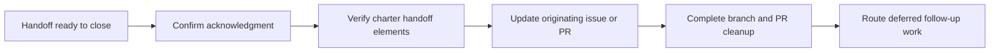

# Close Out a Multi-Agent Handoff

Finish a handoff cleanly: confirm the next owner has taken over, verify nothing
important was lost in transit, update the source issue or PR, and clean up
branches. Use it once work has been passed from one person or agent to another
and you are ready to mark that transfer complete.

A *handoff* is the structured transfer of an active task between operators
(human or AI). The contract for what a handoff must carry lives in the
[multi-agent handoff playbook](../multi-agent-handoff-playbook.md). New to the
project? See [How Brain Factory works](../how-brain-factory-works.md) for the
five-minute tour.

## Diagram

This diagram summarizes the close-out sequence, from acknowledgment through
artifact updates and final cleanup.

## Confirm acknowledgment from next owner

Before closing the handoff, confirm the receiving human or agent has accepted
ownership. Acknowledgment can be a PR comment, an issue comment, or an explicit
assignment update.

Checklist:

- [ ] Receiving owner acknowledged the handoff.
- [ ] Current status reflects the ownership transfer.

## Verify charter handoff elements

A handoff must carry enough context for the next owner to continue without the
original chat. Confirm every required element is preserved:

- objective
- context
- constraints
- acceptance criteria
- validation expectations
- next owner

Verification checklist:

- [ ] All required elements live in durable artifacts.
- [ ] No critical context lives only in chat or a transcript.
- [ ] Open questions and risks are listed.

## Update originating issue or PR

Record completion on the source artifact:

1. Add a completion note on the originating issue or PR.
2. Link the receiving artifact(s).
3. Note anything deferred and who owns the follow-up.

Completion checklist:

- [ ] Originating issue or PR has a closure note.
- [ ] Receiving artifact links are present.
- [ ] Deferred items are tracked as follow-up issue(s).

## Branch and PR cleanup

Follow [`docs/branching-and-cleanup.md`](../branching-and-cleanup.md). After the
merge or closure:

- [ ] Branch is deleted.
- [ ] Project or issue status is updated.
- [ ] Any residual work is routed to a new bounded issue.

## Related guide

See the [multi-agent handoff playbook](../multi-agent-handoff-playbook.md) for
the full handoff-contract details.

## Mobile quick action

- **Use when:** you are ready to close a handoff and need to confirm the ownership transfer from mobile.
- **Do from mobile:**
  - Confirm acknowledgment from the next owner in issue or PR comments.
  - Post a close-out note linking the receiving artifacts and any deferred follow-ups.
  - Update status fields to reflect the ownership transfer.
- **Do not do from mobile:**
  - Close a handoff while the objective, constraints, or validation are still missing.
  - Resolve branch conflicts from a phone.
- **Escalate to desktop/cloud when:**
  - Required handoff elements are incomplete across multiple artifacts.
  - Closure depends on branch operations beyond UI-safe actions.
- **Primary artifact to update:**
  - The close-out comment on the originating issue or pull request.

## Related docs

- [Operating model](../operating-model.md) — how the framework runs day-to-day.
- [Governance checklist](../governance-checklist.md) — periodic audit items.
- [Framework health](../framework-health.md) — current snapshot and charter-to-artifact map.
- [Branching and cleanup](../branching-and-cleanup.md) — branch lifecycle and stale-branch handling.
- Other runbooks: [Handle a Dependabot PR](handle-a-dependabot-pr.md), [Promote an External AI Artifact](promote-external-ai-artifact.md), [Respond to Support Intake](respond-to-support-intake.md), [Run the Framework Health Audit](run-the-framework-health-audit.md), [Start a Framework Change](start-a-framework-change.md), [Triage the stale-branch report](triage-stale-branch-report.md).
