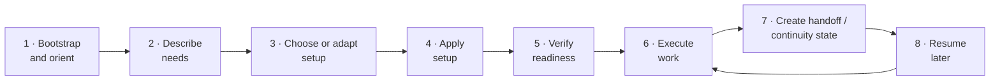

# Framework Lifecycle Map and Operator Journey

## When to use this guide

Use this guide to understand the full operating loop of a Brain Factory project
— from your first contact with it through active work, handoff, and resume — so
you always know where you are and what to do next.

This is the durable lifecycle reference. Each stage has an explicit purpose, key
artifacts, expected operator actions, and entry/exit signals. The startup
runbooks cover individual steps; this map connects them into one coherent story.

If you are new to the project, read
[How Brain Factory works](../how-brain-factory-works.md) first for the
five-minute tour, then use this map to place yourself in the lifecycle.

For event-style transition acknowledgments (for example, "setup applied"), see
[`../framework-state-milestones.md`](../framework-state-milestones.md).

## Lifecycle overview

The framework has eight stages. Every project moves through them roughly in
order, though you will often cycle back through later stages.



Stages 1–5 form the **onboarding arc**. Stage 6 is the steady-state **work
loop**. Stages 7–8 are the **continuity arc** that keeps the framework usable
across interruptions, team changes, and agent transitions.

## Event-style milestone signals

Use milestone acknowledgments to make major stage transitions explicit:

| Stage transition | Milestone signal |
| --- | --- |
| Stage 3 complete | `setup_selected` |
| Stage 4 complete | `setup_applied` |
| Stage 5 complete | `readiness_verified` |
| Stage 6 entered for bounded objective | `active_work_started` |
| Stage 7 complete | `handoff_created` |
| Stage 8 complete | `resume_completed` |

Record each signal in a durable artifact (issue/PR/snapshot/handoff packet) with
timestamp plus evidence link.

---

## Stage 1 — Bootstrap and orient

**Purpose:** Get your bearings. Understand what the framework is, how it works,
and what its non-negotiable rules are before touching any artifacts.

**Key artifacts:**

| Artifact | Description |
| --- | --- |
| [`../../AGENTS.md`](../../AGENTS.md) | Minimum operating contract for agents and contributors |
| [`../framework-continuity-and-memory.md`](../framework-continuity-and-memory.md) | Durable principles and continuity model |
| [`../operating-model.md`](../operating-model.md) | How the framework runs day-to-day |
| [`../operator-onboarding-pack.md`](../operator-onboarding-pack.md) | Practical day-0/day-1 path |

**Expected operator actions:**

1. Read `AGENTS.md` — it is the minimum contract.
2. Read `docs/framework-continuity-and-memory.md` — it explains what the system
   preserves across sessions.
3. Decide which execution surface you will use first — that is, where you will do
   the work (GitHub cloud agent, local VS Code/Copilot, or GitHub Mobile). See
   [`surface-specific-startup-guides.md`](surface-specific-startup-guides.md).
4. If you are a solo developer setting up locally, use
   [`local-first-quickstart.md`](local-first-quickstart.md).

**Entry condition:** You are new to the framework or operating from a fresh
context (new session, new collaborator, resumed after a long break).

**Exit condition:** You have read `AGENTS.md`, know which surface you are using,
and understand the core non-negotiable rules.

**What to do next:** Move to Stage 2 — Describe needs.

---

## Stage 2 — Describe needs

**Purpose:** Capture your project's operating requirements in natural language
before selecting a profile or writing any configuration. This prevents premature
optimization and keeps setup decisions traceable to actual needs. (A *profile* is
a named bundle of sensible defaults — for example `solo_prototype`; a *setup
intent* is the JSON file that records your chosen configuration.)

**Key artifacts:**

| Artifact | Description |
| --- | --- |
| [`prompt-to-setup-bootstrap.md`](prompt-to-setup-bootstrap.md) | Full bridge from natural-language description to setup intent |
| [`../framework-setup-intent-schema-and-application-model.md`](../framework-setup-intent-schema-and-application-model.md) | Schema for what a setup intent captures |
| [`../work-type-matrix.md`](../work-type-matrix.md) | Classify the work types you expect to run |

**Expected operator actions:**

1. Write a short natural-language description of your project, team size,
   deployment model, work types, and governance needs.
2. Identify the axes that matter most for your context (deployment model,
   automation depth, governance level, security posture, surfaces).
3. Capture this description in a durable GitHub artifact (issue or discussion)
   so it is not lost in chat.

**Entry condition:** You have completed Stage 1 and know that you need to
configure or adapt setup for your context.

**Exit condition:** You have a written, GitHub-captured description of your
project's operating needs. You know roughly what profile category fits.

**What to do next:** Move to Stage 3 — Choose or adapt setup.

---

## Stage 3 — Choose or adapt setup

**Purpose:** Map your natural-language description to the nearest setup profile
and, if needed, adapt an example intent file to match your specific axes.

**Key artifacts:**

| Artifact | Description |
| --- | --- |
| [`../framework-setup-profiles-and-intent-examples.md`](../framework-setup-profiles-and-intent-examples.md) | Concrete setup profile catalog and machine-readable intent examples |
| [`../framework-profile-packs.md`](../framework-profile-packs.md) | Practical profile layer for adapting one framework across contexts |
| [`../framework-automation-bundles-by-profile.md`](../framework-automation-bundles-by-profile.md) | Staged automation bundles matched to profile and maturity |
| [`prompt-to-setup-bootstrap.md`](prompt-to-setup-bootstrap.md) | Steps 3–4 of the unified bootstrap guide |

**Expected operator actions:**

1. Compare your description against the setup profile catalog.
2. Pick the nearest profile (`solo_prototype`, `product_team`, `platform_infra`,
   etc.) as your starting point.
3. Copy the matching example intent file and update the minimum required fields:
   `setup_id`, `project.name`, `team.owners`.
4. Adjust axes that do not match your needs. Record deferred items with explicit
   reasons and owners.

**Entry condition:** You have a written description of needs from Stage 2.

**Exit condition:** You have a customized setup-intent JSON file that reflects
your actual operating axes, with explicit deferrals for anything you are not
enabling yet.

**What to do next:** Move to Stage 4 — Apply setup.

---

## Stage 4 — Apply setup

**Purpose:** Run the setup application script against your intent file to write
the canonical framework configuration to the repository. This makes your setup
explicit, machine-readable, and verifiable by downstream scripts and CI.

**Key artifacts:**

| Artifact | Description |
| --- | --- |
| [`apply-setup.md`](apply-setup.md) | Step-by-step procedure for applying a setup intent |
| [`apply-framework-setup.md`](apply-framework-setup.md) | Setup-productization entrypoint that routes to the apply flow |
| `scripts/apply-setup.sh` | The executable setup application script |
| `.github/framework-setup-intent.json` | Canonical path where setup is written |

**Expected operator actions:**

1. Dry-run the setup script to confirm no validation errors:

   ```bash
   bash scripts/apply-setup.sh --intent /tmp/my-setup-intent.json --dry-run
   ```

2. Review the dry-run output. Confirm project name, owners, bundle, and deferred
   items match your intent.
3. Apply setup:

   ```bash
   bash scripts/apply-setup.sh --intent /tmp/my-setup-intent.json
   ```

4. Confirm `.github/framework-setup-intent.json` was written and is schema-valid.

**Entry condition:** You have a complete, customized setup-intent JSON file from
Stage 3.

**Exit condition:** `scripts/apply-setup.sh` runs without error.
`.github/framework-setup-intent.json` exists and contains your project's name,
owners, and explicit deferred items.

**What to do next:** Move to Stage 5 — Verify readiness.

---

## Stage 5 — Verify readiness

**Purpose:** Run the readiness check and baseline validation suite to confirm
the repository is in a coherent "ready to work" state before starting any
bounded work.

**Key artifacts:**

| Artifact | Description |
| --- | --- |
| `scripts/check-setup-readiness.sh` | Validates that the canonical intent is schema-valid and required dimensions are satisfied |
| [`../framework-readiness-checklist.md`](../framework-readiness-checklist.md) | Lightweight readiness/certification-style checklist for coherent adoption |
| [`apply-setup.md`](apply-setup.md) | Steps 4–5 of the apply-setup procedure |

**Expected operator actions:**

1. Run the readiness check:

   ```bash
   bash scripts/check-setup-readiness.sh
   ```

2. Run baseline validation:

   ```bash
   npx -y markdownlint-cli2 "**/*.md"
   bash scripts/check-framework-task-queue.sh
   bash scripts/check-queue-health.sh
   bash scripts/check-security-guardrails.sh
   bash scripts/check-index-parity.sh
   ```

3. Resolve any errors. If an item is intentionally deferred, add a `deferred[]`
   entry with a reason and owner in the intent file and re-run.
4. Open a bootstrap issue documenting this setup. Link it to
   `.github/framework-setup-intent.json`.
5. Open one follow-up issue per deferred item.

**Entry condition:** Setup has been applied in Stage 4.
`.github/framework-setup-intent.json` exists.

**Exit condition:** `check-setup-readiness.sh` passes. Baseline checks pass. A
bootstrap issue exists that records this setup application and any deferred
items.

**What to do next:** Move to Stage 6 — Execute work for your first bounded task.

---

## Stage 6 — Execute work

**Purpose:** Do the actual delivery work — features, fixes, docs, governance —
within the framework's bounded issue → PR → validate → merge → close loop.

This is the steady-state stage. You will return to this stage after every
resume, handoff receipt, and continuity check.

**Key artifacts:**

| Artifact | Description |
| --- | --- |
| [`../operating-model.md`](../operating-model.md) | How the framework runs day-to-day |
| [`../work-type-matrix.md`](../work-type-matrix.md) | Tailoring guide by work category |
| [`../issue-taxonomy.md`](../issue-taxonomy.md) | Issue types, required fields, and routing |
| [`open-an-issue.md`](open-an-issue.md) | Runbook for creating execution-ready issues |
| [`start-a-framework-change.md`](start-a-framework-change.md) | Runbook for framework changes |
| [`../multi-agent-handoff-playbook.md`](../multi-agent-handoff-playbook.md) | Handoff contracts and anti-patterns |

**Expected operator actions:**

1. Confirm there is a scoped, execution-ready issue with objective, context,
   constraints, acceptance criteria, and validation steps.
2. Choose the right execution surface for this task.
3. Classify work type and apply the tailoring from `work-type-matrix.md`.
4. Implement in one bounded PR linked to the source issue.
5. Run required checks and capture validation evidence in the PR.
6. Merge and close out with durable writeback: issue/project status, queue
   state, branch cleanup.
7. If working from the task queue, confirm queue state transitions.

**Entry condition:** Readiness is verified (Stage 5 passed). A scoped, complete
issue exists for the next task.

**Exit condition:** The PR is merged, the issue is closed, queue state is
accurate, and any deferred items or follow-up issues are recorded.

**What to do next:**

- If continuing to the next task: return to the top of Stage 6.
- If stopping or handing off: move to Stage 7 — Create handoff / continuity state.

---

## Stage 7 — Create handoff / continuity state

**Purpose:** Preserve a durable continuity snapshot so that you, another
contributor, or an agent can resume the current operating context without
depending on private chat memory or short-lived notes.

**Key artifacts:**

| Artifact | Description |
| --- | --- |
| [`../framework-continuity-snapshot-template.md`](../framework-continuity-snapshot-template.md) | Canonical structured continuity snapshot format |
| [`create-continuity-snapshot.md`](create-continuity-snapshot.md) | Runbook for when/how to create or refresh continuity snapshots |
| [`resume-from-handoff-packet.md`](resume-from-handoff-packet.md) | Runbook for explicit resume verification and next-safe-action selection |
| [`../multi-agent-handoff-playbook.md`](../multi-agent-handoff-playbook.md) | Handoff contracts, patterns, and anti-patterns |
| [`../handoff-packet-template.md`](../handoff-packet-template.md) | Canonical reusable handoff packet template |
| [`close-out-a-multi-agent-handoff.md`](close-out-a-multi-agent-handoff.md) | Runbook for closing out received handoffs |
| [`../framework-continuity-and-memory.md`](../framework-continuity-and-memory.md) | Durable continuity model |
| `scripts/check-handoff-packet.sh` | Enforces handoff packet completeness |

**Expected operator actions:**

1. Create or refresh a structured continuity snapshot using
   [`../framework-continuity-snapshot-template.md`](../framework-continuity-snapshot-template.md)
   and [`create-continuity-snapshot.md`](create-continuity-snapshot.md), ensuring
   lifecycle/setup/readiness/work/queue/handoff/next-action state is explicit.
2. Fill the handoff packet template, ensuring at minimum:
   - **Objective** — what must happen next
   - **Context** — relevant background
   - **Constraints** — guardrails, non-goals, required standards
   - **Acceptance criteria** — what makes the work complete
   - **Validation expectations** — checks, evidence expectations
   - **Related artifacts** — issues, PRs, ADRs, docs
   - **Next owner** — who or which surface acts next
   - **Status / current state** — where work stopped
   - **Unresolved risks / questions** — open decisions or blockers
3. Capture this in a durable GitHub artifact (issue, PR comment, or discussion).
4. Update queue state if this is queue-backed work.
5. Run `bash scripts/check-handoff-packet.sh` to confirm completeness.
6. Add the ordered "required artifacts to review first", recommended next safe
   action, and resume verification steps in the handoff packet.
7. Notify the next owner with links to both handoff packet and continuity snapshot.

**Entry condition:** A bounded work cycle (Stage 6) has been completed or
interrupted. You need to transfer context to another person, agent, or future
self.

**Exit condition:** A complete, durable handoff packet is captured in a GitHub
artifact. The next owner can resume without reading chat history.

**What to do next:** The next operator or agent moves to Stage 8 — Resume later.

---

## Stage 8 — Resume later

**Purpose:** Safely re-enter the framework's operating context from a handoff
packet, without needing private notes, chat history, or tribal memory.

**Key artifacts:**

| Artifact | Description |
| --- | --- |
| [`../framework-continuity-snapshot-template.md`](../framework-continuity-snapshot-template.md) | Structured continuity snapshot format to read first during resume |
| [`create-continuity-snapshot.md`](create-continuity-snapshot.md) | Runbook for updating stale/incomplete snapshot state before continuing |
| [`../multi-agent-handoff-playbook.md`](../multi-agent-handoff-playbook.md) | How to read and act on a received handoff |
| [`../handoff-packet-template.md`](../handoff-packet-template.md) | What the handoff packet fields mean |
| [`resume-from-handoff-packet.md`](resume-from-handoff-packet.md) | Ordered resume procedure and verification checklist |
| [`close-out-a-multi-agent-handoff.md`](close-out-a-multi-agent-handoff.md) | Close-out checklist after receiving a handoff |
| [`../framework-continuity-and-memory.md`](../framework-continuity-and-memory.md) | What the framework preserves automatically |
| [`../operator-onboarding-pack.md`](../operator-onboarding-pack.md) | "How to continue someone else's work" checklist |

**Expected operator actions:**

1. Find the latest continuity snapshot and handoff artifact linked to the work
   you are resuming.
2. Read the continuity snapshot first, then read the handoff packet fields in
   full before touching any files.
3. Confirm the constraints and non-goals survived from the source issue to the
   current state.
4. Follow [`resume-from-handoff-packet.md`](resume-from-handoff-packet.md) to
   validate lifecycle/work posture, setup/readiness validity, blockers/deferred
   posture, and next safe action.
5. Confirm queue state and issue/PR linkage are accurate.
6. Run `check-setup-readiness.sh` if you are re-entering after a long gap — the
   setup state may have changed.
7. Run baseline checks to confirm the repository is coherent.
8. Refresh the continuity snapshot if any status field is stale before
   continuing implementation.
9. Close out any received handoff acknowledgement steps using
   [`close-out-a-multi-agent-handoff.md`](close-out-a-multi-agent-handoff.md).
10. Continue only the bounded objective in the handoff. Open follow-up issues for
   anything out of scope.

**Entry condition:** A complete handoff packet exists (Stage 7) and you are the
designated next owner.

**Exit condition:** You have read the handoff packet, confirmed repository
coherence, and are ready to continue bounded work.

**What to do next:** Return to Stage 6 — Execute work to continue the operating
loop.

---

## Quick-reference stage map

| Stage | Name | Entry condition | Exit signal | Milestone signal | Key runbook |
| --- | --- | --- | --- | --- | --- |
| 1 | Bootstrap and orient | Fresh start or new context | Read `AGENTS.md`, know your surface | n/a | [Surface-specific startup guides](surface-specific-startup-guides.md) |
| 2 | Describe needs | Completed Stage 1 | Written description in a GitHub artifact | n/a | [Prompt-to-setup bootstrap](prompt-to-setup-bootstrap.md) |
| 3 | Choose or adapt setup | Written description from Stage 2 | Customized setup-intent JSON with explicit deferrals | `setup_selected` | [Prompt-to-setup bootstrap](prompt-to-setup-bootstrap.md) |
| 4 | Apply setup | Complete setup-intent JSON | `.github/framework-setup-intent.json` written | `setup_applied` | [Apply setup](apply-setup.md) |
| 5 | Verify readiness | Setup applied in Stage 4 | All checks pass; bootstrap issue exists | `readiness_verified` | [Apply setup](apply-setup.md) |
| 6 | Execute work | Readiness verified; scoped issue exists | PR merged; issue closed; queue accurate | `active_work_started` | [Operating model](../operating-model.md) |
| 7 | Create handoff / continuity | Need to transfer context | Complete handoff packet + continuity snapshot in GitHub | `handoff_created` | [Create continuity snapshot](create-continuity-snapshot.md) |
| 8 | Resume later | Handoff packet + snapshot exist | Snapshot and packet read; coherence confirmed | `resume_completed` | [Resume from a handoff packet](resume-from-handoff-packet.md) |

---

## Where am I in the lifecycle?

Use this checklist to locate yourself when re-entering the framework.

- [ ] Have you read `AGENTS.md`? → You have completed Stage 1.
- [ ] Is there a setup-intent JSON file at `.github/framework-setup-intent.json`? → You are past Stage 4.
- [ ] Does `check-setup-readiness.sh` pass? → You are past Stage 5.
- [ ] Is there an open issue scoping your next task? → You are ready for Stage 6.
- [ ] Is there a handoff packet from your predecessor? → Read it; you are in Stage 8.

---

## Mobile quick action

- **Use when:** you need to locate yourself in the framework lifecycle from
  mobile and decide the right next action.
- **Do from mobile:**
  - Use the "Where am I in the lifecycle?" checklist above.
  - Review an open handoff artifact and confirm the next owner is correct.
  - Leave a comment on the active issue or PR naming the current lifecycle stage
    and the next action.
- **Do not do from mobile:**
  - Run setup scripts, readiness checks, or baseline validation.
  - Edit setup-intent JSON files directly.
  - Author handoff packets from scratch on mobile.
- **Escalate to desktop/cloud when:**
  - Readiness checks need to be run and evidence captured.
  - A setup-intent update or new profile selection is needed.
  - The handoff packet requires substantive editing.
- **Primary artifact to update:**
  - The active issue, PR, or handoff artifact carrying the current stage context.

## Related docs

- [Prompt-to-setup bootstrap](prompt-to-setup-bootstrap.md)
- [Local-first quickstart](local-first-quickstart.md)
- [Surface-specific startup guides](surface-specific-startup-guides.md)
- [Create continuity snapshot](create-continuity-snapshot.md)
- [Resume from a handoff packet](resume-from-handoff-packet.md)
- [Apply setup](apply-setup.md)
- [Apply framework setup](apply-framework-setup.md)
- [Multi-agent handoff playbook](../multi-agent-handoff-playbook.md)
- [Handoff packet template](../handoff-packet-template.md)
- [Close out a multi-agent handoff](close-out-a-multi-agent-handoff.md)
- [Framework continuity and memory](../framework-continuity-and-memory.md)
- [Searchable continuity and artifact indexing guidance](../framework-continuity-artifact-indexing.md)
- [Framework readiness checklist](../framework-readiness-checklist.md)
- [Framework state milestones](../framework-state-milestones.md)
- [Operator onboarding pack](../operator-onboarding-pack.md)
- [Operating model](../operating-model.md)
- [AGENTS.md](../../AGENTS.md)
