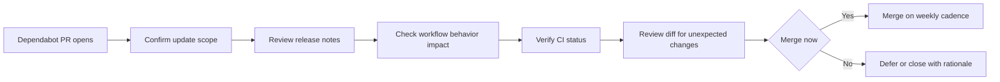

# Handle a Dependabot PR

Triage and merge the routine dependency-update pull requests that Dependabot
opens against a brain. Use it during your weekly maintenance pass, or whenever a
new Dependabot PR appears.

New to the project? See
[How Brain Factory works](../how-brain-factory-works.md) for the five-minute
tour. In short: a *brain* is the per-project repository you operate from, and
its GitHub Actions workflows enforce the quality gates this runbook protects.

## Why Dependabot matters here

A brain relies on CI checks (markdown linting in particular) as control gates:
work merges only when those checks pass. Dependabot keeps the GitHub Actions and
tooling those checks depend on current, so the gates stay reliable and secure.

For the reasoning behind the markdown gate, see
[`docs/adr/0004-markdown-ci-guardrail.md`](../adr/0004-markdown-ci-guardrail.md).

## Diagram

This diagram shows the Dependabot triage flow from scope review and CI checks
to a merge decision or deferral with follow-up.

> 📐 Hi-res view: [SVG](../diagrams/handle-a-dependabot-pr.svg)

## Triage steps

For each Dependabot PR:

1. Confirm the update scope: a GitHub Action, a tooling package, or both.
2. Read the linked release notes or changelog for breaking changes.
3. Check whether the bump changes workflow syntax or behavior.
4. Verify that CI on the PR is green.
5. Review the diff for unexpected or transitive changes.

Quick checklist:

- [ ] Release notes reviewed.
- [ ] Breaking-change risk assessed.
- [ ] CI checks passed.
- [ ] No unrelated file changes.

## Merge cadence and batching

Keep a steady weekly cadence.

Preferred pattern:

- Merge low-risk, independent updates promptly.
- Batch only when updates are tightly related and easier to validate together.
- Keep batches small enough to roll back quickly if needed.

Cadence guardrails:

- [ ] No long backlog of stale dependency PRs.
- [ ] At least one scheduled triage pass per week.

## When to defer or close

Defer when:

- CI fails because of upstream breakage that needs follow-up work.
- A major-version bump needs coordination with maintainers.
- A pending framework change would invalidate an immediate merge.

Close when:

- A newer Dependabot PR supersedes the update.
- The package or action is no longer used.

If you defer or close:

- [ ] Leave a short rationale in the PR.
- [ ] Open or link a follow-up issue if remediation is needed.

## Automation context

For more on execution surfaces and how automation runs against a brain, see
[`docs/gh-agents-and-automation.md`](../gh-agents-and-automation.md).

## Mobile quick action

- **Use when:** a routine Dependabot PR needs a quick triage and merge-or-defer decision from mobile.
- **Do from mobile:**
  - Confirm the scope and read the Dependabot summary and release notes.
  - Verify required checks are green before approving.
  - Approve, or defer with a short rationale comment.
- **Do not do from mobile:**
  - Merge when checks are failing or missing.
  - Treat a major-version upgrade as routine without deeper review.
- **Escalate to desktop/cloud when:**
  - The diff includes unexpected files or risks changing workflow behavior.
  - A CI failure needs log-level investigation or remediation.
- **Primary artifact to update:**
  - The decision comment on the Dependabot pull request.

## Related docs

- [Operating model](../operating-model.md) — how the framework runs day-to-day.
- [Governance checklist](../governance-checklist.md) — periodic audit items.
- [Framework health](../framework-health.md) — current snapshot and charter-to-artifact map.
- [Branching and cleanup](../branching-and-cleanup.md) — branch lifecycle and stale-branch handling.
- Other runbooks: [Close Out a Multi-Agent Handoff](close-out-a-multi-agent-handoff.md), [Promote an External AI Artifact](promote-external-ai-artifact.md), [Respond to Support Intake](respond-to-support-intake.md), [Run the Framework Health Audit](run-the-framework-health-audit.md), [Start a Framework Change](start-a-framework-change.md), [Triage the stale-branch report](triage-stale-branch-report.md).
