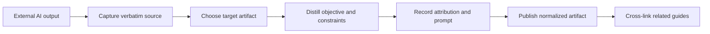

# Promote an External AI Artifact

Turn an output from an external AI tool (a Claude Code session, a ChatGPT reply,
a chat transcript) into a durable, attributed repository artifact. Use it before
anyone acts on that output, so the work is grounded in GitHub rather than in a
chat window that will scroll away.

Here, *normalize* means distilling raw AI output into a structured GitHub
artifact — an issue, a decision record (ADR), or a documentation PR — with its
source and prompt preserved. New to the project? See
[How Brain Factory works](../how-brain-factory-works.md) for the five-minute
tour.

## Why normalize

External AI output is great for discovery, but implementation must rest on
durable repository artifacts. This runbook applies a core continuity principle
from
[`docs/framework-continuity-and-memory.md`](../framework-continuity-and-memory.md):
**"External AI outputs must be normalized into GitHub artifacts before
implementation."**

## Diagram

This diagram shows the normalization flow from external AI output to a durable,
attributed repository artifact.

> 📐 Hi-res view: [SVG](../diagrams/promote-external-ai-artifact.svg)

## Capture verbatim source first

Before summarizing, preserve the original output exactly as produced:

1. Paste the full external output into a GitHub issue or discussion.
2. Mark whether the content is a raw transcript, a plan, or a synthesis.
3. Keep that source copy unchanged for traceability.

Verbatim capture checklist:

- [ ] Source is preserved verbatim.
- [ ] Source location is durable and linkable.
- [ ] Sensitive data is removed or redacted before posting.

## Distill into the right artifact

Choose the target artifact by intent:

- **Issue** — for executable, bounded work.
- **ADR** — for architecture or process decisions and their tradeoffs.
- **Doc PR** — for guidance updates and operational procedures.

Distillation checklist:

- [ ] Objective is explicit.
- [ ] Context and assumptions are separated.
- [ ] Constraints and acceptance criteria are defined.
- [ ] Validation expectations are included.

## Preserve attribution and original prompt

Always record provenance:

- which system produced the output
- the original prompt text
- the date and time (if known) and the operator
- a link back to the verbatim source artifact

Attribution checklist:

- [ ] Original prompt is preserved.
- [ ] Source system is identified.
- [ ] Normalized artifact links back to the verbatim source.

## Related guides

- [`docs/context-synchronization.md`](../context-synchronization.md)
- [`docs/prompt-cookbook.md`](../prompt-cookbook.md)

## Mobile quick action

- **Use when:** you need to normalize external AI output into a durable artifact from mobile.
- **Do from mobile:**
  - Capture the source output in an issue or discussion, labeling its type clearly.
  - Choose and note the target artifact type (issue, ADR, or doc PR).
  - Record the source system, a prompt reference, and attribution links.
- **Do not do from mobile:**
  - Publish unredacted sensitive content.
  - Start implementation before normalization is complete.
- **Escalate to desktop/cloud when:**
  - The source transcript is long and needs structured synthesis.
  - Normalization requires multi-file document updates.
- **Primary artifact to update:**
  - The normalization issue or discussion holding the source and the distilled packet.

## Related docs

- [Operating model](../operating-model.md) — how the framework runs day-to-day.
- [Governance checklist](../governance-checklist.md) — periodic audit items.
- [Framework health](../framework-health.md) — current snapshot and charter-to-artifact map.
- [Branching and cleanup](../branching-and-cleanup.md) — branch lifecycle and stale-branch handling.
- Other runbooks: [Close Out a Multi-Agent Handoff](close-out-a-multi-agent-handoff.md), [Handle a Dependabot PR](handle-a-dependabot-pr.md), [Respond to Support Intake](respond-to-support-intake.md), [Run the Framework Health Audit](run-the-framework-health-audit.md), [Start a Framework Change](start-a-framework-change.md), [Triage the stale-branch report](triage-stale-branch-report.md).
