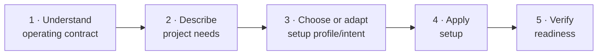

# Prompt-to-Setup Bootstrap

## When to use this runbook

Use this runbook when you are adopting Brain Factory and need one coherent path
from "what we are building" to a setup that is ready for day-one work. It is the
most complete on-ramp; the other startup runbooks are shortcuts off it.

The runbook bridges four steps:

1. natural-language project and operator needs
2. choosing a setup profile and a setup intent (the JSON file that records your
   configuration)
3. applying that setup and verifying readiness
4. starting your first bounded piece of work under the operating model

If you are new to the project, read
[How Brain Factory works](../how-brain-factory-works.md) first for the
five-minute tour.

## Journey overview

The complete adoption path moves through five stages:



Each stage has a clear entry condition and exit signal. You can start at any
stage if you already have outputs from earlier stages. The numbered steps below
correspond to each stage.

## What information matters most

Before translating your needs into a setup intent, confirm you can answer these:

1. **Project shape:** Solo prototype, small team, product team, or
   platform/shared service?
2. **Deployment model:** Local dev only, cloud-only, hybrid, or
   regulated/compliant environment?
3. **Team owners:** Who owns day-to-day operation and who is responsible for
   governance and security decisions?
4. **Automation depth:** How much automation do you want immediately versus what
   is intentionally deferred?
5. **Governance and evidence posture:** How much audit evidence do you need now
   versus later?
6. **Intentional deferrals:** What are you explicitly not setting up yet, and
   why?

If you cannot answer most of these, write rough answers in plain language first.
Uncertainty is expected — record it as a deferral with a reason and an owner.
These six signals map directly to the setup-intent fields in Step 2.

## Step 1 — Describe your needs in natural language

Write a short setup description in an issue, discussion, or planning note that
can be normalized into a durable GitHub artifact.

Include these fields explicitly:

- What you are building (`project.name`, expected primary work types)
- Who owns operation and delivery (`team.owners`, team shape)
- How you plan to deploy/operate (`deployment.model`, likely targets)
- Governance and evidence posture (`governance.evidence_level`)
- Security posture (`security.posture`)
- Desired automation depth now (`automation.bundle`, `automation.stage`)
- Expected execution surfaces (`execution_surfaces`)
- What is intentionally deferred (`deferred[]` candidates)

Use plain language first. Do not optimize for JSON yet.

## Step 2 — Translate your description into setup-intent axes

Map your natural-language statements to setup intent fields:

| Natural-language signal | Setup-intent field(s) to set |
| --- | --- |
| "Solo prototype", "small repo", "fast iteration" | `project.repo_shape`, `team.primary_profile`, `automation.bundle/stage` |
| "Product team", "multiple contributors", "steady delivery" | `team.primary_profile`, `execution_surfaces`, `preferences.projects_enabled` |
| "Platform/shared service", "higher blast radius" | `project.repo_shape`, `deployment.model`, `security.posture`, stricter governance fields |
| "Regulated/compliance-heavy" | `deployment.model`, `governance.evidence_level`, `security.posture` |
| "We will defer X for now" | `deferred[]` with reason, owner, enablement criteria |

Canonical contract reference:
[`docs/framework-setup-intent-schema-and-application-model.md`](../framework-setup-intent-schema-and-application-model.md)

## Step 3 — Pick a starting setup profile

Choose the closest reusable profile from:
[`docs/framework-setup-profiles-and-intent-examples.md`](../framework-setup-profiles-and-intent-examples.md)

Selection rule:

1. pick the nearest profile for team/repo shape
2. keep explicit intent fields for anything profile defaults do not fit
3. record profile selection in `preferences.setup_profile`

If no profile is close enough, use explicit fields and set a custom automation
plan with documented deferrals.

## Step 4 — Create or adapt a setup-intent JSON file

Start from one of the example intents in `examples/setup-intent/` and adapt it,
or author a new JSON file that satisfies the required schema fields.

Then run:

```bash
bash scripts/apply-setup.sh --intent path/to/your-intent.json --dry-run
```

Fix any validation errors before writing the canonical intent.

## Step 5 — Apply setup to canonical intent path

When dry-run output is correct, apply the setup:

```bash
bash scripts/apply-setup.sh --intent path/to/your-intent.json
```

This writes/updates `.github/framework-setup-intent.json` and prints a summary
of resolved setup decisions.

## Step 6 — Verify setup readiness

Run:

```bash
bash scripts/check-setup-readiness.sh
```

A passing result confirms schema validity, explicit profile/bundle choices,
owner presence, and deferred-item shape.

## Step 7 — Run baseline validation checks

Run the baseline checks for setup coherence:

```bash
npx -y markdownlint-cli2 "**/*.md"
bash scripts/check-framework-task-queue.sh
bash scripts/check-queue-health.sh
bash scripts/check-security-guardrails.sh
bash scripts/check-handoff-packet.sh
bash scripts/check-mobile-quick-action.sh
bash scripts/check-index-parity.sh
```

Enable additional checks based on your selected profile/bundle guidance.

## Step 8 — Start day-one work with the operating model

After readiness and validation pass:

1. open one bounded bootstrap issue that links the canonical setup intent
2. capture deferred setup items as follow-up issues with owners
3. run your first bounded issue → PR flow using:
   [`docs/operating-model.md`](../operating-model.md)

This closes the bootstrap loop from natural-language setup intent to
"ready-to-work" framework operation.

## Mobile quick action

- **Use when:** you need to quickly verify that a setup description has enough
  information to choose a profile and run setup later from desktop/cloud.
- **Do from mobile:**
  - Check that project, owners, deployment, governance/security posture, and
    automation intent are all explicitly described in the active issue.
  - Confirm a candidate setup profile is named, or flag that custom explicit
    fields are required.
  - Comment with missing setup-intent fields before setup is executed.
- **Do not do from mobile:**
  - Run `apply-setup.sh` or `check-setup-readiness.sh`.
  - Author large setup-intent JSON updates from scratch.
  - Resolve broad profile/bundle tradeoffs without reviewing linked docs.
- **Escalate to desktop/cloud when:**
  - setup-intent schema validation fails
  - profile defaults need multiple explicit overrides
  - baseline checks must be run and evidence captured
- **Primary artifact to update:**
  - The setup bootstrap issue or pull request containing the normalized setup
    description and selected setup intent.

## Related docs

- [Framework setup intent schema and application model](../framework-setup-intent-schema-and-application-model.md)
- [Framework setup profiles and intent examples](../framework-setup-profiles-and-intent-examples.md)
- [Apply setup](apply-setup.md)
- [Framework starter kit / bootstrap pack](../framework-starter-kit.md)
- [Framework portability and adoption](../framework-portability-and-adoption.md)
- [Operator onboarding pack](../operator-onboarding-pack.md)
- [Operating model](../operating-model.md)
