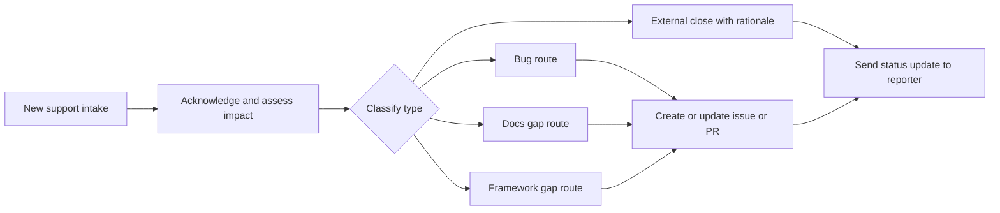

# Respond to Support Intake

Acknowledge, classify, and route every new support request that arrives through
the support issue template (`support-intake.yml`). Use it the moment a support
intake lands so the reporter gets a fast reply and the work flows to a durable
artifact instead of staying in chat.

New to the project? See
[How Brain Factory works](../how-brain-factory-works.md) for the five-minute
tour. A *brain* is the per-project repository you operate from; this runbook
turns inbound reports into tracked issues, PRs, or decision records (ADRs)
within it.

## Scope

The goal is to acknowledge quickly, classify accurately, and route the request
to a durable execution artifact (an issue, PR, or ADR).

## Diagram

This diagram shows the intake triage path from acknowledgment and
classification to routing, artifact creation, and reporter closure.

> 📐 Hi-res view: [SVG](../diagrams/respond-to-support-intake.svg)

## Acknowledge and classify

When an intake arrives:

1. Acknowledge receipt to the reporter.
2. Confirm reproducibility and immediate impact.
3. Classify it into one primary type:
   - bug
   - docs gap
   - framework gap
   - security-sensitive
   - external (out of scope or third-party)

Classification checklist:

- [ ] Reporter received an acknowledgment.
- [ ] Primary class assigned.
- [ ] Severity and urgency captured.
- [ ] Project status updated (`Triage`, `Support Active`, `Blocked`, `Follow-up / Deferred`, or `Done` as applicable).

## Route to the right work type

Follow the routing model in
[`docs/product-support-and-improvement-loop.md`](../product-support-and-improvement-loop.md):

- Bug: defect issue path.
- Docs gap: docs/improvement issue path.
- Framework gap: improvement or ADR proposal path.
- Security-sensitive: private advisory route (`SECURITY.md`), with a sanitized public follow-up only when appropriate. See [Handle security-sensitive intake](handle-security-sensitive-intake.md).
- External: close with a rationale and references.

## Convert to an actionable issue or PR

Create or update a durable artifact using the right template in
[`.github/ISSUE_TEMPLATE/`](../../.github/ISSUE_TEMPLATE/). Fill these minimum
fields before any execution starts:

- [ ] Objective
- [ ] Context
- [ ] Constraints
- [ ] Acceptance criteria
- [ ] Validation plan

If the fix is small and immediate, open a linked PR directly from the routed
issue.

## Close the loop with the reporter

After triage or merge:

1. Post a closure or status comment describing what changed.
2. Link the issue, PR, and ADR artifacts used to resolve it.
3. Note any deferred follow-up items and who owns them.

Communication checklist:

- [ ] Reporter got a clear status update.
- [ ] Durable artifact links are included.
- [ ] Deferred work is captured as separate follow-up issue(s).

## Mobile quick action

- **Use when:** a new support-intake issue arrives and needs immediate triage from mobile.
- **Do from mobile:**
  - Acknowledge the reporter and set the initial severity and urgency.
  - Classify the intake type and apply the routing labels and status.
  - Link or open the routed execution artifact.
- **Do not do from mobile:**
  - Close an unclear report without evidence and a rationale.
  - Commit to a fix before the objective, constraints, and validation are documented.
- **Escalate to desktop/cloud when:**
  - Reproduction or deeper investigation is required.
  - The intake spans multiple systems or needs coordinated follow-up.
- **Primary artifact to update:**
  - The support-intake issue, recording the triage and routing outcome.

## Related docs

- [Operating model](../operating-model.md) — how the framework runs day-to-day.
- [Governance checklist](../governance-checklist.md) — periodic audit items.
- [Security and secure delivery guardrails](../security-and-secure-delivery.md) — security-sensitive routing and redaction guardrails.
- [Framework health](../framework-health.md) — current snapshot and charter-to-artifact map.
- [Branching and cleanup](../branching-and-cleanup.md) — branch lifecycle and stale-branch handling.
- Other runbooks: [Close Out a Multi-Agent Handoff](close-out-a-multi-agent-handoff.md), [Handle a Dependabot PR](handle-a-dependabot-pr.md), [Promote an External AI Artifact](promote-external-ai-artifact.md), [Run the Framework Health Audit](run-the-framework-health-audit.md), [Start a Framework Change](start-a-framework-change.md), [Triage the stale-branch report](triage-stale-branch-report.md).
