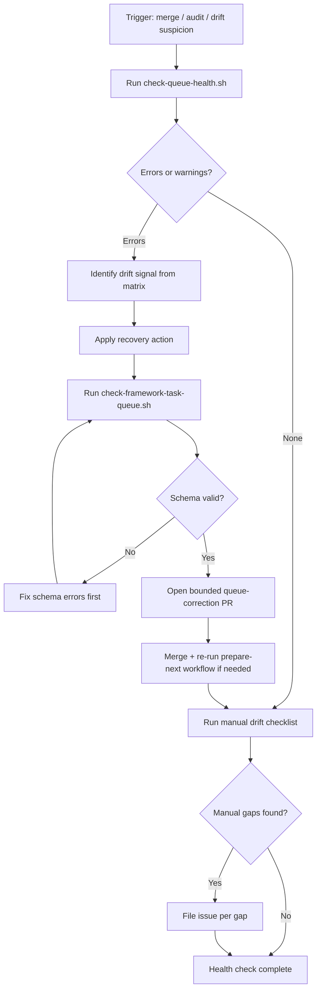

# Run the Queue Health Check

Detect and fix *queue drift*: any case where the framework task queue in
`.github/framework-task-queue.json` no longer matches reality — merged work,
the real state of issues and PRs, or current priorities. Run it after merges,
during audits, or whenever the queue looks off.

The framework task queue is an ordered, version-controlled backlog of framework
work; merge-triggered automation reads it to prepare the next task. If that is
new, start with the
[task queue operations runbook](operate-framework-task-queue.md) and
[How Brain Factory works](../how-brain-factory-works.md).

## When to use this runbook

- After any merge to `main` that touched the queue file or related implementation work.
- During the monthly framework health audit (see
  [Run the framework health audit](run-the-framework-health-audit.md)).
- When merge-triggered preparation picks an unexpected next task.
- When a queue entry's status looks inconsistent with its issue or PR history.
- When a `related_docs` path in a queue entry may have moved or been renamed.

## Primary artifacts

- Queue source of truth: [`.github/framework-task-queue.json`](../../.github/framework-task-queue.json)
- Drift-detection script: [`scripts/check-queue-health.sh`](../../scripts/check-queue-health.sh)
- Schema-validation script: [`scripts/check-framework-task-queue.sh`](../../scripts/check-framework-task-queue.sh)
- Canonical queue schema/governance model: [`../framework-queued-execution-memory.md`](../framework-queued-execution-memory.md)
- Queue operations runbook: [`operate-framework-task-queue.md`](operate-framework-task-queue.md)

## Diagram

Procedure flow for a queue health check run: start automated checks, branch on findings, then either close or open a bounded correction PR.



> 📐 Hi-res view: [SVG](../diagrams/run-queue-health-check.svg)

## Procedure

### Step 1 — Run the drift-detection script

```bash
bash scripts/check-queue-health.sh
```

The script checks:

1. Every `related_docs` path in every task actually exists in the repository.
2. Every `blocked` task whose dependencies are all `done` is promoted to `pending`.
3. Every `pending` task has all its dependencies in `done` status.
4. No non-terminal task depends on a `superseded` task.
5. Multiple `in_progress` tasks exist simultaneously (warning only).
6. (When `GITHUB_TOKEN` and `GITHUB_REPOSITORY` are available) open queue-linked
   issues do not remain open after merged PR linkage/closure.

Any error means structural drift that you must fix before the queue is used for
the next merge-triggered preparation.

### Step 2 — Run the schema validator

```bash
bash scripts/check-framework-task-queue.sh
```

The schema check and the health check catch different problems, not the same
ones. Both must pass before you can trust the queue's state.

### Step 3 — Run the bounded queue alignment audit

This audit confirms that five surfaces agree: queue state, prepared issues, open
PRs, merged-PR evidence, and the merge-driven automation's behavior.

#### Healthy state definition

Treat queue state as healthy only when **all** of these are true:

| Surface | Healthy signal |
| --- | --- |
| Queue file | `.github/framework-task-queue.json` passes schema + health checks; status/dependency semantics are coherent. |
| Prepared issues | At most one canonical open prepared issue per queue id marker; no open prepared issue for tasks already `done`/`superseded`. |
| Open PRs | Every active queue-backed PR maps to exactly one `in_progress` queue item and canonical queue-linked issue. |
| Merged PR evidence | Every `done` task has merged PR traceability and queue-linked issue closure/reconciliation evidence. |
| Automation behavior | Latest `prepare-next-framework-task.yml` run prepared the expected next dependency-ready task, or intentionally skipped when none are ready. |

#### Audit checklist (queue ↔ issue ↔ PR ↔ automation)

- [ ] Confirm queue state: exactly the intended active statuses (`pending` / `in_progress`) and no unexpected stale transitions.
- [ ] Confirm prepared-issue marker alignment: every open prepared issue marker maps to a real queue id and expected status.
- [ ] Confirm stale prepared issue absence: no open prepared issue exists for queue ids already marked `done` or `superseded`.
- [ ] Confirm PR alignment: open implementation PRs map to `in_progress` tasks and reference canonical queue-linked issues.
- [ ] Confirm merged evidence alignment: recently merged queue-backed PRs have durable linkage (close keyword or manual reconciliation comment).
- [ ] Confirm automation alignment: latest `prepare-next-framework-task.yml` output matches current queue truth and did not re-prepare stale completed work.

### Step 4 — Walk the manual drift checklist

These signals cannot be checked by the scripts; they need GitHub API access or
human judgment:

- [ ] Every `in_progress` task has an open implementation issue or PR.
- [ ] Every `done` task has a merged PR or a documented merge rationale.
- [ ] `in_progress` / `done` / `superseded` tasks satisfy the queue's
  `issue_backed_queue_model.issue_required_statuses` expectation.
- [ ] `blocked` / `pending` tasks are allowed to be issue-less per
  `issue_backed_queue_model.allow_issueless_statuses`, and are not silently
  treated as active execution.
- [ ] Every queue-backed implementation PR uses `Closes #...` for the canonical
  queue-linked source issue (with `Relates-to #...` for non-closing links).
- [ ] Prepared issues (those with the `<!-- framework-task-queue-id:<id> -->` marker)
  match the current `pending` task in the queue.
- [ ] `why_now` text in each entry still reflects current priorities (no stale context).
- [ ] `suggested_prompt` text still references accurate doc paths and terminology.
- [ ] Task ordering remains consistent with current team priorities.

Capture any manual gaps as issues — do not leave them in chat-only notes.

## Drift signal matrix

| Signal | Automated? | Recovery action |
| --- | --- | --- |
| `related_docs` path does not exist in repo | ✅ Script error | Update the path to the correct location, or remove the stale entry. |
| `blocked` task with all deps `done` | ✅ Script error | Promote the task status to `pending`. Confirm exactly one dep-ready `pending` exists. |
| `pending` task with unresolved deps | ✅ Script error | Set the task back to `blocked`, or first advance its deps to `done`. |
| Non-terminal task depends on `superseded` dep | ✅ Script error | Replace the dependency reference with the successor task id, or mark this task `superseded` too. |
| Multiple `in_progress` tasks | ✅ Script warning | Check whether any in-progress tasks have merged; update merged ones to `done`. |
| Open queue-linked issue with merged PR references but no close keyword | ✅ Script error (GitHub API context required) | Update future PR linkage to use `Closes #...`; close/reconcile the still-open issue and record merged PR evidence. |
| Open queue-linked issue while queue task is already `done` | ✅ Script error (GitHub API context required) | Close/reconcile the issue, or correct queue status if merge evidence is incorrect. |
| `in_progress` task with no open issue or PR | 🔲 Manual | Reconcile to `done` (if merged), `pending` (if not started), or `superseded` (if retired). |
| `done` task with no merge evidence | 🔲 Manual | Confirm merge via PR history; if not merged, revert to the correct pre-merge status. |
| Prepared issue queue-id marker mismatches queue | 🔲 Manual | Update issue body marker or queue entry id to restore consistency. |
| Active queue state with no issue-backed traceability | 🔲 Manual | Reconcile status and issue linkage to match `issue_backed_queue_model` expectations. |
| Stale `why_now` or `suggested_prompt` text | 🔲 Manual | Refine the text in a bounded queue-maintenance PR before the item is executed. |
| Ordering no longer reflects priorities | 🔲 Manual | Reorder entries with durable rationale documented in the correction PR description. |

## Recovery guidance

For each drift signal you correct:

1. Edit `.github/framework-task-queue.json` with the minimum changes needed.
2. Run `bash scripts/check-queue-health.sh` — it must pass with no errors.
3. Run `bash scripts/check-framework-task-queue.sh` — it must pass.
4. Open a bounded queue-correction PR that explains:
   - what drift signal was found
   - what was changed and why
   - any related issue or PR links
5. If issue closure/linkage drift was detected:
   - close the canonical queue-linked issue if still open
   - leave a reconciliation comment with merged PR evidence
   - confirm queue state reflects the closeout result
6. After merge, check the latest
   [Prepare Next Framework Task](../../.github/workflows/prepare-next-framework-task.yml)
   run to confirm next-task preparation is correct, or trigger it manually via
   `workflow_dispatch` if preparation needs recovery.

### Bounded reconciliation decision points

When drift is found, decide in this order:

1. **Is queue status wrong, or are issue/PR artifacts wrong?**
   - If implementation merged and evidence is durable, update queue to `done`.
   - If implementation did not merge, move queue back to `pending`/`blocked` as appropriate.
2. **Is there more than one prepared issue for the same queue id?**
   - Keep one canonical issue open.
   - Close duplicates with a link to the canonical issue and reconciliation note.
3. **Is a prepared issue still open for a `done` task?**
   - Close it with merged PR evidence and explain whether close keyword was missing or automation could not reconcile.
4. **Did firewall/API restrictions prevent API-backed checks?**
   - Treat API checks as skipped.
   - Perform manual issue/PR reconciliation using durable merge evidence before declaring health.
5. **Does automation now match reconciled truth?**
   - Verify latest `prepare-next-framework-task.yml` run behavior.
   - Trigger `workflow_dispatch` only after queue/issue/PR truth is corrected.

### Closure/linkage drift repair sequence (merged PR + open issue)

Use this sequence whenever drift signals involve a still-open canonical queue-linked issue:

1. Confirm merged PR evidence:
   - find merged PR(s) referencing the issue
   - confirm whether a close keyword (`Closes #...`) was present
2. Reconcile issue state:
   - if issue is still open, close it manually
   - add a reconciliation comment linking the merged PR(s) and why manual closeout was required
3. Reconcile queue state:
   - if implementation is merged, queue status should be `done` (or `superseded` with rationale)
   - if merge evidence is incorrect/incomplete, revert to the correct pre-merge status and document why
4. Validate:
   - `bash scripts/check-queue-health.sh`
   - `bash scripts/check-framework-task-queue.sh`
5. Open/merge bounded queue-correction PR and then verify the latest
   `prepare-next-framework-task.yml` run reflects the corrected state.

### Continuity and memory writeback after reconciliation

After reconciliation, write durable evidence so future operators can resume
without chat history:

1. In the queue-correction PR description, capture:
   - drift signal(s) found
   - operator decision taken (`done` / `pending` / `blocked` / `superseded`)
   - merged PR and issue links used as source of truth
   - whether firewall/API restrictions affected automated checks
2. In reconciled issues, leave a closeout/reconciliation comment that links merged
   PR evidence and any manual closure reason.
3. If process guidance changed, update:
   - [`../framework-queued-execution-memory.md`](../framework-queued-execution-memory.md)
   - [`../framework-continuity-and-memory.md`](../framework-continuity-and-memory.md)
   - [`operate-framework-task-queue.md`](operate-framework-task-queue.md)
4. Re-run validation checks and include pass evidence in the PR:
   - `bash scripts/check-queue-health.sh`
   - `bash scripts/check-framework-task-queue.sh`

## Automation boundary

Automated (script + CI):

- Stale `related_docs` file-existence check.
- State inconsistency between `blocked`/`pending` status and dependency resolution.
- Superseded-dependency traps.
- Multiple simultaneous `in_progress` warning.
- Optional API-backed merged-PR/open-issue closure/linkage drift detection.

Human-in-the-loop:

- Verifying `in_progress` tasks against open GitHub issues/PRs.
- Verifying `done` tasks against merged PRs.
- Reviewing `suggested_prompt` and `why_now` text for staleness.
- Deciding whether stale items should be updated, superseded, or removed.
- Final queue-correction PR review and merge.

## Mobile quick action

- **Use when:** you want to spot-check queue health after a merge or during a mobile audit sweep.
- **Do from mobile:**
  - Confirm the latest `framework-audit.yml` run passed (including the `queue-health` job).
  - Open `.github/framework-task-queue.json` and verify the `in_progress` task has a matching open issue or PR.
  - Leave a drift note on the relevant issue or PR comment thread.
- **Do not do from mobile:**
  - Rewrite multiple queue entries or fix the dependency graph.
  - Reconcile complex supersession decisions without desktop validation.
- **Escalate to desktop/cloud when:**
  - Script errors are present.
  - Multiple entries need coordinated state updates.
  - Drift spans multiple tasks or dependency chains.
- **Primary artifact to update:**
  - The queue-correction issue or PR recording the reconciliation decisions.

## Related docs

- [Framework queued execution memory](../framework-queued-execution-memory.md) — canonical queue schema, state model, linkage model, and governance.
- [Operate the framework task queue](operate-framework-task-queue.md) — step-by-step queue state transitions and recovery.
- [Run the framework health audit](run-the-framework-health-audit.md) — full framework health audit procedure.
- [Framework health](../framework-health.md) — charter-to-artifact map and operational hygiene checks.
- [Governance checklist](../governance-checklist.md) — periodic audit items including queue state and drift.
- [ADR 0017: Queue health check and drift-detection layer](../adr/0017-queue-health-check-layer.md) — decision record for this check.
