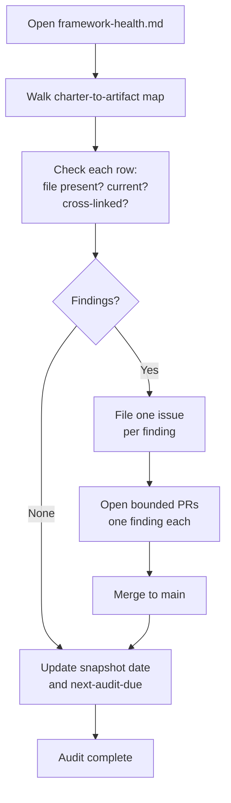

# Run the Framework Health Audit

Re-run the framework health audit: walk the charter-to-artifact map in
`docs/framework-health.md`, confirm every referenced file is present, current,
and correctly cross-linked, then refresh the snapshot. Use it on a regular
cadence and after any change that touches the framework's structure.

The *charter-to-artifact map* is the table in `docs/framework-health.md` that
ties each commitment the framework makes to the file that fulfills it; this audit
checks that the map still reflects reality. New to the project? See
[How Brain Factory works](../how-brain-factory-works.md) for the five-minute
tour.

## When to run

Run this audit on a recurring cadence and after meaningful framework changes.

Recommended triggers:

- Monthly maintenance pass. The [`framework-audit.yml`](../../.github/workflows/framework-audit.yml)
  workflow runs automatically on the first of each month and can be triggered at any time
  via `workflow_dispatch` — use it to run all automated framework checks before the manual
  walkthrough.

- After merges that change framework structure, governance, or core routing docs.
- When discoverability or continuity drift is reported.

## Diagram

Procedure flow for running the framework health audit: walk every row of the charter-to-artifact map, branch on findings, then update the snapshot.

> 📐 Hi-res view: [SVG](../diagrams/run-the-framework-health-audit.svg)

## Walk the charter-to-artifact map and refresh the snapshot

Use [`docs/framework-health.md`](../framework-health.md) as the source checklist.

1. Open `framework-health.md` and walk each section in order.
2. Trigger the [`framework-audit.yml`](../../.github/workflows/framework-audit.yml) workflow via `workflow_dispatch` to run all automated framework checks (index parity, security guardrails, handoff packet, SVG companions, mobile quick action). Review any failures before continuing.
3. Re-verify each charter-to-artifact row against the current repository state.
4. Re-run the operational hygiene checks: CI status, stale branches, ADR index, `docs/README.md` index parity, link paths, and security guardrail checks.
5. Confirm governance and routing references still point to valid files.
6. Confirm cross-link discipline still holds.
7. Refresh the `Snapshot (as of YYYY-MM-DD)` date and statuses.

Audit completion checklist:

- [ ] Every checklist item in `framework-health.md` has a current status.
- [ ] Snapshot date is updated.
- [ ] Any changed facts are reflected in the snapshot section.

## Capturing gaps as issues or PRs (no chat-only gaps)

Never leave a gap in a chat-only note. When you find one:

1. Open an issue with an objective, context, and acceptance criteria.
2. If the fix is immediate and bounded, open a PR linked to that issue.
3. Record follow-up ownership if the gap cannot be fixed in the same pass.

Gap-handling checklist:

- [ ] Every identified gap has a durable GitHub artifact.
- [ ] Follow-up owner and next action are explicit.

## Continuity principles behind this audit

For the continuity principles this audit protects, see
[`docs/framework-continuity-and-memory.md`](../framework-continuity-and-memory.md).

## Mobile quick action

- **Use when:** you are doing a quick health-status sweep or confirming audit follow-ups from mobile.
- **Do from mobile:**
  - Open `framework-health.md` and spot-check key rows for drift.
  - File one issue per confirmed gap.
  - Leave an audit-status comment naming the next action and owner.
- **Do not do from mobile:**
  - Perform full-table remediation edits in one pass.
  - Treat a chat note as a substitute for an issue or PR artifact.
- **Escalate to desktop/cloud when:**
  - Multiple findings require coordinated doc or workflow updates.
  - Validation needs broad link checks or repository-wide checks.
- **Primary artifact to update:**
  - The health-audit issue or pull request capturing the findings and their closure.

## Related docs

- [Operating model](../operating-model.md) — how the framework runs day-to-day.
- [Governance checklist](../governance-checklist.md) — periodic audit items.
- [Framework health](../framework-health.md) — current snapshot and charter-to-artifact map.
- [Framework reporting and review cadence](../framework-reporting-and-review-cadence.md) — practical recurring rhythm for weekly/monthly/quarterly/event-driven reviews.
- [Branching and cleanup](../branching-and-cleanup.md) — branch lifecycle and stale-branch handling.
- Other runbooks: [Close Out a Multi-Agent Handoff](close-out-a-multi-agent-handoff.md), [Handle a Dependabot PR](handle-a-dependabot-pr.md), [Promote an External AI Artifact](promote-external-ai-artifact.md), [Respond to Support Intake](respond-to-support-intake.md), [Start a Framework Change](start-a-framework-change.md), [Triage the stale-branch report](triage-stale-branch-report.md).
