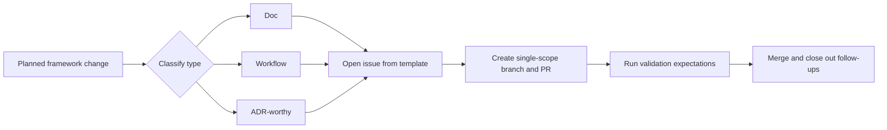

# Start a Framework Change

## When to use this runbook

Use this runbook when you are about to change the framework itself — its
behavior, docs, governance, or automation — rather than building a product
feature. Run it before opening an issue or PR so the scope and validation gates
are set early.

For how the framework relates to Brain Factory as a whole, see
[How Brain Factory works](../how-brain-factory-works.md).

## Diagram

The change workflow: classify the change, open the issue, run it through a
single-scope branch and PR, validate, then merge and close out.

> 📐 Hi-res view: [SVG](../diagrams/start-a-framework-change.svg)

## Decide the change type (doc / workflow / ADR-worthy)

Classify the work before opening artifacts:

1. **Doc**: guidance, examples, wording, cross-links, runbooks, or templates.

2. **Workflow**: CI workflows, automation behavior, configs, or scripts.

3. **ADR-worthy**: architecture or process decisions with durable tradeoffs.

Decision checklist:

- [ ] Is the change explanatory and low-risk? → doc.

- [ ] Does it alter execution gates, automation, or behavior? → workflow.

- [ ] Does it define a durable policy or architecture direction? → ADR-worthy.

## Open the right issue

Start from issue templates in [`.github/ISSUE_TEMPLATE/`](https://github.com/izakl/brainforge/tree/main/.github/ISSUE_TEMPLATE).

Quick routing:

- Docs/process improvement → `docs.yml` or `improvement.yml`.

- Defect/change in behavior → `bug-defect.yml` or `enhancement.yml`.

- Decision proposal → `adr.yml`.

Issue minimums:

- [ ] Objective
- [ ] Context
- [ ] Constraints
- [ ] Acceptance criteria
- [ ] Validation expectations

## Branch and PR conventions

Follow [`docs/branching-and-cleanup.md`](../branching-and-cleanup.md).

Operational steps:

1. Create a single-scope branch (`docs/...`, `fix/...`, `chore/...`, etc.).

2. Keep one work packet per branch.

3. Open one PR that links the issue (`Closes #...` or `Relates-to #...`).

4. Keep scope bounded; defer extras into follow-up issues.

## Validation expectations

Markdown/docs changes must pass the markdown workflow at [`.github/workflows/markdown.yml`](https://github.com/izakl/brainforge/blob/main/.github/workflows/markdown.yml).

Before requesting review:

- [ ] Local markdown lint passes.
- [ ] Relative links resolve and avoid dead UI-only targets.
- [ ] Governance alignment is checked against [`docs/governance-checklist.md`](../governance-checklist.md).
- [ ] Security-sensitive routing and redaction expectations are checked against [`docs/security-and-secure-delivery.md`](../security-and-secure-delivery.md).

## Close-out and follow-ups

Before merge:

- [ ] PR describes the problem, scope, and validation results.
- [ ] Any deferred work is captured as explicit follow-up issue(s).

After merge:

- [ ] Branch is deleted.
- [ ] Linked issues/project items are updated.
- [ ] Operational guidance stays cross-linked from primary entry points.

## Mobile quick action

- **Use when:** you are framing a bounded framework change and opening the right starting artifact from mobile.
- **Do from mobile:**
  - Classify change type (doc, workflow, or ADR-worthy).
  - Draft the issue with objective, constraints, acceptance, and validation fields.
  - Note expected validation gates before implementation starts.
- **Do not do from mobile:**
  - Start broad implementation without a normalized issue packet.
  - Bundle unrelated framework changes into one mobile edit pass.
- **Escalate to desktop/cloud when:**
  - Scope is ambiguous or likely to cross doc/workflow/ADR boundaries.
  - Implementation or validation requires local tooling.
- **Primary artifact to update:**
  - The new framework-change issue used as execution source.

## Related docs

- [Operating model](../operating-model.md) — how the framework runs day-to-day.
- [Framework queued execution memory](../framework-queued-execution-memory.md) — canonical queue schema/linkage model when the change affects queue-governance behavior.
- [Framework release notes and upgrade summaries](../framework-release-notes-and-upgrade-summaries.md) — when/how to publish a lightweight change summary for maintainers and adopters.
- [Governance checklist](../governance-checklist.md) — periodic audit items.
- [Framework health](../framework-health.md) — current snapshot and charter-to-artifact map.
- [Branching and cleanup](../branching-and-cleanup.md) — branch lifecycle and stale-branch handling.
- Other runbooks: [Close Out a Multi-Agent Handoff](close-out-a-multi-agent-handoff.md), [Handle a Dependabot PR](handle-a-dependabot-pr.md), [Promote an External AI Artifact](promote-external-ai-artifact.md), [Respond to Support Intake](respond-to-support-intake.md), [Run the Framework Health Audit](run-the-framework-health-audit.md), [Triage the stale-branch report](triage-stale-branch-report.md).
