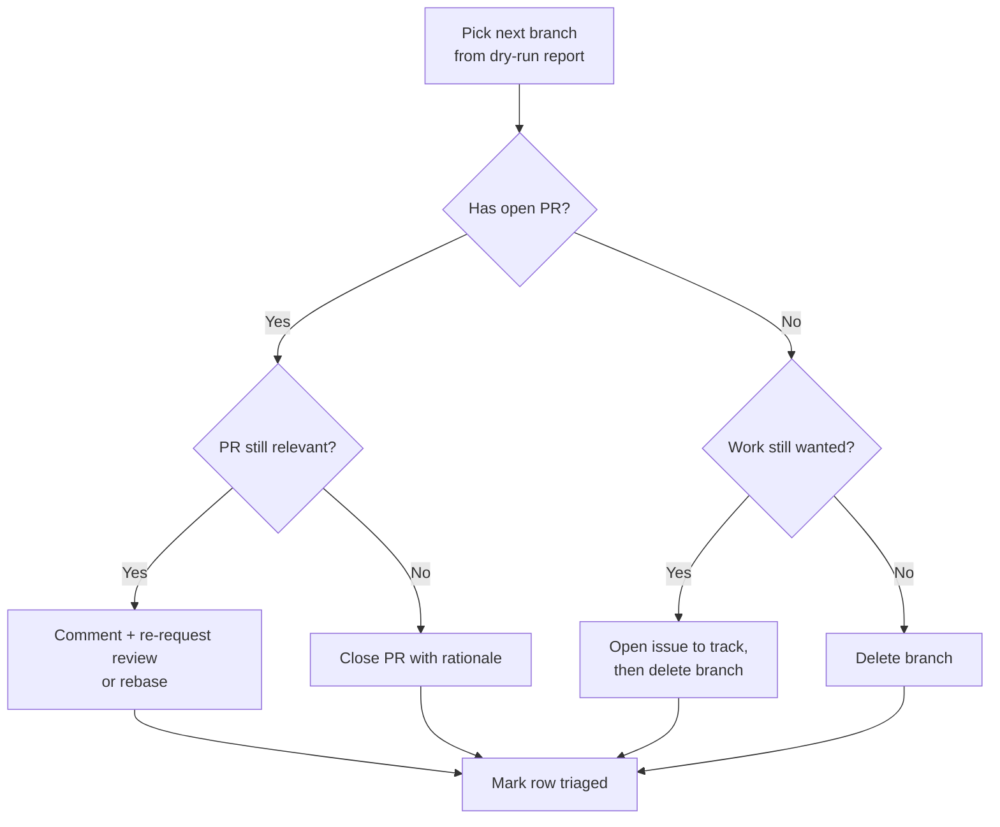

# Triage the stale-branch report

Review the weekly report produced by the `Stale Branches` workflow and decide
what to do with each flagged branch: keep it, track it, or delete it. The
workflow only *reports* by default; you make the deletion decisions.

New to the project? See
[How Brain Factory works](../how-brain-factory-works.md) for the five-minute
tour. A *brain* is the per-project repository you operate from, and this runbook
keeps its branch list clean.

## When to use this runbook

- Weekly, after the `Stale Branches` workflow runs (Mondays).
- Ad hoc, after a manual `workflow_dispatch` run.
- Whenever the branch list feels cluttered.
- After a first-run dry-run pass (see [First-run procedure](#first-run-procedure) below).

## Inputs

- The most recent run of the [`Stale Branches` workflow](../../.github/workflows/stale-branches.yml).
- Its second step ("Report long-lived non-tracked branches"), which lists branches with no open PR and no activity in 60 days.
- Its first step's output, which lists the `copilot/*` branches that would be (or were) deleted.

## Diagram

Per-branch triage decision flow for each row in the weekly stale-branch dry-run report.

> 📐 Hi-res view: [SVG](../diagrams/triage-stale-branch-report.svg)

## Triage steps

For each flagged branch:

1. Open the branch and identify its last commit and author.
2. Search by branch name and recent commits to find any associated issue or PR.
3. Classify the branch into one of:
   - **Abandoned** — work was superseded, merged via a different branch, or no longer relevant. Delete the branch.
   - **In progress (long-lived feature)** — legitimate ongoing work. Leave it; consider opening a draft PR so future audits see it as tracked.
   - **Needs decision** — unclear whether it is still needed. Open a short issue asking the original author, labelled `governance`.
4. To delete an abandoned branch, use the GitHub UI (Branches view) or run `git push origin --delete <branch>`. When in doubt, do not delete.
5. Record the outcome in the workflow run's summary comment, or in a comment on the tracking issue if you opened one.

## Decision rules

- Never delete `main` or any protected branch (the workflow already excludes `main`).
- Never delete a branch with an open PR (the workflow already excludes these, but double-check).
- When you cannot reach the author within one audit cycle, prefer leaving the branch over deleting it.
- If the same branch appears in two consecutive weekly reports with no activity and no response, it is safe to delete on the second cycle.

## copilot/* branch decision rules

`copilot/*` branches are created by the GitHub Copilot coding agent, one per
bounded task. Apply these rules:

- No open PR and last commit older than 7 days: safe to treat as abandoned. The automated cleanup step deletes it on the scheduled run.
- Open PR: actively tracked. Do not delete it.
- A very recent commit (within 7 days): may still be active. Verify before deleting.
- If unsure about a branch, check whether its topic was already addressed by a merged PR or a commit on `main`.
- For a large backlog (50+) accumulated before the first workflow run, use the first-run procedure below for a single bulk pass.

## First-run procedure

Use this procedure when the workflow has not run yet and a large backlog exists.

1. Go to the Actions tab, select `Stale Branches`, then `Run workflow`.
2. Leave **dry-run mode** checked (the default, `true`) and run.
3. Review step 1's output ("Delete merged copilot/\* and dependabot/\* branches") to confirm which branches would be deleted.
4. Confirm none of the listed branches have open PRs or are still in active use.
5. If satisfied, re-run the workflow with **dry-run mode unchecked** (`false`) to perform the actual cleanup.
6. Record the outcome (count of branches deleted, date) in the tracking issue or PR for this pass.
7. Update `docs/framework-health.md` and `docs/framework-continuity-and-memory.md` with the new branch count and evidence.

## Cadence

| Trigger | What runs | Who acts |
| --- | --- | --- |
| Weekly cron (Monday 06:00 UTC) | Step 1 deletes merged `copilot/*`/`dependabot/*` >7 days; Step 2 reports others >60 days | Automated (Step 1); operator reviews Step 2 output |
| `workflow_dispatch` (dry_run: true) | Both steps report only; no deletions | Operator reviews before committing to delete |
| `workflow_dispatch` (dry_run: false) | Step 1 actually deletes; Step 2 reports | Operator confirms first |

Review the Step 2 dry-run report at least monthly. If the same non-`copilot/*` branch appears in two consecutive reports without activity or owner response, it is safe to delete.

## Cross-links

- [`../../.github/workflows/stale-branches.yml`](../../.github/workflows/stale-branches.yml)
- [`../branching-and-cleanup.md`](../branching-and-cleanup.md)
- [`../adr/0008-stale-branch-cleanup-automation.md`](../adr/0008-stale-branch-cleanup-automation.md)
- [`run-the-framework-health-audit.md`](run-the-framework-health-audit.md)

## Mobile quick action

- **Use when:** the weekly stale-branch report needs quick per-branch triage from GitHub Mobile.
- **Do from mobile:**
  - Open each flagged branch and check its linked PR or issue status.
  - Classify each branch as `abandoned`, `in progress`, or `needs decision`.
  - Record the triage outcome in a comment or tracking issue.
- **Do not do from mobile:**
  - Delete a branch when its ownership or relevance is uncertain.
  - Attempt recovery that requires local git history work.
- **Escalate to desktop/cloud when:**
  - A branch's provenance is still unclear after initial checks.
  - A rebase, recovery, or bulk cleanup is required.
- **Primary artifact to update:**
  - The stale-branch tracking comment or issue holding the triage decisions.

## Related docs

- [Operating model](../operating-model.md) — how the framework runs day-to-day.
- [Governance checklist](../governance-checklist.md) — periodic audit items.
- [Framework health](../framework-health.md) — current snapshot and charter-to-artifact map.
- [Branching and cleanup](../branching-and-cleanup.md) — branch lifecycle and stale-branch handling.
- Other runbooks: [Close Out a Multi-Agent Handoff](close-out-a-multi-agent-handoff.md), [Handle a Dependabot PR](handle-a-dependabot-pr.md), [Promote an External AI Artifact](promote-external-ai-artifact.md), [Respond to Support Intake](respond-to-support-intake.md), [Run the Framework Health Audit](run-the-framework-health-audit.md), [Start a Framework Change](start-a-framework-change.md).
