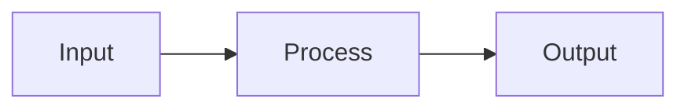

# Visual Diagrams Plan

This is the plan and convention for adding diagrams to Brain Factory docs: each
major document gets a diagram of the flow or architecture it describes, plus one
top-level diagram of how the whole framework fits together. Diagrams must stay in
sync with the prose as the framework evolves. It is for anyone authoring or
reviewing a diagrammed doc. New to the project? See
[How Brain Factory works](how-brain-factory-works.md) first.

**Status:** This convention is now formalized in [ADR 0010: Diagrams convention](adr/0010-diagrams-convention.md) after rollouts #1–#10. The rules below remain the working reference; the ADR is the canonical record.

## Goals

- **Per-document visual:** every major doc in `docs/` gets at least one diagram showing the flow
  or architecture relevant to that doc.
- **Whole-framework view:** a top-level diagram showing how the operating model, governance,
  runbooks, ADRs, automation, and Projects layer relate.
- **Drift prevention:** diagrams must remain in sync with the prose they accompany; drift is
  treated like any other continuity drift.
- **Discoverability:** diagrams live inside the doc they describe, not in a separate gallery.

## Format decision

1. **Mermaid** (primary). Renders natively in GitHub markdown, diffs as text, no build step, no
   new dependencies, works on mobile.
2. **SVG / PNG in `docs/assets/diagrams/`** (fallback). Use only when Mermaid cannot express the
   diagram (e.g. detailed UI mockups, complex layouts). The source file (e.g. `.drawio`,
   `.excalidraw`) must be committed alongside the rendered asset so it remains editable.
3. **JSX / React components** (deferred). Only revisit if/when the repo adopts a docs site
   (e.g. Docusaurus, Astro Starlight). Not justified for a pure-markdown repo today.

This decision is now recorded in
[ADR 0009: Mermaid as primary diagram format](adr/0009-mermaid-as-primary-diagram-format.md).

## Per-document diagram convention

Every diagrammed doc follows this convention:

- Add a single `## Diagram` section to the doc (or `## Diagrams` if more than one is needed).
- Place it after the intro / "Purpose" section and before deep-dive sections, so readers see the
  picture before the details.
- Each diagram must have a one-line caption above it explaining what it shows.
- Use Mermaid fenced code blocks.
- Keep diagrams small enough to render legibly on GitHub Mobile (rule of thumb: ≤ ~12 nodes per
  diagram; split into multiple diagrams if larger).

Example of a minimal Mermaid block using this convention:

## Priority rollout order

Each doc below is a separate small PR (one doc per PR).

1. `docs/operating-model.md` — surfaces × work types matrix as a flow.
2. `docs/multi-agent-handoff-playbook.md` — handoff state machine.
3. `docs/product-support-and-improvement-loop.md` — intake → triage → backlog → improvement loop.
4. `docs/example-issue-to-pr-flow.md` — end-to-end issue → PR → merge lifecycle.
5. `docs/framework-continuity-and-memory.md` — top-level "whole framework" diagram showing how
   charter, operating model, runbooks, ADRs, automation, and Projects relate.
6. `docs/gh-agents-and-automation.md` — automation surface map (Dependabot, labeler, stale-branch
   cleanup, markdown CI).
7. Remaining `docs/` files, one per PR.

The order is a starting point and can be re-prioritized as the rollout progresses.

## Keep-in-sync rules

- Diagrams are continuity artifacts. The PR template's existing "Continuity artifacts were
  updated" checkbox already covers them.
- If a PR changes the prose of a diagrammed section, the diagram must be updated in the same PR.
- `docs/framework-health.md` tracks diagram currency in its "Diagrams in sync" row; keep that
  row accurate during each health audit.
- New docs added going forward should include their diagram in the same PR that introduces them.

## Out of scope for this PR

- No diagrams are added in this PR.
- No ADR is added in this PR (the format-decision ADR comes in a follow-up).
- No `docs/assets/` directory is created yet (the first SVG-fallback diagram will create it).
- No changes to `docs/framework-health.md` or the PR template (handled by subsequent continuity
  re-sync PRs). `docs/framework-continuity-and-memory.md` receives only a single cross-link
  bullet addition in `## Related guides`; no other sections are touched.

## Mobile quick action

- **Use when:** you are reviewing diagram rollout scope, ordering, or drift signals from mobile.
- **Do from mobile:**
  - Confirm proposed diagram work matches the rollout priorities and convention rules.
  - Leave concise review feedback on readability and mobile legibility.
  - Capture missing-diagram or drift findings as linked follow-up issues.
- **Do not do from mobile:**
  - Edit Mermaid/SVG content.
  - Restructure rollout sequencing with broad plan rewrites.
- **Escalate to desktop/cloud when:**
  - Diagram source updates are required.
  - Convention or ADR-level diagram governance changes are being proposed.
- **Primary artifact to update:**
  - The diagram-related issue or pull request comment with the review decision.
