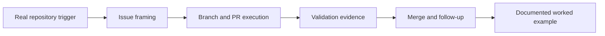

# Examples

This directory holds two kinds of worked examples for Brain Factory, the hub
framework that provisions a per-project repository (a "brain") for each project
you work on. New to the project? Start with
[`../docs/how-brain-factory-works.md`](../docs/how-brain-factory-works.md) for a
five-minute tour, then come back here for concrete walkthroughs.

The two kinds are:

- **Worked examples** — narrated walkthroughs of real changes that already
  shipped in this repository, traced from trigger to merge.
- **Adoption examples** — representative traces showing how different teams apply
  the framework in a bounded issue-to-PR flow when they adopt it.

Runbooks tell you what to do next; these examples show how one bounded change
actually moves through issue, PR, validation, and merge. They are illustrative.
For the canonical, required structure, use:

- [`../docs/issue-taxonomy.md`](../docs/issue-taxonomy.md) — issue template and work-type rules.
- [`../docs/handoff-packet-template.md`](../docs/handoff-packet-template.md) — handoff fields.
- [`../.github/pull_request_template.md`](../.github/pull_request_template.md) — PR packet expectations.

## Example lifecycle

The shape every worked example follows, from trigger to merged outcome and
reusable lessons.

## Example index

- [`worked-example-issue-to-pr.md`](worked-example-issue-to-pr.md) — end-to-end lifecycle of the markdown CI guardrail change (trigger, PR #17, ADR 0004, validation, and follow-up learning).

- [Handle a Dependabot pull request](worked-example-dependabot-pr.md) — end-to-end walkthrough of triaging, validating, and merging a Dependabot PR using the runbook.

- [External context normalization flow](worked-example-external-context-normalization.md) — end-to-end trace from local raw context (Tier 1) through connector-friendly synthesis (Tier 2) to a normalized GitHub issue, implementation PR, and durable writeback (Tier 3).

## Downstream adoption examples

These show how different team types apply the framework when they adopt it in
their own repositories. Use them to make concrete decisions — which files to
copy, which automation bundle to enable, and how to sequence the rollout —
instead of inferring everything from abstract guidance. For phase-gated migration
execution and required evidence capture, pair these with
[`../docs/framework-repo-transplant-checklist.md`](../docs/framework-repo-transplant-checklist.md).

- [Adoption example: solo maintainer / small repository](adoption-example-solo-small-repo.md) — how a solo maintainer or small team applies the essential baseline, selects Bundle A automation, and defers higher-complexity layers.

- [Adoption example: product delivery team](adoption-example-product-delivery-team.md) — how a multi-contributor product team adopts the full issue/project/PR/handoff loop with Bundle B automation and explicit deferred items.

- [Adoption example: platform and infrastructure team](adoption-example-platform-infra-team.md) — how a platform team with broad blast radius adopts Bundle C automation, ADR discipline, and security-first controls from day one.

- [Adoption example: starter-kit bootstrap in one bounded issue → PR flow](adoption-example-starter-kit-bootstrap-flow.md) — how a new-repository onboarder applies the starter-kit essential baseline in one bounded implementation cycle with explicit deferred-scope writeback.

- [Adoption example: profile upgrade from small-repo baseline to product team](adoption-example-profile-upgrade-small-to-product.md) — how a growing repository upgrades its profile and bundle in one bounded issue-to-PR flow without over-scoping into queue or governance layers.

## Setup-intent artifacts (machine-readable)

These artifacts are concrete setup-intent packets aligned with the setup schema
and setup-profile defaults.

- [`setup-intent/solo-prototype.intent.json`](setup-intent/solo-prototype.intent.json) — solo prototype baseline.
- [`setup-intent/solo-production-app.intent.json`](setup-intent/solo-production-app.intent.json) — solo production app defaults.
- [`setup-intent/small-saas-team.intent.json`](setup-intent/small-saas-team.intent.json) — small SaaS team baseline.
- [`setup-intent/internal-platform-service-team.intent.json`](setup-intent/internal-platform-service-team.intent.json) — internal platform/service team baseline.
- [`setup-intent/regulated-high-governance-service.intent.json`](setup-intent/regulated-high-governance-service.intent.json) — regulated/high-governance service baseline.
