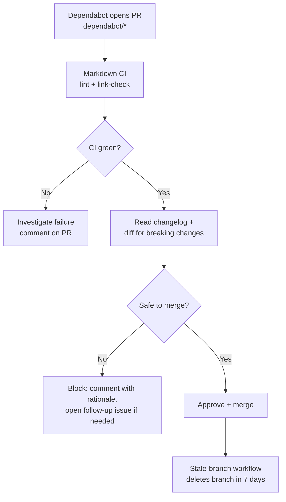

# Worked example: handle a Dependabot pull request

This walkthrough shows how to triage, validate, and merge a routine automated
dependency update end to end, following the project's runbook. Dependabot is
GitHub's bot that opens PRs to bump dependencies; this example uses a GitHub
Actions version bump. By the end you will know which checks gate the merge and
when a routine bump still needs human judgment.

New to the project? See
[`../docs/how-brain-factory-works.md`](../docs/how-brain-factory-works.md) for the
big picture first.

## Scenario

Dependabot opens a PR that bumps `actions/checkout` from one release to the next.
The path-based labeler applies the `ci` and `automation` labels, and the markdown
lint and link-check jobs both pass.

## Diagram

Review flow for a Dependabot PR from open to merge, including the human checks that gate automated dependency updates.

> 📐 Hi-res view: [SVG](../docs/diagrams/worked-example-dependabot-pr.svg)

## Step-by-step

1. Receive the Dependabot PR notification in Projects, email, or GitHub Mobile, then open the PR.

2. Verify the `ci` and `automation` labels are present to confirm the labeler workflow ran.

3. Check the PR checks and confirm both markdown lint and link-check jobs are green.

4. Review the diff and confirm changes are limited to `.github/workflows/*.yml` and/or `.github/dependabot.yml`, with no unrelated files.

5. Read the release-notes context linked in the Dependabot-generated PR description for the bumped action version.

6. Apply the governance checks in `docs/runbooks/handle-a-dependabot-pr.md`: CI green, scope bounded, and release notes reviewed.

7. Merge the PR using the standard squash-merge flow.

8. Confirm the merged `dependabot/*` branch will be cleaned up by the `Stale Branches` workflow on its next run, per ADR 0008.

9. Skip the continuity-artifact update — routine version bumps do not need one.

## What this demonstrates

- Dependabot automation (ADR 0005) keeps the toolchain current with minimal manual effort.

- The path-based auto-labeler (ADR 0007) classifies the PR without operator intervention.

- The stale-branches workflow (ADR 0008) handles branch cleanup automatically post-merge.

- The runbook (`docs/runbooks/handle-a-dependabot-pr.md`) gives the operator a single source of truth for the procedure.

- The markdown CI guardrail (ADR 0004) verifies docs didn't drift, even on a non-docs PR.

## Cross-links

- [`../docs/runbooks/handle-a-dependabot-pr.md`](../docs/runbooks/handle-a-dependabot-pr.md)

- [`../docs/adr/0005-dependabot-for-github-actions.md`](../docs/adr/0005-dependabot-for-github-actions.md)

- [`../docs/adr/0007-path-based-pr-auto-labeler.md`](../docs/adr/0007-path-based-pr-auto-labeler.md)

- [`../docs/adr/0008-stale-branch-cleanup-automation.md`](../docs/adr/0008-stale-branch-cleanup-automation.md)

- [`../docs/branching-and-cleanup.md`](../docs/branching-and-cleanup.md)

- [`worked-example-issue-to-pr.md`](worked-example-issue-to-pr.md)

## Mobile quick action

- **Use when:** you need a quick reference while reviewing a live Dependabot PR from mobile.
- **Do from mobile:**
  - Compare the active PR against the sequence in this worked example.
  - Confirm labels and required checks match the documented path.
  - Leave an approve/defer rationale comment based on scope and risk.
- **Do not do from mobile:**
  - Treat this example as blanket approval for all dependency updates.
  - Skip release-note and diff checks.
- **Escalate to desktop/cloud when:**
  - The live PR diverges from this routine pattern.
  - CI failures or unexpected file changes need deeper analysis.
- **Primary artifact to update:**
  - The active Dependabot pull request review comment.

## Related docs

- [Operating model](../docs/operating-model.md) — how the framework runs day-to-day.
- [Product support and improvement loop](../docs/product-support-and-improvement-loop.md) — how signals flow back into the framework.
- [Framework continuity and memory](../docs/framework-continuity-and-memory.md) — what the framework remembers across sessions.
- Other examples: [Worked Example: Issue to PR to ADR (Markdown CI Guardrail)](worked-example-issue-to-pr.md).
