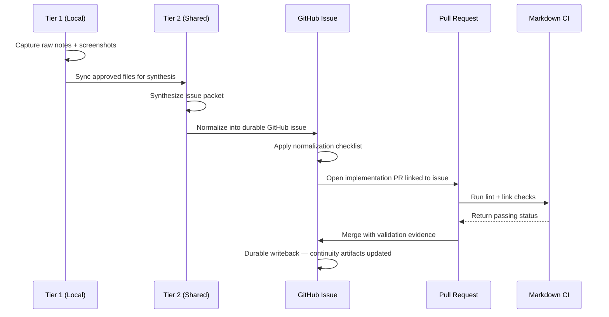

# Worked Example: External Context Normalization Flow

## Why this example exists

This walkthrough shows how raw material that starts outside GitHub — local notes,
screenshots, and AI-summarized drafts — is safely turned into durable GitHub
artifacts before any code is written. It makes the three-tier context model in
[`../docs/context-synchronization.md`](../docs/context-synchronization.md) concrete
and traceable from first capture to merged change.

The three tiers, in short:

- **Tier 1 (local):** private, unreviewed material on someone's machine.
- **Tier 2 (shared):** reviewed, redacted material safe for connector-accessible storage and AI-assisted synthesis.
- **Tier 3 (durable):** normalized GitHub issues and PRs — the system of record.

New to the project? See
[`../docs/how-brain-factory-works.md`](../docs/how-brain-factory-works.md) for the
big picture first.

## Diagram

This diagram traces the normalization sequence from local raw capture (Tier 1) through
connector-friendly synthesis (Tier 2) to durable GitHub issue and implementation PR (Tier 3).



> 📐 Hi-res view: [SVG](../docs/diagrams/worked-example-external-context-normalization.svg)

## The scenario

During a weekly support call, a product manager hears repeated customer complaints
about session timeouts. They jot down notes and grab a screenshot of the error
banner while reproducing the bug. Those notes and that screenshot are Tier 1:
private, non-durable, and not yet safe to act on.

The goal is to move that signal through Tier 2 synthesis and into a Tier 3 GitHub
issue before any implementation begins.

---

## Step 1 — Tier 1: Capture raw context locally

The product manager's local working folder (`work/session-timeout/`) holds:

```text
work/
  session-timeout/
    2026-05-25-notes.md         ← raw call notes (personal, not reviewed)
    screenshots/
      timeout-error-banner.png  ← repro screenshot (not yet classified)
    exports/
      support-ticket-raw.csv    ← support ticket export (may contain PII)
```

**What stays local:**

- Personal call notes that have not been reviewed for sensitive content.
- The raw support export (`support-ticket-raw.csv`) because it may contain customer PII.
- Transient screenshots taken before the repro was confirmed reproducible.

**Nothing is shared or implemented yet.** Tier 1 is a staging zone only.

---

## Step 2 — Tier 2: Sync approved files for AI-assisted synthesis

The product manager reviews the notes and confirms the screenshot and a redacted call
summary are safe for connector-accessible storage. They copy those files to a shared folder:

```text
Shared Drive/
  ai-framework-context/
    session-timeout/
      01-source/
        call-summary-redacted.md      ← redacted and reviewed
        timeout-error-banner.png      ← confirmed safe to share
      02-synthesized/
        draft-problem-summary.md      ← external AI synthesis output
      03-ready-to-normalize/
        issue-packet-v1.md            ← ready for GitHub normalization
```

An external AI agent (for example, Claude Code or Copilot Chat) synthesizes the source
files and produces `draft-problem-summary.md`. The product manager reviews the synthesis
and promotes it to `issue-packet-v1.md` with corrections and added constraints.

**What is recorded at this tier:**

- Redacted, reviewed source material only.
- AI-synthesized summary as a draft (not authoritative until reviewed).
- A versioned issue packet that carries the proposed objective, constraints, and acceptance
  criteria in plain language.

**What does not move from Tier 1 to Tier 2:**

- The raw CSV export (contains PII — stays local or is discarded).
- Personal opinions and unresolved assumptions (resolved before promotion).

---

## Step 3 — Tier 3: Normalize into a durable GitHub issue

The product manager opens a **Bug/Defect** issue in GitHub using the repository's issue
template. The issue body is derived from `issue-packet-v1.md`.

### Example normalized issue body

> **Title:** Intermittent session timeout after 15 minutes of inactivity
>
> **Objective:** Make the session expiry behavior predictable and surface a clear
> user-visible warning before the session expires.
>
> **Context:** Repeated customer reports (support call 2026-05-25) show users are
> unexpectedly logged out after 15 minutes of reading content without interaction.
> A repro session confirmed the error banner displays after the fact with no
> preceding warning. Source material is in Shared Drive `session-timeout/` (Tier 2).
>
> **Constraints:**
>
> - Token rotation and audit logging requirements must remain unchanged.
> - The warning must be visible on mobile viewports.
> - No change to the 15-minute policy value — only the warning behaviour.
>
> **Acceptance criteria:**
>
> - A visible in-app warning appears at least 2 minutes before session expiry.
> - The warning is dismissible without extending the session unless the user acts.
> - Repro steps from the support call no longer produce a silent logout.
>
> **Validation:** Manual repro steps are documented in the issue comments. A test
> account and environment details are noted in the linked Tier 2 synthesis file.
>
> **Source links:** Shared Drive › `ai-framework-context/session-timeout/03-ready-to-normalize/issue-packet-v1.md`
>
> **Labels:** `bug`, `ux`, `triage`
>
> **Project status:** `Triage`

**What is now durable (Tier 3):**

- The objective, context summary, constraints, acceptance criteria, and validation
  steps live in GitHub.
- Source links give reviewers a path to the Tier 2 synthesis without embedding
  private content.
- The normalization checklist (see `docs/context-synchronization.md`) has been
  satisfied before the issue is assigned.

**What is still not in GitHub:**

- Raw call notes and the PII-containing CSV (neither is needed for implementation).
- The Tier 2 synthesis drafts (not needed — the normalized issue captures the decision
  surface).

---

## Step 4 — Normalization checklist (before assigning implementation)

Applied from `docs/context-synchronization.md`:

- [x] Problem statement captured in issue
- [x] Objective and constraints captured
- [x] Acceptance criteria listed
- [x] Validation steps listed
- [x] Source context summarized in durable form
- [x] Sensitive or non-shareable data removed or redacted

Only after all six checks pass does the issue move to `Ready` and implementation begin.

---

## Step 5 — Implementation PR linked to the issue

A developer (or GitHub Copilot Coding Agent) picks up the issue and opens an implementation
PR from a bounded branch.

The PR body:

- opens with `Closes #<issue-number>` to link back to the normalized issue.
- restates the objective and non-goals explicitly.
- records validation evidence (repro steps attempted, test results, environment).
- notes any constraints that were preserved or consciously deferred.

**Example PR body excerpt:**

> **Closes #42**
>
> **Objective:** Surface a session-expiry warning 2 minutes before timeout.
>
> **What changed:** Added a countdown banner component triggered at T-2 min. No
> changes to token rotation, audit logging, or the 15-minute policy value.
>
> **Validation performed:**
>
> - Manual repro of original failure case: warning now visible at 13:00 remaining.
> - Mobile viewport: banner renders correctly at 375px width.
> - Edge case: dismissing warning does not extend session.
>
> **Out of scope:** Changing the 15-minute policy — tracked as a separate Product decision.

CI runs markdown lint and link-check on the PR. Both pass before review is requested.

---

## Step 6 — Merge and durable writeback

After review and CI pass, the PR is merged.

**Post-merge durable artifacts:**

- The closed issue retains the normalized context, constraints, acceptance criteria, and
  validation for future reference.
- The merged PR retains the validation evidence and implementation rationale.
- If the timeout policy decision becomes relevant later, an ADR Proposal issue is the
  correct next artifact — not a reopen of this issue.
- Any deferred follow-up (for example, the policy-value decision) is captured as an
  **Improvement** issue linked from the merged PR.

The continuity and health writeback notes that the external-context normalization example
gap is now closed. See `docs/framework-continuity-and-memory.md` for the resume point.

---

## Tier boundary summary

| What | Tier | Rationale |
| --- | --- | --- |
| Raw call notes, PII CSV export | Tier 1 only | Sensitive; not needed for implementation |
| Redacted call summary, confirmed screenshots | Tier 2 | Safe for connector-assisted synthesis |
| AI synthesis drafts | Tier 2 | Intermediate; not authoritative until reviewed |
| Normalized issue: objective/constraints/AC/validation | **Tier 3** | **Required before implementation** |
| Implementation PR with validation evidence | **Tier 3** | **Required for merge** |
| Closed issue + merged PR | **Tier 3** | **Durable record** |

---

## What future contributors should learn

1. Tier 1 is a staging zone — never a reason to begin implementation.
2. Tier 2 is an optional bridge for AI-assisted synthesis — useful when raw material
   is rich but not yet structured enough for a GitHub issue.
3. The normalization checklist is the gate. If any item is unresolved, the issue is
   not ready to assign.
4. Source links in the issue give reviewers provenance without pulling private
   content into GitHub.
5. The PR must preserve the issue's constraints — implementation should not quietly
   drop or relax them without updating the issue or an ADR.
6. Writeback is part of the flow. Closing the loop in the continuity artifacts means
   the next session starts with an accurate picture of what is done.

## Mobile quick action

- **Use when:** you need to confirm that external context has been correctly normalized
  before approving an issue or PR from mobile.
- **Do from mobile:**
  - Check that the issue body covers objective, context, constraints, acceptance criteria,
    and validation before marking it `Ready`.
  - Verify the PR closes the linked issue and states validation performed.
  - Leave a comment if any normalization checklist item is visibly missing.
- **Do not do from mobile:**
  - Approve implementation that started without a normalized GitHub issue.
  - Reconstruct context from Tier 1 or Tier 2 sources that are not accessible from mobile.
- **Escalate to desktop/cloud when:**
  - Sensitive or un-redacted content appears in the issue or PR and needs classification.
  - Tier 2 synthesis is incomplete and needs external AI agent assistance before the issue
    can be finalized.
- **Primary artifact to update:**
  - The GitHub issue that carries the normalized context, or the PR description if
    validation evidence is missing.

## Related docs

- [Context synchronization](../docs/context-synchronization.md) — three-tier model and
  normalization checklist.
- [Multi-agent handoff playbook](../docs/multi-agent-handoff-playbook.md) — handoff packet
  structure and artifact expectations.
- [Framework continuity and memory](../docs/framework-continuity-and-memory.md) — what the
  framework remembers across sessions.
- [Operating model](../docs/operating-model.md) — how the framework runs day-to-day.
- [Promote an external AI artifact](../docs/runbooks/promote-external-ai-artifact.md) —
  runbook for turning external AI outputs into durable repository artifacts.
- Other examples: [Worked example: handle a Dependabot pull request](worked-example-dependabot-pr.md),
  [Worked Example: Issue to PR to ADR (Markdown CI Guardrail)](worked-example-issue-to-pr.md).
