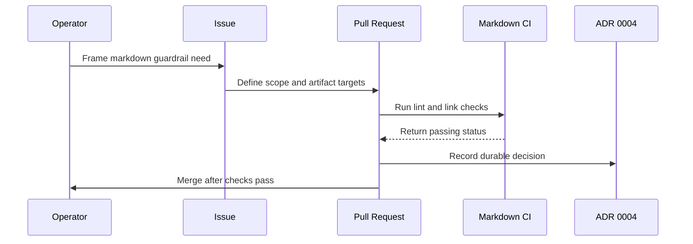

# Worked Example: Issue to PR to ADR (Markdown CI Guardrail)

## Why this example exists

This walkthrough follows one real change end to end: how the team added a markdown
quality gate to CI, then recorded the decision so it would outlast any chat history.
You will see how a small operational need becomes an issue, a pull request, an
Architecture Decision Record (ADR — a short, durable note that captures a decision
and its rationale), and an automated check. Every artifact referenced here already
exists in this repository.

New to the project? See
[`../docs/how-brain-factory-works.md`](../docs/how-brain-factory-works.md) for the
big picture first.

## Diagram

The sequence from operational trigger through PR execution, CI validation, ADR
capture, and merge.

## The trigger

Documentation is a control surface in this project, so it needs a durable quality
gate. Manual review alone was not catching formatting drift and dead links reliably.

## The problem statement artifact

The change was framed as a repository-level guardrail and delivered through the normal
pull-request flow. The files it would touch were explicit from the start:

- `.github/workflows/markdown.yml`

- `.markdownlint.jsonc`

- `.github/markdown-link-check.json`

## Branch and PR execution

Implementation shipped in **PR #17**, which introduced:

- markdown linting on PRs and pushes to `main`
- markdown link checks on PRs and pushes to `main`
- repository-level enforcement against documentation quality drift

A later hardening pass in **PR #20** restored stricter formatting discipline for
heading and list spacing.

## ADR capture

The decision was recorded as an ADR:

- [`docs/adr/0004-markdown-ci-guardrail.md`](../docs/adr/0004-markdown-ci-guardrail.md)

The ADR preserves the context, the decision, the alternatives considered, and the
consequences — so the reasoning survives long after the original discussion.

## Validation and CI evidence

The workflow itself is the source of truth for what runs:

- [`.github/workflows/markdown.yml`](../.github/workflows/markdown.yml)

In the flow, evidence meant:

- PR checks showed the markdownlint status.
- PR checks showed the link-check status.
- Merge happened only after both were passing.

## Merge and follow-up

After merge, follow-up work brought the docs and links into line with the new gate.
That included replacing fragile UI links with stable relative file paths, so the
unauthenticated link-check runs stay green.

## What future contributors should learn

1. Start from a clear operational need, not an abstract tooling change.
2. Name the files you will touch early (workflow, config, docs).
3. Treat ADRs as durable memory for process decisions.
4. Use CI as the control gate, then fix documentation drift to match it.
5. Prefer relative repository links over fragile UI endpoints in markdown.

## Mobile quick action

- **Use when:** you need to validate or explain the issue→PR→ADR chain from mobile.
- **Do from mobile:**
  - Follow the artifact chain and verify links are intact.
  - Use this example to leave precise guidance on missing step/order in active work.
  - Confirm CI gate expectations are explicitly referenced in the current issue or PR.
- **Do not do from mobile:**
  - Recreate historical ADR or workflow content from memory.
  - Apply this example blindly when the current change type differs.
- **Escalate to desktop/cloud when:**
  - The current path requires new workflow/ADR edits.
  - Multiple artifacts need synchronized updates beyond comment-level guidance.
- **Primary artifact to update:**
  - The active issue or pull request that is being aligned to this flow.

## Related docs

- [Operating model](../docs/operating-model.md) — how the framework runs day-to-day.
- [Product support and improvement loop](../docs/product-support-and-improvement-loop.md) — how signals flow back into the framework.
- [Framework continuity and memory](../docs/framework-continuity-and-memory.md) — what the framework remembers across sessions.
- Other examples: [Worked example: handle a Dependabot pull request](worked-example-dependabot-pr.md).
